# CS336 Lab1 Basics 实现基本思路与简洁代码

可以在[这个仓库](https://github.com/TRpuppy/CS336_TRpuppy/tree/master)找到我的代码实现。

## 实现BPE Tokenizer：Training与Encode, Decode

一个BPE Tokenizer，简单地说起来，就是两个规则表：

+ 一个从id到bytes序列的词汇表字典(vocabulary)。
+ 一个merge规则表，表示按顺序产生的merge rules.

但是大数据量会让一切看起来简单的东西变得不简单。我们的数据约有10G的文本，所以需要引入一些高效的处理，使得整个实现在内存和时间上都可接受。

### BPE Training

先约定一下：在这一节，我会把Pre tokenize后的单个结果叫成是"token"，BPE的词汇叫成是"word"。word的初始值就是所有utf8的bytes。

训练时，我们会每次寻找出现次数最多的相邻words对，然后合并这两个words成为一个新的word。

也是说起来简单，做起来不容易的一件事情。

#### PreTokenizer

我们先使用PreTokenizer，将文件切分为单词的形式，我们统计words对的时候，忽略跨Pre Token单词间的words对。按照指导文件，我们使用下面这个PAT正则表达式，在文件中找到所有匹配项。

```python
PAT = r"""'(?:[sdmt]|ll|ve|re)| ?\p{L}+| ?\p{N}+| ?[^\s\p{L}\p{N}]+|\s+(?!\S)|\s+"""
```

最终我把pretokenize后的结果，处理成一个字典`appear_times:dict[str:int]`的形式。`appear_times[word]`是一个整数，表示这个word在文件中出现了多少次。然后我们就只需要对整个文件过一次PreTokenizer，然后剩下的事情全部在`appear_times`这个词汇表里面办。

然而对于10G这个量级，一次遍历也是挺慢的，并且它对内存也不是一件很友好的事情。所以我使用了并行化设计，将整个文章切成若干个大小为1M的块(切点在Special Tokens处)，交给64个workers并行化处理(这里赞美一下我们伟大的180核CPU服务器)，每个块单独形成一个字典，最终再将整个字典合并。经过测试，这样并行化Pre Tokenize一个10G的文件大约只需要1分钟。

最终结果：总共发现 6601892 个唯一token, 总出现次数: 2,471,753,092，运行时间67s。(owt_train.txt)。

有了思路后，具体的代码交给AI完成。

#### Training Progress

按我们上面所说的，PreTokenize之后，剩下的事情我们只需要在PreTokenize后的token表上面办。这大大减小了我们的处理任务量。我们先会把每个token处理成一个token list，然后每次训练简单地分为两个步骤：

(1)统计所有word pair的出现频率，找出现频率最高的一个pair。

(2)对这个pair进行合并，更新所有token的word list。

最简单的方法，就是每次遍历两遍所有token的word list。但是其实总token数目N=6600000也不是一个太小的数目。如果我们需要生成一个words量为M=32000的词汇表。迭代M次肯定是不免要做的。如果每次遍历一遍所有Token，也即是每次N*Token_length的复杂度。如果Token_length认为是5的话，总复杂度就是10^12量级。且训练的过程也不好并行化。这是挺不能接受的一个方法。

我们最好寻找一点优化的方法。第一个想法就是其实word pair的出现频率你每次去找的话肯定浪费，因为它更新其实没多少。记录下来维护一个变化量其实是更好的办法。而这个变化量当然也好维护：你每次不是要更新word list么，更新word list的时候顺手把前后的word pair出现次数，消除的该减减，出现的该加加就好了。这样就有了一个统一的`appear_times:dict[(int,int):int]`字典，键是word pair，值是出现次数。

但是这其实并没有解决数量级问题，因为你每次更新的时候还是要遍历一遍所有token。我们能不能引入一个结构，描述每个word pair出现在哪些token里面，从而不去遍历一遍所有token，只针对性地找这个pair出现过的token呢？想了一下确实是可以的。

最开始我的实现是`appear_index:dict[(int,int):List[int]]`，键是word pair，值是一个token下标的列表，表示在哪些token里面出现过。这样，每次更新的时候，就只需要在这个列表对应的token里面处理就好了。

但是这有一个小问题，我举个例子：例如`he`这个word pair和`there`这个token。在初始化时会认为he出现在there中。但是如果我们第一次合并的是`th`这个word pair，那`he`这个word pair就不再出现了。虽然这不是什么大毛病：至少这样维护出来的列表总是保证出现word pair的token一定在列表中。

但是如果想做得更好，可以更新成`appear_index:dict[(int,int):Dict[int:int]]`。第一个键是键是word pair，第二个键是token下标，值表示这个word pair在这个token中出现过多少次。如果减到0了，就删除这个键。这也就是我最终的实现。

整体速度：训练阶段约30mins。(owt_train.txt，32000 vocabs)

### BPE Encoding and Decoding

下面我们切换一下语言约定：BPE的词汇表中的词汇统一称作token(在上面，它被称作word)，token对应的标号就叫token_id。

Decoding很简单，从token_id复原回token，再从token连接起来的bytes复原回UTF-8就可以了。同时目前为止，我们也没有大规模Decoding的需求，所以暂时可以不作任何优化。

Encoding基本的idea就是对输入的字符串按顺序应用merge rules。同时有一个细节需要注意：为了保持与训练时一致，我们在encoding时也需要使用相同的方式进行Pre Tokenize，然后忽略所有跨Pre_token的合并。所以我们的实现中，最小单位的函数设计成：`apply_merges(token:bytes)->list[int]`，这个函数只接受PreTokenize后得到的一个小token，返回最终的encode结果。

这个函数的具体实现：别傻傻地去遍历一遍所有merge rules(约32000个)了~~(没错说的就是我自己)~~，一个token大小约为5，你直接在token里面找byte pair，看看它们在不在merge rules里面。这样会快得多。

此外，我还弄了个LRU的小缓存~~(绝对不会告诉你这是因为之前弄成遍历一遍merge rules，导致这个函数太慢了)~~，储存token和编码结果，如果缓存命中就可以直接返回，不用再处理一遍。

指引上要求写的encode()函数和encode_iter函数，直接写就好了。它们适合用来处理小段形式的文本，约10M左右。

这一部分的最终任务，是将四个给出的数据集分别编码成为numpy uint16列表的形式。为高效处理这种文件形式的大文本编码，我专门写了一个`encode_files.py`。这个脚本专门负责大文件的并行化编码。操作如下：

1. 将文件预切分为若干个大小约为1M的块(切点在Special Tokens处)，这点和PreTokenize的操作很像。
2. 并行化编码所有块，保存成临时文件，避免过多内存占用。
3. 等所有块编码成临时文件后，合并所有临时文件。为了快速合并，合并的时候我们也采用并行化的设计，采用类似二叉树的合并方法。等剩余文件数较少或单个文件过大的时候，再采用串行合并。

整体速度：编码阶段3.5mins，合并阶段0.5mins。(owt_train.txt，最终编码结果owt_train_encoded.npy，6.5G)


## 实现语言模型的基本组件，并合成TransformerLM类

> 训练一个大语言模型需要几步？
>
> 第一步：从大语言模型类里声明一个对象
>
> 第二步：把收集到的数据处理好
>
> 第三步：Model.train(dataset)

这章的主要目的是构建一个后续我们可以点击即用的TransformerLM类。按照讲义上的介绍，基本架构如下左图所示。其核心组件是若干个Transformer块，一个Transformer块是由残差连接的方式组成的，包含一个多头注意力层和一个双线性层。

每个组件的具体实现，在讲义上已经介绍得很清楚了。我们这节主要从理论(或者直观)的角度来理解一下每个组件。


### 基本架构

模型的输入是一段长至多为`max_seq_len`的token序列。训练时，模型会对每个i，仅依靠前`i`个token，预测第`i+1`个token的值，进而计算cross entropy loss。而生成文字时，模型会基于整个token序列，预测下一个token的值。

首先，模型收到token序列`(...,seq_len)`后，经过Embedding层将每个Token编码成`d_model`维的向量。然后进入模型的核心，即多个堆叠的注意力层。我们的实现中，每个注意力层的输入和输出维度都是`(...,seq_len,d_model)`。模型的输出表示概率，经过softmax后计算loss。(即cross entropy loss)。

接下来我们来拆解一下一个Transformer Block中的具体组成：

### 注意力块的具体实现

> We offer no explanation as to why these architectures seem to work; we attribute their success, as all else, to divine benevolence.  ——Shazeer
#### RMS PreNorm without transition

一个注意力块包括一个多头注意力层和一个双线性层。层之间通过残差连接，且使用Pre-Norm的方式。

> A variety of work has found that moving layer normalization from the output of each sub-layer to the input of each sub-layerimproves Transformer training stability.

RMSNorm(Root mean square)正则化层的设计引入了权重参数$g_i$。公式如下：
$$
Norm(a_i)=\frac{a_i}{QM(a)+\epsilon}g_i
$$
其中QM是平方平均值(Quadratic Mean)，$g_i$是可学习的参数。

有点奇怪的是，与传统的Normalize相比，这里我们并没有用到平移来把均值归零。

#### 激活函数SiLU与SwiGLU

激活函数使用的是$SiLU:f(x)=\frac{x}{1+e^{-x}}=x\cdot\sigma(x)$。它和Relu的函数走势很相似，但相比Relu，SiLU在衔接处是平滑的。

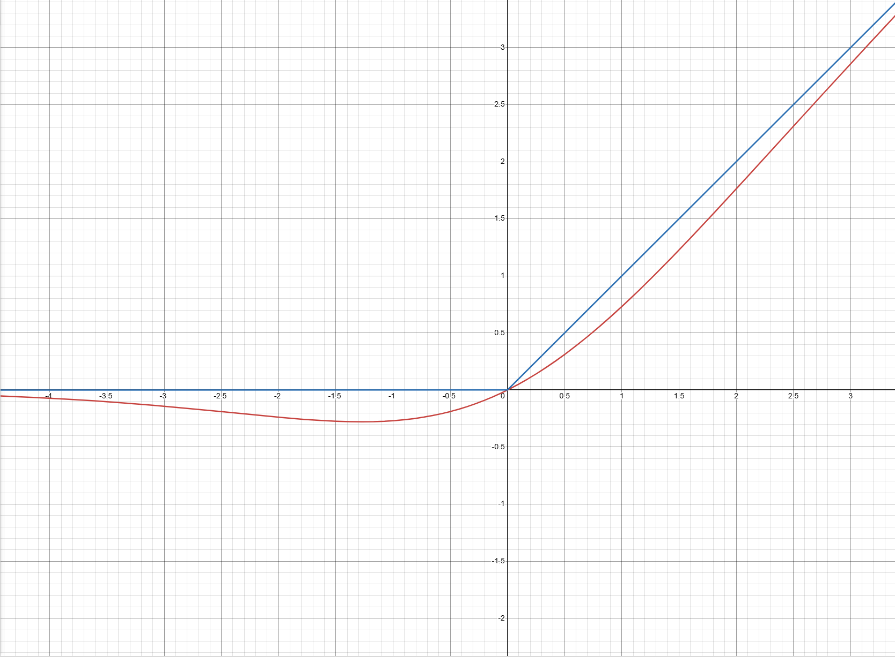

传统的双线性层采用`Linear-activate-Linear`的方式。通常来说，隐藏层的大小会设计成输入层的四倍。而教程推荐采用的办法是GLU(Gated Linear Units)的办法，这种方法也是采用两个线性变换，但是是使用逐项相乘（$\odot$）的形式。
$$
GLU(x,W_1,W_2)=f(W_1x)\odot (W_2x)
$$
GLU的想法是一个“门控机制”。上面的f是激活函数。最开始提出GLU的时候人们采用的是sigmoid函数，它输出0-1的一个数，逐项乘后面的线性层结果，直观上就代表在什么程度上保存对应的元素值。这相当于能够灵活地调整不同部分的权重。后面人们将其它激活函数(如Relu,SiLU等)替换sigmoid后，发现依然能够有良好的效果，直观上理解，它们也有类似"门控"的功能，能够抑制那些负数的部分。

最终我们的前向线性层FFN采用SwiGLU设计，公式如下：

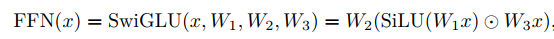

> Shazeer [2020] first proposed combining the SiLU/Swish activation with GLUs and conducted experiments showing that SwiGLU outperforms baselines like ReLU and SiLU (without gating) on language modeling tasks.  

#### RoPE传递相对位置信息

接下来是RoPE。这也是一个比较精妙的设计。我们在注意力机制中如果不加任何预处理，直接对所有的token统一进行注意力机制的处理，就会导致相同的token在不同的位置上的地位是等价的。换句话说，我们丢失了位置信息。

解决方式，当然是我们需要想办法将位置编码到向量中。一个朴素的想法是将位置(整数)作为一个额外的维度放在编码中。但是这带来的问题是这个编码维度会很大程度上破坏层内向量的数值分布(神经网络内，典型值一般差不多是标准正态分布)，同时也难以传递有效的信息。
RoPE的处理是将每个q和k向量(假设是`d_model`维)都看成在复数域上的`d_model/2`维的向量(每相邻两个元素组成一个复数的实部和虚部)，然后对每个复数维，设定一个角度$\theta_k(k=1,2\dots d_{model}/2)$，然后对序列中每个的token，让这个维度的复数旋转角度$i\theta_k(i=0,1,2\dots seq\_len-1)$。我们将RoPE应用在Q和K矩阵上，一个关键的特性是对于两个token i和j，则$q_i^T\cdot k_j$中收到旋转的角度值的影响只与$i-j$有关。这也就是说，在注意力机制中使用$Q^TK$的时候，实际上RoPE传递的是token的相对位置信息。这也是很符合我们语言直觉的一个结果。

一般来说，我们设置一个常数$\Theta$(常为10000)，并使$\theta_k=\Theta^{-2k/d}$。同时为了避免多次计算三角函数值拉慢速度，我们计算一次之后就会作为RoPE的类缓存，把三角函数值存起来。

#### 多头注意力机制

单头注意力的公式是
$$
Attention(Q,K,V)=softmax(\frac{Q^TK}{\sqrt{d_k}})V
$$
其中

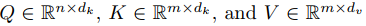

而多头注意力，在实现上就是把Q,K,V的$d_k,d_v$维度切成若干份，形成若干个头，分别去作注意力，最终拼合起来。这个好处是对于每个query，可以从不同的角度，分别给与到不同的keys以不同的权重分布。

整体的公式写成下面的形式：

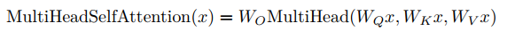


其中$W_O$是最终Output前的线性变换，$Q_i,K_i,V_i$是Q,K,V矩阵的$d_k/d_v$维度按照头切块的结果，Concat就是将他们重新接连在一起。

此外，还记得我们说模型在训练时需要通过前i个token来预测第i+1个token。为了不让模型在训练时提前看到后面的序列内容，我们在注意力机制中会将对后面的Value的权重设置为0，具体而言，可以将$Q^TK$的结果中对应的部分设置成$-\inf$。

将上面的内容综合起来，就可以得到一个Transformer LM类。

## AdamW优化器与Cosine学习率调节器

这两个我们在北大的CV课程中都有所接触。关于AdamW优化器的思想，在[**我的CV博客**](../cv-crash-course/3#神经网络)中有所涉及，这里补充一点关于AdamW中的"W"的细节：

原始的Adam公式是这样子的，先计算梯度：

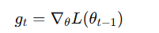

然后再进行动量与梯度平方和的累计与修正：

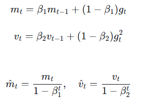

然后通过动量和平方和，自适应地进行学习：

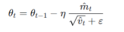

我们看看对于Adam框架，正则化项在哪里。正则化项被包含在$g_t$的梯度之中，所以对于正则化损失，它会累计到$m_t$与$v_t$之中。这其实与我们设计动量和自适应学习器的初衷是违背的——它们的设计本身是针对复杂的损失函数，想要避免鞍点与参数更新频率导致的训练问题。但正则化本身是一个很简单的损失函数。

AdamW做的事情是将正则化项从损失中解耦出来。它的梯度计算中不包含正则化项，正则化项在最终的学习公式中单独进行计算。

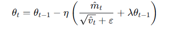

采用AdamW优化器会额外需要两倍于模型本身大小的显存。在下面我们会看到这一点。

Cosine学习率调节器平滑地让学习率进行衰减，公式如下：

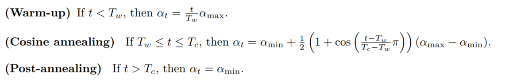

## 训练循环与性能估算

这一节中，我们先约定一下符号意义：

+ Number of layers: $N$
+ model dimension: $D$
+ dimension of hidden layer: $D'$
+ Vocabulary Size: $V$
+ Batch Size: $B$
+ max sequence length: $L$
+ Number of heads: $h$
+ Number of Parameters: $P$ 

### 训练循环

训练循环首先需要从数据集中读取数据。我们采用的数据集以.npy格式存储。可以使用`np.load()`函数进行读取。我们的训练文件是很大的，不需要全部读取进内存当中，可以采用`mmap=true`模式，来将整个numpy列表存储到虚拟内存中，读取时采用Lazy读取。

读取数据的形式是这样的：每一个Epoch，我们会读取$B$个长度为$L+1$的token序列。每一个序列为模型提供$L$次预测需求，分别为预测下标为$1,2,3...L$的token。而这B个序列，我们在整个numpy列表中采用随机选取的方式即可。

每训练一段时间后，我们使用`torch.save()`函数来保存检查点。注意，因为我们采用了cosine学习率调节，这个调节器需要输入训练循环数，所以我们需要额外存储这个参数。此外，因为AdamW优化器本身需要存储动量和梯度平方和信息，所以我们也需要把优化器给存起来。总CheckPoint的大小应该是模型大小的三倍。

如果训练中遇到问题，需要重启训练，可以读取模型数据和优化器数据，然后接续训练进程。

### 性能估计

对于一个模型配置，有三个很重要的数据我们需要进行估计：

+ 模型参数量。这个毋庸置疑，是模型纵向比较中很重要的一个指标。
+ 训练时FLOPS数。这个数值估计结合显卡的配置，能够让我们大概计算出所需的训练时长。
+ 训练时占用显存。很多情况下显卡"训练不动"一个模型主要是因为显存不够。我们需要估计这个数值以保证显存使用量合理。同时，计算这个配置也对$B,L$和总训练步数的选择提供了指导。

### 模型参数量

在估计中为了简单起见，我们会忽略小量。计算模型参数量时，我们只考虑这些组件：

+ Token Embedding层——参数量为$VD$

+ Transformer中的MSA层和SwiGLU层——总共有$N$个层。

  + MSA有四个映射矩阵，分别是`W_q,W_k,W_v`和最终的输出线性矩阵`W_o`。下面是实现代码。

    ```python
    def forward(self, x: Float[Tensor, " ... sequence_length d_in"]) -> Float[Tensor, " ... sequence_length d_out"]:
        Q = einsum(x, self.W_q, " ... sequence_length d_in, d d_in -> ... sequence_length d")#d = d_k * h
        K = einsum(x, self.W_k, " ... sequence_length d_in, d d_in -> ... sequence_length d")#d = d_k * h
        V = einsum(x, self.W_v, " ... sequence_length d_in, d d_in -> ... sequence_length d")#d = d_v * h
        
        Q = rearrange(Q, " ... sequence_length (h d_k) -> ... h sequence_length d_k", h=self.num_heads , d_k = self.d_k)
        K = rearrange(K, " ... sequence_length (h d_k) -> ... h sequence_length d_k", h=self.num_heads , d_k = self.d_k)
        V = rearrange(V, " ... sequence_length (h d_v) -> ... h sequence_length d_v", h=self.num_heads , d_v = self.d_v)
    
        if self.RoPE is not None:
            Q = self.RoPE(Q, self.token_positions)
            K = self.RoPE(K, self.token_positions)
        
        mask = torch.tril(torch.ones(Q.shape[-2], Q.shape[-2], device=self.device, dtype=self.dtype))
        mask = mask.expand(*Q.shape[:-2], Q.shape[-2], Q.shape[-2])
        Result = self.sdp_attention(Q, K, V, mask)
        Result = rearrange(Result, " ... h sequence_length d_v -> ... sequence_length (h d_v)", h=self.num_heads , d_v = self.d_v)
        Result = einsum(Result, self.W_o, " ... sequence_length d, d_model d -> ... sequence_length d_model")#d = d_v * h
        return Result
    ```

    实现中，我们是先对x计算大的QKV矩阵，然后再将QKV切分成h段分别去作Attention。参数量其实是只有四个大矩阵，而每个矩阵是$D\times D$的，所以一个MSA层的参数量是$4D^2$。

  + 回忆一下，SwiGLU层的表达式是

    

    这里有三个矩阵，每个矩阵都是$D\times D'$的。所以每个SwiGLU层的参数量是$3DD'$。

+ 尾部的线性层——参数量为$VD$。

被忽略的组件是Norm层，RoPE层。

总的参数量为：$P=2VD+N(4D^2+3DD')$

### FLOPS

一个FLOP是一次加法或者乘法运算。我们下面来计算一次训练步中的总FLOPS数。

一个$n\times m$的矩阵与一个$m\times p$的矩阵相乘，会产生$2mnp$个FLOPS。这是我们计算FLOPS的基础。

一步训练中FLOP数显然是和$B$成正比的。所以这里我们对$B=1$来进行估计。还是只考虑主要组件，正则化，Softmax和SiLU等组件的计算开销，因为是逐个元素进行的，量级上比矩阵乘法少整整一个量级，所以我们直接忽略之。同时，对于反向传播中的优化器更新，也是逐个元素去作动量和方差的估计，也几乎可以忽略不计。所以总的FLOPS几乎全部来自矩阵乘法(或者说线性层)。

那么对于矩阵乘法$y=Wx$，我们反向传播时给定$\nabla y$，需要计算$\nabla W$和$\nabla x$，即反向传播时基本需要计算两次相同大小的矩阵乘法。也就是说，一个线性层的反向传播FLOPS数约是正向传播的2倍。那么我们只要计算正向传播的FLOPS数，再乘以3，基本就是总FLOPS数目。

下面来估计主要的FLOPS开销：

+ Token Embedding层——正向传播是直接查表，没有矩阵乘法，忽略不计。

+ Transformer中的MSA层和SwiGLU层——总共有$N$个层。

  + MSA中，首先是计算QKV的矩阵乘，每个是投影矩阵$D\times D$与输入矩阵$L\times D$的乘法，这就是$6LD^2$。

    然后，把QKV矩阵都分割成h个块，每个块的形状是$L\times (D/h)$，然后作RoPE。RoPE的过程本身也基本可以看成是逐元素(事实上应该是逐元素对)进行的，所以它本身产生的FLOPS也不多。

    然后是h个注意力头。每个注意力头计算$softmax(\frac{Q^TK}{\sqrt{d_k}})V$，$Q^TK$的FLOPS数是$2(\frac{D}{h})L^2$，生成的$L\times L$矩阵再去乘以V的FLOPS数也是$2(\frac{D}{h})L^2$。乘以h就是$4D^2L$。

    接下来，输出投影也是投影矩阵`W_o`($D\times D$)与$L\times D$的乘法，也是$2LD^2$。

    综上，一个MSA的FLOPS数是：$8LD^2+4DL^2$。

  + SwiGLU的FLOPS就是三个矩阵乘法，比较好计算，是$6LDD'$。

  在这里我们总结一下，可以见到一个Transformer块的前后向传播FLOPS总和为$24LD^2+12DL^2+18LDD'$。GPT的论文中提到，训练 FLOPs计算公式为 6×参数量×训练 tokens，这其实是忽略了$DL^2$项导致的结果。(没准在他们的实现中，L会远小于D？但在我们的参数配置中，这两个量级是差不多大的，所以不太能忽略。)

+ 尾部的线性层——单个矩阵乘法，前向$2D^2V$，前向加后向总共$6D^2V$。

所以一次训练步，单个batch，总FLOPS数约为：$6D^2V+N(24LD^2+12L^2D+18LDD')$。

### 显存占用

显存占用，如果我们不去仔细研究它的话，它是一件很令人迷惑的事情。

训练模型时主要的显存占用分为三个主要部分——模型参数，优化器参数和激活值。

模型参数是最好理解的，因为模型本身肯定要被放在内存之中。同时AdamW优化器对于每个参数要存储动量和梯度平方和两个量，它的数目是模型参数的两倍。

参数量为P，如果参数用Float存储的话，也就是每个参数4个字节。上面占的总量就是12P(单位：B)。

算完这两个，你觉得别的地方应该也没有什么显存开销了吧？毕竟都没有开什么大的变量。于是你开心地开火训练，发现炸了。

问题究竟出现在哪里呢？

问题就出在torch为你提供的非常方便的自动反向传播功能。你正向传播一遍，得到Loss之后，torch可是要帮你在整个过程中对所有的参数求一次导数。那这不就是对每个参数再存一个梯度吗？再加显存4P？不对！求导的过程除了要用到梯度信息，还要用到中间的计算值信息！比如你前向传播计算$y=Wx$，在反向传播计算梯度的过程中，除了用到$\nabla y$，还要用到其中的W和x的值。所以为了计算梯度，**torch需要存储所有的中间值(即激活值)！**那可就大了去了。举个例子，SwiGLU公式是下面这样，其中$W_1,W_2,W_3$是模型参数。所以激活值里面就会存$y_1=W_1x,y_3=W_3x,S(y_3)=SiLU(W_1x),y=SiLU(W_1x)\odot W_3x$，这么多中间值。


仔细想想这好像是很浪费的一件事情。明明这个公式只需要$W_1,W_2,W_3,x$就唯一确定了，为什么要存这么多中间值？这就是torch里面默认行为导致的坑。因为torch不能知道什么值要存，什么值不存，于是就只好老老实实把所有的中间值都存起来。

而中间值的值本身是可以通过重走一段正向传播计算出来的。我们当然可以只存$W_1,W_2,W_3,x$的值和梯度，如果反向传播中什么时候我们需要用到$y_1$，我们就把$W_1$和$x$带进去重新算一遍$y_1$。这也就是模型反向传播中的梯度检查点方法(英文也叫checkpoint，但是注意区分它和模型的保存点)。

checkpoint函数在torch.utils.checkpoint中。它的意思是，对于某个函数，只保留输入的值，不会保留函数内部的激活值。使用方式见下面一段代码，这是Transformer Block中的实现，其中在swiglu和msa前都设置检查点。

```python
    def _msa_forward(self, x: Float[Tensor, " ... sequence_length d_model"]) -> Float[Tensor, " ... sequence_length d_model"]:
        """MSA 部分的 forward，用于梯度检查点"""
        y = self.rms_norm1(x)
        y = self.msa(y)
        return y
    
    def _swiglu_forward(self, x: Float[Tensor, " ... sequence_length d_model"]) -> Float[Tensor, " ... sequence_length d_model"]:
        """SwiGLU 部分的 forward，用于梯度检查点"""
        y = self.rms_norm2(x)
        y = self.swiglu(y)
        return y
    
    def forward(self, x: Float[Tensor, " ... sequence_length d_model"]) -> Float[Tensor, " ... sequence_length d_model"]:
        # 检查点1：MSA 前（保存 rms_norm1 的输出作为检查点）
        # 在反向传播时，如果需要中间激活值，会从检查点重新计算 rms_norm1 + msa
        y = checkpoint(self._msa_forward, x, use_reentrant=False)
        x = x + y
        
        # 检查点2：SwiGLU 前（保存 rms_norm2 的输出作为检查点）
        # 在反向传播时，如果需要中间激活值，会从检查点重新计算 rms_norm2 + swiglu
        y = checkpoint(self._swiglu_forward, x, use_reentrant=False)
        return x + y
```

我们按照每个Transformer块设置一个检查点的方式(注意，与上面的实现不同)来计算一下激活值参数量。这个值为P(模型本身梯度)+$NBLD$(N个检查点，每个检查点的参数量为BLD)。

实际训练起来，最占用内存的部分是$QK$乘积矩阵。这个矩阵的规模是$B\times h \times L \times L$。如果L选取1024，采用Float存储，那么占用内存就是$4Bh$这么多MB。实际占用显存峰值会比估计要高几倍，这可能是由于库函数的实现所导致的。

### 训练配置与最终结果

采用了两组模型配置，分别是指引中推荐的配置和提到的GPT2_Large的配置。CS336配置在OWT数据集上跑，GPT2_LARGE配置在Tiny上跑。前者在验证集上的平均Loss为左右，后者在验证集上的平均Loss为1.1左右。
```python
CS_336_CONFIG = {
    "vocab_size": 32000,
    "d_model": 512,
    "num_layers": 4,
    "num_heads": 16,
    "d_ff": 1344,
    "rope_theta": 10000.0,
    "max_seq_len": 1024,
    "batch_size": 64,
    "max_learning_rate": 2e-3,
    "min_learning_rate": 2e-5,
    "warmup_iters": 100,
    "cosine_cycle_iters": 5000,
    "max_l2_norm": 2.0,
    "num_iters": 5000,
}
GPT_2_LARGE_CONFIG = {
    "vocab_size": 10000,
    "d_model": 1280,
    "num_layers": 36,
    "num_heads": 20,
    "d_ff": 5120,
    "rope_theta": 10000.0,
    "max_seq_len": 1024,
    "batch_size": 32,
    "max_learning_rate": 5e-4,
    "min_learning_rate": 5e-6,
    "warmup_iters": 50,
    "cosine_cycle_iters": 4800,
    "max_l2_norm": 10.0,
    "num_iters": 5000,
}
```


## 文字生成

按照指引，我们实现带温度的softmax概率生成器和top-p采样的方式。

**temperature scaling**的公式是将原始的softmax生成的概率公式修改如下：
$$
probs(v,t)_i=\frac{exp(v_i/t)}{\sum_{j=1}^{vocab\_size}exp(v_j/t)}
$$
温度为1，则生成的概率就是训练中的概率。温度为0，则代表只选择最高概率的词语进行token生成。温度越高，生成效果随机性越高。

top_p采样是为了防止小概率事件选到一些极差的token。具体的实现是将token的概率排序，选择前若干个概率之和恰好超过p的，在这些token之中按照概率加权选取。

下面展示一些生成文章的例子。模型是上面介绍的在Tiny story上训练的GPT2 Large模型。

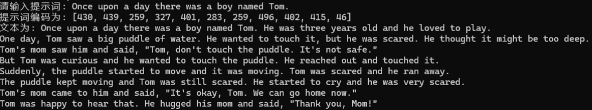

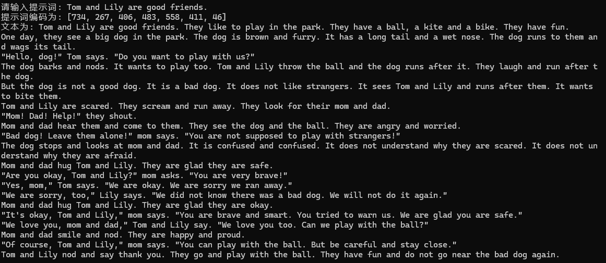

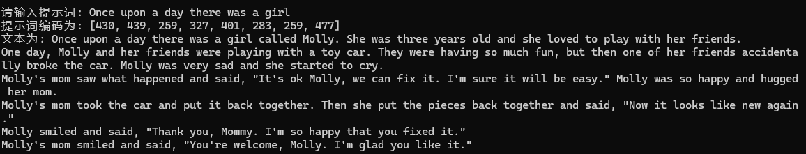
