# 相机与相机参数

## 投影矩阵

相机是由传感器和透镜构成的。

在齐次坐标下，由世界坐标到照片坐标，要经过这样几个线性变换——

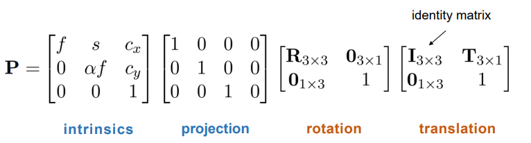

其中，对于一般的相机，$\alpha=1,s=0$。

先进行平移变换和旋转变换，将世界坐标系转换成相机坐标系。然后从相机坐标到照片坐标，需要进行透视投影变换操作。

下面我们来解释一下前面两个蓝色字体的矩阵代表着什么意思。我们以下面的透视模型为例。相机是O，相片是AB。在相片中，我们以O'为原点建立坐标系，坐标系的xy坐标与相机坐标的xy坐标平齐。下面是xz截面，可以看到相机坐标的$(x,y,z)$被映射成为相片坐标$(f\frac{x}{z},f\frac{y}{z})$。这等价于将齐次坐标下的点$(x,y,z,w)$映射成为$(fx,fy,z)$。

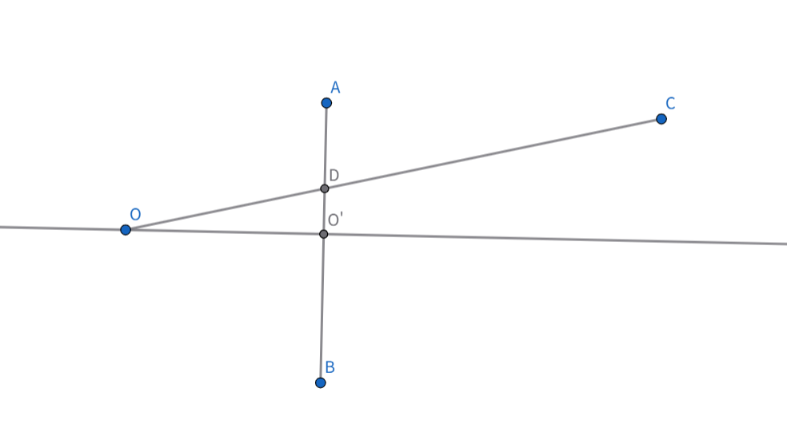

当然，照片坐标中可以以任意原点建立坐标系，这个原点不一定是相机在照片上的垂直投影。所以我们还需要加上一个$(c_x,c_y)$的平移项。注意如果写成上面公式的样子的话，这个平移是以相机坐标为单位的。

总结来说，从世界坐标到相机坐标，就是乘以一个$3\times4$投影矩阵P。

## Vanishing line 与 Vanishing Point

现实世界中的一组平行线，映射到照片中会交于同一点，称为这组平行线的**Vanishing Point**。

对于现实世界中**同时平行于某个平面(一般选择地面)**的不同组平行线，产生若干个不同的Vanishing Point。这些Vanishing Point共线。这条线称为**Vanishing Line**.

我们采用立体几何的方法来证明这个结论。

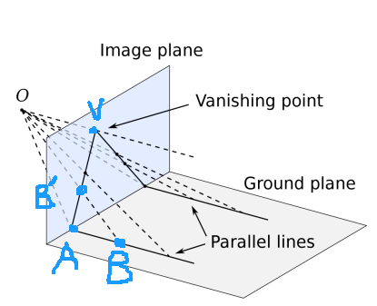

如图。有两条平行线$l_1,l_2$。O是相机，我们过O作它们的平行线，交照片平面于V。考察$l_1$与照片的交点A，$l_1$上的任一点$B$被映射到照片上的$B'$。则考察平面OVAB，显然有AB'V共线。故得到结论：$l_1$在照片上的投影经过V。

同理$l_2$在照片上的投影经过V。则V为**Vanishing Point**。

经过上面的证明，我们也知道了构造Vanishing Point的方法：过相机作平行线交照片即可。

根据上面的构造Vanishing Point的方法，我们也不难证明Vanishing Line的结论。事实上，考察过O作地平线的平行面，与照片交于线$l$，则V在$l$上，可得l为Vanishing Line。

通过Vanishing line 与 Vanishing Point，我们可以求相机参数，具体见作业题。

关于作业题，这里再说一嘴。之前遇到过有同学问我为什么使用例如路灯与房子的竖直线这组平行线不能作为Vanish Line的查找，看了上面的证明，相信大家已经有结论——这组平行线不平行于地平面。

## 对焦,DOF(Depth of Field)和FOV(Field of View)

初中我们学过对焦公式$\frac{1}{f}=\frac{1}{z}+\frac{1}{z'}$。

$z'$是透镜与照片之间的距离，这个距离是摄影师手动调节的。有了$z'$，就有了对应的z，这个z的意义是在现实世界中最清晰的点所对应的距离。在深度为z附近的一个区间内，物体在照片上可以认为是清晰的。DOF描述的就是这个区间的长度。如图所示。

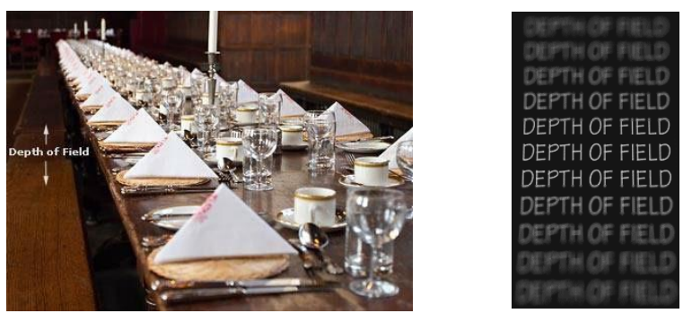

大光圈增大透光量的，但它会让DOF更小。原理图如下。

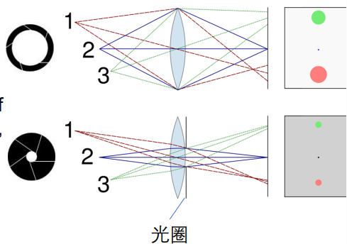

**FOV**是说照片能够观察到世界的角度有多大。这取决于胶片的长度和$z'$的值。若FOV为$\alpha$，则有公式$tan(\frac{\alpha}{2})=\frac{d}{2z'}$。我们作业中做的柯克变焦，就是保证近景在照片中的大小不变，但是增大FOV，以实现某些电影艺术效果。

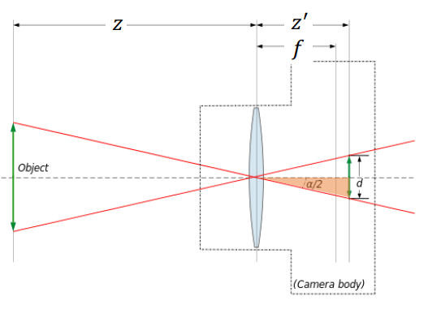

在照片边缘的物体会出现**畸变现象**。

# 图像处理

## Image Filtering(卷积)

数学上的卷积要反转一下卷积核。我们平常做的一般其实是Correlation操作。

常见的模糊滤波：有高斯滤波，均匀滤波等。这些滤波器能减少噪点，使图像模糊。

## 图像上采样与下采样

### 高斯金字塔

我们在需要对图像进行缩小时，如果直接对图片像素进行抽样，会产生严重的走样现象。比较好的方式是维护一个长和宽逐次减半的图像金字塔(这就是**高斯金字塔**)。每次先进行高斯模糊，滤去高频细节信息，再进行下采样。这样得到结果会好很多。

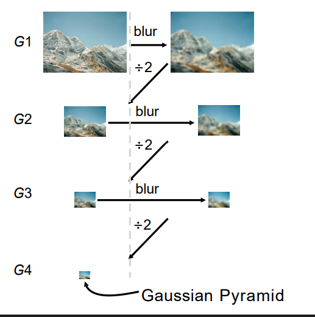

### 拉普拉斯金字塔

得到高斯金字塔之后，我们还可以计算拉普拉斯金字塔。拉普拉斯金字塔的计算方法为$L_i = G_i - Up(G_{i+1})$，如图所示。

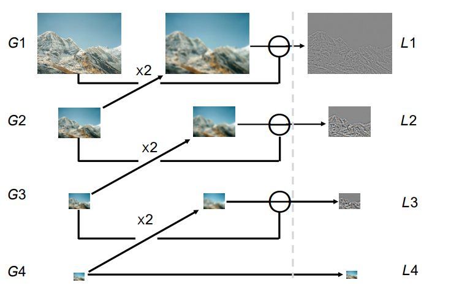

拉普拉斯金字塔中存储的是各级图片的拉普拉斯结果。

直观地来说，这是因为低层图片上采样后，某种程度上是原图片滤去了高频细节之后的样子。再用原图片减去这张图片，得到的就是原图片的高频细节，即边界信息。

还是直观理解，但是稍微引入一点点数学。我们可以认为层图片上采样后近似于原图片过了一个高斯滤波之后的结果(见上面高斯金字塔的构建方式)。我们简单地认为高斯滤波使用的是这样一个滤波器——
$$
\frac{1}{16}\begin{bmatrix}
1 & 2 & 1 \\
2 & 4 & 2 \\
1 & 2 & 1 \\
\end{bmatrix}
$$
那么使用原图片减过了这样一个滤波器后的图片，就相当于原图片过了这么一个滤波器——
$$
\frac{1}{16}\begin{bmatrix}
-1 & -2 & -1 \\
-2 & 12 & -2 \\
-1 & -2 & -1 \\
\end{bmatrix}
$$
这其实是某种拉普拉斯滤波器。

至于更加严谨的推导，可以参看PPT中的推导，使用Difference of Gaussian(DOG)和Laplacian of Gaussian(LOG)的某种近似关系来证明。

另一方面，如果我们要对图片进行放大的话，如果我们简单地用单个像素重复的话，也会形成很严重的走样现象。我们可以引入插值的方法。插值函数可以使用线性插值，三次函数插值等等方法。

# 特征检测与图像拼接

对于图像拼接任务，我们首先需要对每张图片提取一些图像的特征。然后基于提取出来的特征，我们去作特征匹配，得到若干个匹配点。然后基于这些匹配点来计算得到一个变换矩阵，然后就能将两张图片拼接在一起。

对于特征检测，我们主要介绍**Blob检测**和**SIFT Feature**两种检测方式。

## Blob Dectetion

### Edge Detection

所谓图像中的**边**，可以理解为图像上导数值特别大的位置。如图所示，在橙色线上的图像函数的导数有两个峰，这两个峰对应的就是原图中的两条黑白交接边所在的位置。

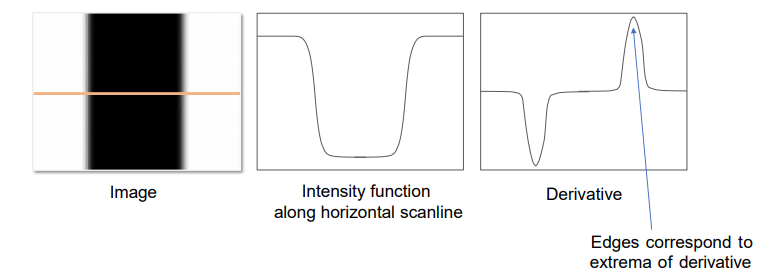

我们可使用Sobel滤波器来求导数。Sobel滤波器的形式是：
$$
\begin{bmatrix}
-1 & 0 & 1 \\
-2 & 0 & 2 \\
-1 & 0 & 1 \\
\end{bmatrix},
\begin{bmatrix}
1 & 2 & 1 \\
0 & 0 & 0 \\
-1 & -2 & -1 \\
\end{bmatrix}
$$
这两个滤波器分别求解图片在某点处x，y方向的导数值。总导数值就是这两个导数值的平方和开根号。

当然，作边检测的时候，结果很容易受到噪点的影响(因为噪点附近处处都是导数值大的像素)。所以我们可以先对图片进行高斯滤波，再过Sobel滤波器。但是高斯滤波本身也会对边产生模糊效果。所以这也是一种Trade off.

最终我们输出的其实是一张0-1图。表示每个像素是/不是边。这其实挺不好做的，因为你很难找到一个合适的Threshold。有许多人提出了比较好的算法流程。

下面来介绍Canny Edge Detector的工作流程：

1. 对图像进行灰度化和高斯滤波。

2. 对图像上的每个点，应用Sobel滤波器计算导数值。

3. **Non-Maximum Suppression**(非最大抑制)。这一步的目的是为了让边尽量细，不要太粗，所以我们只去保留每条边中导数值最大的点。如图所示，在蓝色线上我们只去保留一个亮像素。

   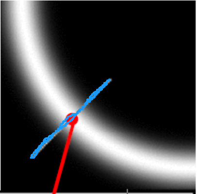

   具体的做法是：对于每个点，沿着它的梯度方向寻找两个相邻点。如果这个点的导数值不比这两个相邻点的导数值都大，则舍弃这个点。如下图所示，保留q当且仅当导数值：$q>p,q>r$。对于p,r的导数值，可以通过插值计算。

   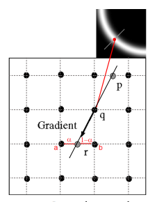

4. **Double threshold and Edge Tracking.**定义两个Threshold$T_1>T_2$。例如$T_1=0.7$,$T_2=0.3$。导数值大于$T_1$的，认为是**强边点**，导数值处于二者之间的，认为是**弱边点**。
5. 保留所有强边点，弱边点能被保留当且仅当它能够通过弱边点连接到强边点。

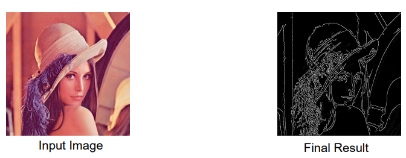

最终效果如上。

### Corner Detection

角点检测。可以这样建模平坦区域，边点和角点的区别——如图所示，考察一个以当前点为中心，可移动的正方形。

+ 如果当前点为平坦区域，则无论这个正方形如何移动，正方形内的颜色都不会有太大变化。
+ 如果当前点为边区域，则往垂直于边的方向移动，正方形内的颜色变化很大；往平行于边的方向移动，正方形内颜色变化很小。
+ 如果当前点为角点，则无论往哪个方向移动，正方形内的颜色变化都会很大。

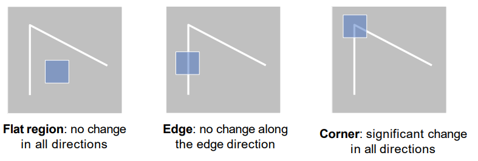

我们来数学化这个思路。用I表示颜色，S表示正方形，$E(u,v)$来表示当前正方形移动$(u,v)$后，颜色的变化量。定义正方形内颜色的变化值为对应像素颜色差的加权平方和，权重用W表示。则
$$
E(u,v)=\Sigma_{(x,y)\in S}W(x,y)(I(x+u,y+v)-I(x,y))^2
$$
再引入一个线性假设，假设$I(x+u,y+v)=I(x,y)+I_x(x,y)u+I_y(x,y)v)$。这里$I_x,I_y$分别是在x,y方向上的导数。

于是通过公式变形，得到：
$$
E(u,v)=\Sigma_{(x,y)\in S}W(x,y)(I_x(x,y)u+I_y(x,y)v)^2=(u,v)M(u,v)^T
$$
其中，
$$
M=\begin{bmatrix}
\Sigma_{(x,y)\in S}WI_x^2 & \Sigma_{(x,y)\in S}WI_xI_y \\
\Sigma_{(x,y)\in S}WI_xI_y & \Sigma_{(x,y)\in S}WI_y^2 \\
\end{bmatrix}
$$
我们根据上面所说的，需要判断这个算式的情况，究竟是下面中的哪一种？

1. 无论怎么取$(u,v)$，E都很小。
2. 在特定方向上取$(u,v)$，E很小，在另一个方向上取$(u,v)$，E很大。
3. 无论怎么取$(u,v)$，E都很大。

这其实等价于考察M的特征值的大小。若M的两个特征值：都很小/一大一小/都很大，就对应着上面的三种情况。

这即是角点检测的方法。

总结一下步骤——拿到一张图片，确定一个正方形窗口S，然后对每个像素点计算M矩阵，取M矩阵两个特征值均较大的点作为检测出的角点。

### Blob Detection

## SIFT feature

## Image Stitching

