# 3D视觉

3D视觉的任务是从图片中重建3D场景。这本质是一个从低维度到高维度的问题，照片上的一个点对应世界中的多个点(Single-view Ambiguity，单视图歧义)。解决这种问题的方法有光照投影，多目立体视觉等。

## 对极几何(Epipolar Geometry)

对极几何是两张照片中形成的一些几何性质。

考虑两张照片，它们分别由在$O$和$O'$处的相机拍摄而成。如图所示。

设$OO'$交两张照片于$e,e'$。过$OO'$的连线任意作一个平面交两张照片于$l,l'$，这两条照片上的线成为极线。

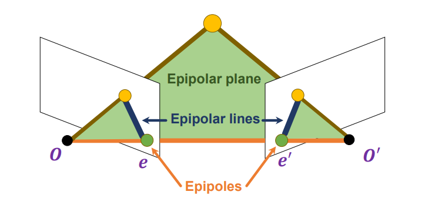

极线的性质：若点X在照片O上的投影点出现在$l$上，则X在O’上的投影点一定会出现在$l'$上。

这其实给了我们一种方式，在寻找对应点前，我们只需要在极线上寻找就可以了。

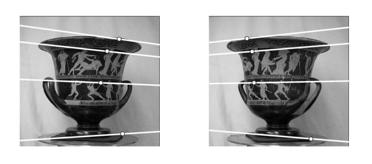

对极几何有一种特殊形式，即两张照片是平行的，且它们还平行于$OO'$的连线。这种情形下$e,e'$是无穷远点，极线就是过对应点作$OO'$的平行线。

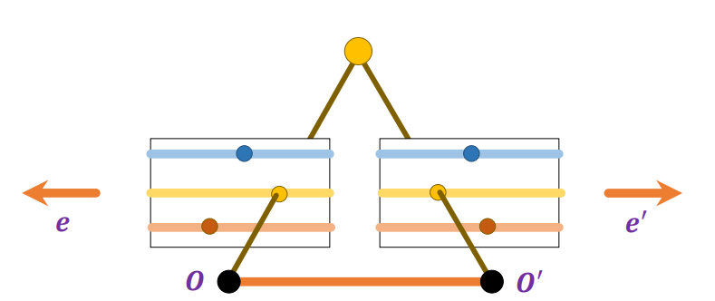

## Essential Matrix 与 Fundamental Matrix

我们想要用数学形式描述好极线的限制。

我们建立世界系。还是两张照片，为了简单，世界系与O点的相机坐标系重合。于是对于世界系中齐次坐标点X就有：
$$
x_{pixel} \cong K[I,0]X\\
x'_{pixel} \cong K'[R,t]X
$$
我们定义：
$$
x=K^{-1}x_{pixel} \cong [I,0]X\\
x'=K'^{-1}x'_{pixel} \cong [R,t]X
$$
于是有：
$$
x'\cong Rx+t
$$
即$x',Rx,t$线性相关。这可以用这样的形式表示：
$$
x'\cdot(t\times(Rx))=0
$$
把$t_{\times}$写成一个矩阵，则有：
$$
x'^T[t_{\times}]Rx=0
$$
令$E=[t_{\times}]R$，则E称为Essential Matrix。有$x'^TEx=0$。

Essential Matrix描述了**normalized image coordinates** x与x'之间的关系。

如果我们想要直接地描述像素点之间的关系，我们可以把它们的表达式代入。得到：
$$
x'_{pixel}(K'^{-1})^TEK^{-1}x_{pixel}=0
$$
令$F=(K'^{-1})^TEK^{-1}$，即$x'_{pixel}Fx_{pixel}=0$。

下面我们来考虑E和F的自由度数。

$E=[t_{\times}]R$由旋转和平移方式唯一确定，且E还有缩放不变性。旋转和平移各有3个自由度，而缩放不变性减了一个自由度，故E的总自由度为5。

$F=(K'^{-1})^TEK^{-1}$，其秩为2，所以丢失了一个自由度，然后又由放缩不变性，所以F的总自由度为7。

计算F的方式还是和前面基本一样。将限制化成线性方程，然后采用最小特征值对应的特征向量的方式来求解F。

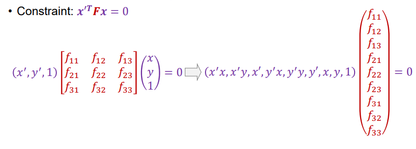

注意：这样求解出来的F不一定保证秩为2的限制。我们可以使用矩阵奇异值分解来进行处理。将解出来的F通过奇异值分解得到$F=U\Sigma V^T$，这里$\Sigma$是F的奇异值组成的对角矩阵。然后我们手动将最小的奇异值设置成0，就可以保证秩为2的限制。

在实际操作过程中，我们会发现系数矩阵中元素的大小差异很大。如果x,y的量级是$10^3$，那么系数就会有下面这样的量级。

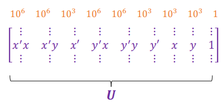

于是在实际操作中，我们会对相片坐标作坐标变换，将原点设置在所有匹配点的中心，缩放坐标使得原点到所有匹配点之间的平均距离为2。

## 双目立体视觉

双目立体视觉的任务是从两张照片之中得到世界场景的深度图。像人的眼睛就是一个双目立体视觉的例子，眼睛看到的是两张图片，由大脑处理成为具有深度信息的3D世界。

### 从匹配点到深度图

我们考虑一个简单的双目立体视觉的例子。在这个例子中，两张照片是平行的，两个相机之间只进行了一个x方向上的平移。如图所示。

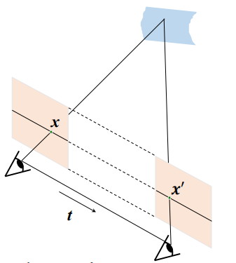

在这个例子中，y相同的线就是两张照片之中对应的极线。

我们的要做的事情是对于第一张照片中的每个点P，在第二张照片的极线上寻找对应的最佳匹配点P'。然后根据P与P'之间的距离，解出深度信息。如图所示，由相似可得：
$$
\frac{OO'}{OO'-PP'}=\frac{z}{f}
$$
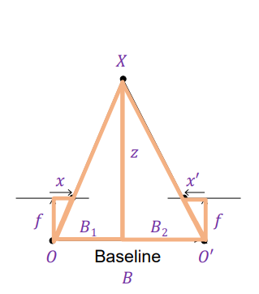

图中用x和x'来表示与相机系中的原点对应的x方向距离。由推导可知深度z与$x-x'$成反比，比例系数为$fB$。

### 寻找匹配点——暴力方法

我们解决了找到匹配点后如何得到深度的问题。接下来我们来看看如何寻找匹配点。

最简单的方式是对于每个点考察对应极线上的所有点，一一比较(对于以点为中心的一个窗口，使用SSD距离什么之类的)并寻找最优匹配。这种方式低效，但是有效。有几个点需要注意：

1. 窗口大小如何选择？小的窗口会引入很多噪声，大的窗口会消灭很多细节信息。
2. 如果有些点在标准图片中存在，而在参考图片中对应的点不存在(如被遮挡)怎么办？会导致不匹配。
3. 如果图片中有重复的相同纹样，则会很容易导致误匹配。

### 寻找匹配点——基于动态规划的全局优化方法

我们引入三个**不一定正确**的假设。

1. 一张图片中的一个点在另一张图片中最多有一个匹配点。
2. 匹配点在极线上都是按照顺序分布的。
3. 两张图片的匹配点之间的距离不会太大。

这样的话，我们就可以将匹配问题转换成一个动态规划问题。我们寻找两条相互对应的极线，将上面的点按顺序排列，假设都是0到N。对于每两个点之间的匹配，我们定义一个匹配代价函数$Cost(i,j)$。如果单个点出现不匹配，则我们认为代价为一个常数值C。

我们需要找到一种匹配方式最小化总匹配代价。

记$dp[i][j]$为：对于第一条极线上的0-i与第二条极线上的0-j点进行匹配的最小代价。

则可以写出状态转移方程：
$$
dp[i][j]=max(dp[i-1][j-1] + Cost(i,j) , dp[i-1][j] + C , dp[i][j-1] + C)
$$
得到最终的$dp[N][N]$，并回溯即可。

如果我们认为两张图片的匹配点之间的距离不会太大，那么我们就只需要对$|i-j|<M$的$i,j$进行计算了。

## Structure from Motion

**Structure from Motion的输入是许多从不同相机拍摄而来的图片，输出一方面是是相机参数，一方面是3D结构。**为了简单，我们考虑对仿射相机作SFM问题。

### 仿射相机

仿射相机是对一般相机的一种简单化。记得我们在相机投影矩阵的推导中说到，相机坐标的$(x,y,z)$被映射为相片坐标中的$(f\frac{x}{z},f\frac{y}{z})$，然后再去进行平移和旋转。所谓仿射相机，就是我们认为在图片中是直接把z丢弃，然后再在相机坐标系中进行一组线性变换。

对于仿射相机而言，相机矩阵P的形式如下：

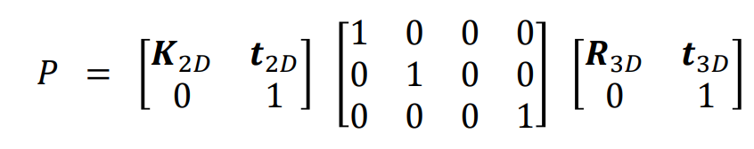

其中最右边的一个矩阵表示在三维空间中的旋转与平移；中间的矩阵表示丢弃z坐标的投影矩阵；左边的矩阵表示在二维空间中的缩放与平移变换。

其中$K_{2D}=\begin{bmatrix}s & 0\\0 & s\end{bmatrix}$表示一个缩放变换。$t_{2D}$表示一个平移变换。

可以把P写成下面的形式：

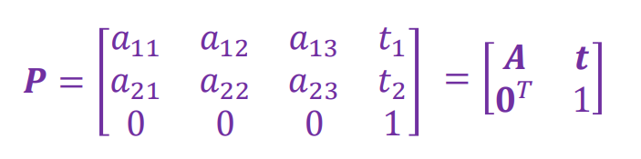

在非齐次坐标下：

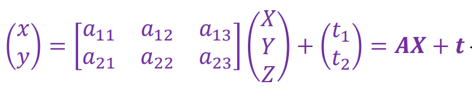

### 仿射相机的SFM求解

暂时先忽略可见性的问题。我们把问题建模成n个相同的3D点出现在m张图片中，即方程组：
$$
x_{ij}\cong P_iX_j(i = 1,2,...m; j = 1,2,...n)
$$
你会发现，对于可逆矩阵$Q_{4\times 4}=\begin{bmatrix}
Q & T \\
0 & 1\\
\end{bmatrix}$,如果我们让所有的$P_i$变成$P_iQ$，让$X_j$变成$Q^{-1}X_j$，方程依然是成立的。

方程数目为2mn个：每个$x_{ij}$的x,y坐标各提供一个方程。

变量数为$3n+8m$个。每个3D点贡献3个变量，每个相机的P矩阵贡献8个变量。

因为Q的任意性，所以将问题的自由度减少了12。总之，我们需要$2mn\ge8m+3n-12$，这样的方程组才能有某种程度上的唯一解。

接下来我们来求解这个方程组。

首先我们将问题转成非齐次坐标的形式。即
$$
x_{ij}=A_iX_j+t_i
$$
然后，我们定义
$$
\hat{X}_i=X_i-\frac{1}{n}\Sigma X_k\\
\hat{x}_{ij}=x_{ij}-\frac{1}{n}\Sigma x_{ik}=A_i(X_j-\frac{1}{n}\Sigma X_k)=A_i\hat{X}_j
$$

这相当于是把x和X均进行了归一化操作。然后我们的方程就变成了比较美丽的形式：
$$
\hat{x}_{ij}=A_i\hat{X}_j
$$
这样，我们可以把所有的方程统一写成一种矩阵乘的形式：

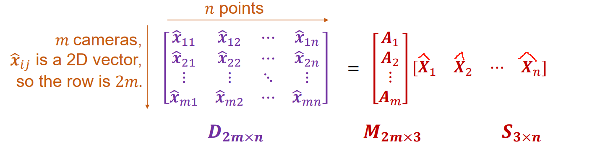

现在是给定D，要求M和S。这个问题可以通过奇异值分解来解决。设D的奇异值分解结果为$D=U\Sigma V^T$，由于噪音等因素，$\Sigma$可能不止有三个非零元，但是我们只保留D的前三大的奇异值。得到：$D\approx U\Sigma_{3\times3}V^T$。

这就基本上解出了M和S。但是有个小问题是$\Sigma$矩阵如何分派到两边。其实这里可以任意让。这其实对应了上面所说的Q的任意性。在实际中，论文提出令$M=U\Sigma^{\frac{1}{2}},S=\Sigma^{\frac{1}{2}}V^T$。

>解出$\hat{X}$之后怎么回到原来的X呢？这其实也有个小问题，在PPT中并没有涉及。其实如果你让所有的$X_j$变成$X_j-\alpha$，$t_i$变成$t_i+A_i\alpha$，原方程也是依然成立的……
>
>所以可以不妨设$X_i$的中心就是0，即$X_i=\hat{X}_i$。

接下来我们来消除歧义性。

使用的条件是：$A_i=\begin{bmatrix}a_1\\a_2\end{bmatrix}$矩阵应该是单位正交的(在相机参数中进行展开可得)。即$||a_1||=||a_2||=1$，$a_1\cdot a_2=0$。

我们需要找到矩阵$Q_{3\times3}$，让所有的$A_i$变成$A_iQ$，让$X_j$变成$Q^{-1}X_j$，然后使得
$$
(A_iQ)(A_iQ)^T=I_{2\times 2}
$$
令$N=QQ^T$，用方程组$A_iNA_i^T=I$解出N，然后进行Cholesky分解，把N分解成$QQ^T$。这样就能找到对应的Q。

### 数据信息的使用方式——Incremental Structure from Motion

我们到目前为止都是假设所有点在所有相片中都可见。但是在实际问题中这显然不现实。于是我们使用增量SFM的方式动态处理这些数据。

基本的思想是先找n个点和m张照片，使得n个点在m张照片中都有出现。如上所示解出n个点的世界坐标和m张照片的相机参数。然后每次可以加入一张新照片或加入一个新点。

+ 加入一个照片要求这张照片中至少出现了3个已知的世界点。可以通过解方程来解出相机的参数。
+ 加入一个世界点要求这个点至少在2张已知的照片中出现了。可以通过三角化来解出这个点的坐标。

实际操作中，每次会挑选具有最多匹配点的照片，在所有匹配点上运行RANSAC方法来计算相机参数，然后查找这张照片和别的照片进行匹配，看有没有匹配出新的特征点。如果有，就使用三角化计算出新的特征点的坐标。
