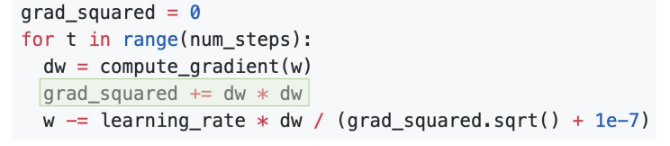
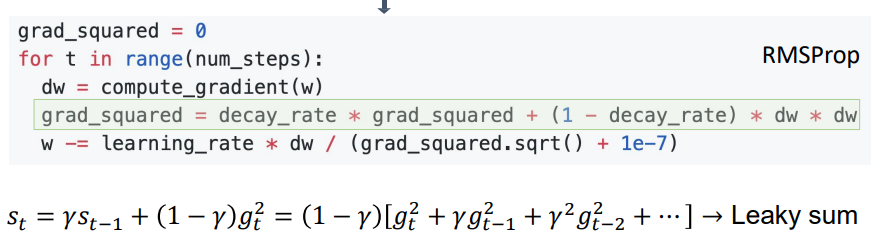

# 线性分类器

线性分类器学习训练矩阵$W$，对于数据$X$与标签$y$，最小化$||y-XW||^2$。这样的$W$的最小二乘解是$W=(X^TX)^{-1}X^Ty$。

有时候我们会引入正则化项，将Loss额外加一项$\lambda||W||^2$来惩罚过于复杂的模型。如果引入了这一项，那么$W$的最小二乘解是$W=(X^TX+\lambda I)^{-1}X^Ty$。

将多个线性层组合起来，中间加入激活函数，就可以得到多层全连接分类器(FCNN)。

此外，Loss Function我们也不再使用平方和，而是更经常采用交叉熵损失(Cross Entropy Loss)或支持向量机损失(SVM Loss)。

在较早期的研究中，一般范式是先使用启发式的特征提取(比如HoG等)，然后再使用线性分类器作图像分类任务。如果维度过高，会使用PCA的方法将主成分进行提取。

## 交叉熵损失

交叉熵损失对分类结果使用多维softmax来得到概率信息，用概率的乘积作为评估标准。在实践中会采用负对数来描述乘积。

对于单个图片$x_i$，经过分类器后得到分类结果$s$，$s$有M维，M为类数。若$x_i$实际属于第$y_i$维，则Loss为：
$$
L_i=-log(p_{y_i})\\
\text{其中，}p_k=\frac{exp(s_k)}{\sum exp(x_j)}
$$

## SVM损失

SVM损失认为正确的类别的分数至少需要比其余分数高某个𝑀𝑎𝑟𝑔𝑖𝑛值。令$t$为𝑀𝑎𝑟𝑔𝑖𝑛值，则Loss为：
$$
L_i=\sum_{j\ne y_i}max(0,s_j-s_{y_i}+t)
$$

# 神经网络

反向传播和梯度下降这一块大家肯定都知道了。与这一套对比下来，课件上说的什么网格搜索简直是笑话（

## 学习率动态衰减

下面我们主要来考虑一下学习率调整的问题。一般我们在训练开始时会采取较高的学习率，在后期时会采取较低的学习率。这涉及到学习率下降的问题。

我们在作业中使用两种学习率下降模式：Step和Cosine。

+ Step下降模式是每训练k个epochs，将学习率乘以系数$\alpha$。
+ Cosine下降模式是将epoch数均匀对应到角度区间$(0,\frac{\pi}{2})$，每个epochs的学习率为初始学习率乘以对应的余弦值。

## 反向传播——动量优化

关于反向传播部分：梯度的计算我们不需要太去关心，现在的python库早就能够做到自动进行梯度计算了。我们在意的问题是全批次进行梯度计算会导致过大的计算量。于是我们常见地会引入随机梯度下降(SGD)的方法。每次选择一个**Batch**的数据进行学习，在这个Batch上进行梯度下降。

这种方法很常见，但是有几个问题需要被优化：

+ 小Batch数据可能没有办法激活所有的神经元。如果它只激活部分神经元，就会出现部分神经元被频繁更新，部分神经元Seldom被更新的现象。下面是一个示意图，纵方向的神经元被频繁更新，造成波动，但是横方向的神经元每次只被少量更新。

  

+ 数据集少可能会放大噪音影响，导致无效优化甚至反向优化。
+ 可能会被局部最优困住。这一点也是梯度下降法的经典问题。

为了解决这些问题，我们引入**动量(Momentum)**的概念。如果每次计算出来的梯度是$h_t$，那么更新时候，更新值$v_t$为:
$$
v_t=\alpha_t(h_t+\rho h_{t-1}+\rho^2 h_{t-2}+...\rho^th_0)
$$
其中$\rho$是一个表示衰减比例的系数,$\alpha_t$为学习率。

这样的做法本质上是让以往的训练历史对当前的训练有影响力。让我们来看看它是怎么解决上面的问题的：

首先，对于波动的问题：如果有参数的梯度产生波动情况的话，历史上的正负梯度会相互抵消，导致最终结果没有太大的更新值。然后对于一些神经元每次只被少量更新的问题，它每次的更新值都是朝着同样的方向走的，所以历史上的梯度累计会让它更新的程度更大。引入梯度后，训练情况示意图如下所示。

其次，动量也能引入历史平均以减少噪声影响。它也让训练参数能有一定的"初速度"以冲出局部鞍点。

还有一种动量实现方式是**Nesterov Momentum**。这种实现和上面的实现区别在于当前梯度在哪里计算。Nesterov Momentum在每步先使用动量更新之后，在更新后的点计算梯度的方式。

## 动态学习优化器(Ada系列)

我们在上面讨论了整体学习率优化的方法，但是这种方式没有做到最好：依照我们上述所说，SGD的方法会导致有些神经元被多次激活，有些神经元很少被激活。理论上来说，我们最好能够对前者设置较小的学习率，后者设置较大的学习率。

**AdaGrad**引入了这一设计思想，它采用逐参数的学习率设置。基本的实现是这样的：每次训练时，会将梯度的(逐元素)平方记录下来，并加到一个总矩阵`grad_squared`中。

将这个总矩阵作为权重，指导训练时的逐元素学习率。

另一种动态调试器叫**RMSProp**，是每次在`grad_squared`矩阵中加的时候，会加上一些权重。这个权重和动量的思想差不多。如下所示：

融合起RMSProp和前面讲到的动量更新，我们就得到了下面的**Adam**优化器。Adam就是动态优化(Ada)与动量(m)的结合。红色框圈起来的部分是动量方法，蓝色框是RMSProp方法，黄色框圈起来的是将权重归一化。

此外，我们还希望在训练过程中引入L2正则化以惩罚复杂的模型。假设正则化权重为$\lambda$，即对应的$Loss=\lambda||w||^2$，它的梯度是$2\lambda w$。即我们需要在最后的w的更改量中再减去一个$2\lambda w$。

这就是我们现在最常用的**AdamW**优化器。它是Adam加上Weight Decay。

值得注意的是前面介绍的Ada优化器，你都需要存储一个与参数相同大小的权重矩阵。Adam和AdamW更进一步，除了要存权重矩阵，还要存动量矩矩阵。这在训练中，直接让整个模型的大小翻了一倍甚至两倍。这其实很浪费。于是近年有研究者提出了**Muon**优化器，其中提出了用低量参数近似参数权重矩阵的方式，这里就不展开了。

# 卷积神经网络

## 基本框架

卷积神经网络中最基本层包括：卷积层，Pooling层，激活函数层和线性层。

我们简单过一下卷积层和Pooling层。

卷积层的Input Size是$N \times C_{in} \times H \times W$，卷积核的大小为$C_{out} \times C_{in} \times h \times w$，卷积后的Output Size为：$N \times C_{out} \times H \times W$。

Pooling层只会改变H和W。一般来说，步长设置为2，在每个$2\times2$的块中进行MaxPool或者MeanPool。这将整张图片的H和W各减半。

一般而言，卷积神经网络会采取减图片W,H每次减半，通道数每次加倍的设计。

过了这些卷积层后，得到的最终特征会被展平成线性，然后过线性分类器。

## 数据处理

首先我们要把数据处理成适合过神经网络的形式。我们的激活函数一般都是去处理0附近的数的，所以对于常见的0-255整数范围的图像像素值，并不适合作为神经网络的输入。

所以我们会对数据进行归一化。在图像中，这个叫做**白化**。白化对每个通道独立进行，它将图像的均值设置成0，协方差矩阵设成单位矩阵$I$。

然后我们可能希望模型有更强的鲁棒性。我们可以对数据进行随机加强的操作。例如裁剪，颜色变换，模糊化，打马赛克等等。

## Droppout层

我们希望让网络减少对特定神经元的过度依赖以导致过拟合。于是我们可以在训练时特定的时候加入Droppout层，强行设置某些参数为0。在测试的时候会取消Droppout，获得更可靠的结果。

注意Droppout会导致后续值期望改变。所以在训练时如果引入了Droppout，需要额外乘一个缩放权重。

## 残差项

历史上人们发现深层的神经网络效果并没有浅层好。

但是有人做了一个思想实验：如果把深层的部分，矩阵参数全部设置成单位阵，那么它和浅层的神经网络是没有区别的。这也就是说，深层的神经网络至少不会差于浅层。之所以它的能力不行，是因为它梯度消失或者梯度爆炸，导致它甚至连单位矩阵都学不到。

一个简单的方法就是我们把它的初始值就设置为单位矩阵。换句话说，对于每个层，我们给层的输出硬性加上一个输入。那么模型学的就是**残差**。这也就是残差神经网络的基本思想。

作业中实现的ResNet和ResNext是两种常见的残差卷积神经网络形式。主要注意点如下：

+ 如果对于一个Block，它的输入channel和输出channel数不等或者输入输出图像大小不同的话，我们会给层的输出加上一个变化后的输入。进行变化的方式就是过一个1*1卷积。
+ 

## 初始化

## Batch Normalization

//TODO: 基本架构，卷积层，Pooling层，残差神经网络的思想，数据归一化与强化方式，Dropout处理，参数初始化方式，层归一化，ResNet与ResNext的参数量区别

