# FNLP期中复习

PPT很乱，所有的东西没有太强的逻辑性。我尽量把其中的知识逻辑以我自己的理解梳理清楚，此外，保证顺序尽量按照课程PPT顺序。

这张当页首图。FNLP Belike：

## 概论

语言包含四种结构：

+ morphology —— 词的形态结构
+ syntax —— 句子的语法结构
+ lexical semantics —— 词的语义结构
+ compositional semantics —— 句子的语义结构

常见的输入有speech或者句子。

任务难点在于自然语言的多义性、多样性。

常见的处理方法有：统计模型，机器学习模型与神经网络。

对于每个子任务，我注意到PPT上基本会介绍一套统计学方法和一套神经网络方法。我也尽量按照这个逻辑来对我的笔记进行分块。

## Word Sense Disambiguation 词义消歧任务

任务：给出一个多义词以及其所处的上下文，决定这个词在句子中取什么含义。

+ 模型应该提前知道目标词所有可能的意义(a sense Inventory)，像是字典给出的。
+ 模型可能可以获取一些标注好wsd的语言数据作为训练数据。

任务方法：

1. 监督学习：通过大量有标注数据，抽取出特征，然后训练模型去学习每个单词的每个label的表征含义。
2. 半监督学习：通过少量数据作为种子，训练一个分类器。然后在无标注数据中选取分类置信度最高的结果，作为训练语料加入训练集，循环若干次。优点是能够获得更大规模的训练数据，但是缺点是会放大前期错误。
3. 无监督学习：通过所有无标注数据，抽取出特征，然后作聚类。但是缺点是聚类结果需要和意义标签对齐。

特征抽取：可以抽取邻近词(作为无序集合或者有序序列)，目标此或邻近词语词性标签(POS tags)，词汇向量表征参数等作为特征。

### 举例：朴素贝叶斯模型

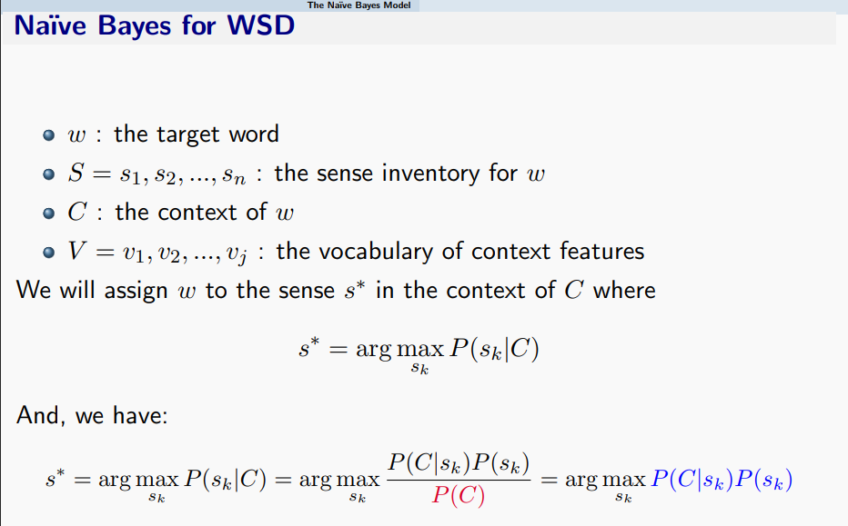

其中$P(s_k)$好计算，同时我们引入独立性假设，认为会有：

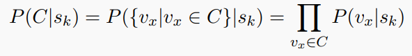

这样我们就会有基于统计数据的概率估计。

对于分类模型的评估方式，有一些十分无聊的名词，这里也很不情愿地做一下解释。假设分类结果如下：

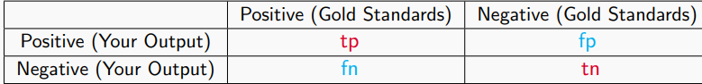

那么分类准确率就是准确分类的数目占比。即：
$$
Acc=\frac{tp+tn}{fp+fn+tp+tn}
$$
还有下面两个指标：

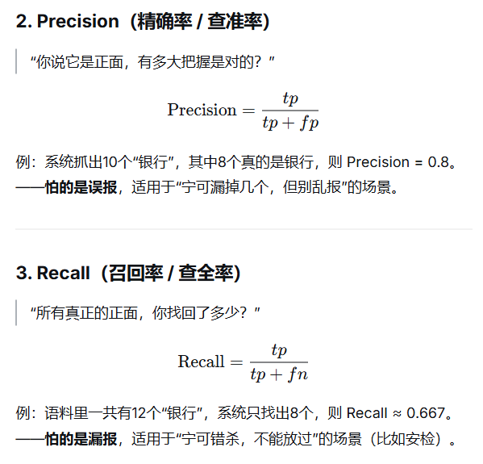

以及基于这两个指标的一些加权计算：

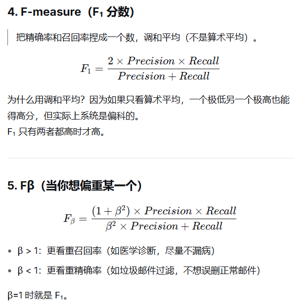

同时，还有一些其它的模型。例如

+ MFS(Most Frequent Sense):无脑选择出现最频繁的语义。
+ Lesk：计算词典例句(或所有标注句)与给出句子的上下文词语重叠程度，选择重叠程度最高的语义。

这是一些很简单的具体任务例子。

## 特征编码

下面我们具体来讨论一下如何进行特征编码。PPT上有一些神人话，用神人的东西去神人地举例特征是什么，这里我们不去管它。我们来具体解释一下对于**文档**的**词袋模型**编码：

我们认为一个词t在文档d中的重要性程度，可以由TF-IDF的方式来衡量。

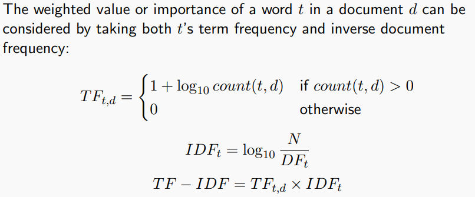

其中：$N$为文档集的总数，$DF_t$是t出现在几篇文档之中。这个公式的意思是，放大文档内高频词的重要性，但是对普遍出现的常见词作权重降低。这样，我们就对文档集中的每个文档d，有了一个词袋表示，每个字典中的词，对应一个向量的维度坐标。

有了向量空间的特征表示之后，我们就可以训练神经网络模型来进行文档分类。这里常见的任务场景对句子(在这里就是一个文档)的情感分类等。

## 线性分类器

我们从最简单的神经网络模型：线性分类器开始讲起。PPT上讲述了一种比较一般性的线性分类器模型如下：

它定义一个函数$f$，对于每个类别$y_i$，提取出了一个$f(x,y_i)$表示$x$在类别$y_i$中的特征向量。然后我们只去训练一个参数向量$\lambda$，$x$在类别$y$处的得分，定义为$\lambda f(x,y)$，然后去用$softmax$归一化之后去作交叉熵损失。这是常见的多元逻辑回归(训练权重矩阵$M$，给定文档特征为$x$，计算$y=Mx$。将y过softmax之后，计算交叉熵损失)的一种一般化。特别地，取$\lambda=\mathbf{1}$，并令$f(x,y_i)$为$Mx$的第$i$个分量，就变成了多元逻辑回归。

但是值得注意的是，与多元逻辑回归不同，这里的$f$函数是不能去做训练的，而是启发式的设计。留给我们去训练的参数只有$\lambda$。

我们要最大化对数似然(Log Likelihood)。假设有$N$组数据集，有m个标签，则：
$$
LL(\lambda)=\sum_{k=1}^N\lambda f(x_k,y_k)-\sum_{k=1}^N\log\sum_{y'=1}^m\exp(\lambda f(x_k,y'))
$$
对$\lambda$去求导，得到：
$$
\begin{align} \frac{\partial LL(\lambda)}{\partial \lambda}&=\sum_{k=1}^Nf(x_k,y_k)-\sum_{k=1}^N\frac{\sum_{y'=1}^mf(x_k,y')\exp(\lambda f(x_k,y'))}{\sum_{y'=1}^m\exp(\lambda f(x_k,y'))}\\&=\sum_{k=1}^Nf(x_k,y_k)-\sum_{k=1}^N\sum_{y'=1}^mf(x_k,y')p(y'|x_k;\lambda)\end{align}
$$
可以把第二项这个式子理解成为函数$f$的期望。令整个式子等于0，也就是说，我们希望**实际的f期望**等于**模型预测出的f期望**。

PPT上讲述的训练方式，是使用**Exact Line Search**的梯度下降方式与**随机梯度下降**的方法来进行训练。我们在凸分析与优化课程中接触过类似的训练方法，这里也不展开介绍了。

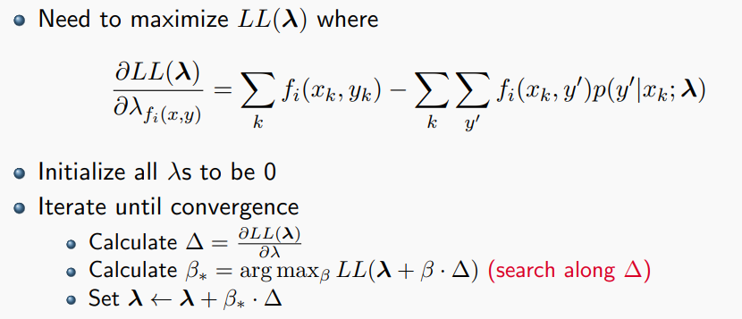

同时，我们也可以加入正则化项$\alpha||\lambda||_p$，来防止在某些特定规则上的过拟合。

在这里再介绍一下PPT上的一个很无聊的分类。

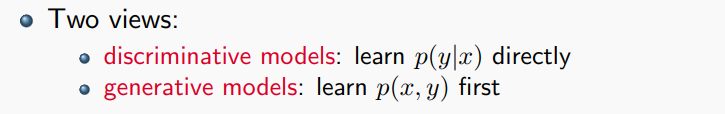

朴素贝叶斯通过学习$p(x,y)$，然后去选择使得它最大的y。而我们上面介绍的线性模型是直接去学习$p(y|x)$。所以我们按照PPT上的说法，很不情愿地认为他们分别属于**generative和discriminative**模型。

PPT里还介绍了train-valid-test三分数据集，和数据集k折的训练方式。这里就不展开了。

## 语言模型

语言模型可以用来做很多事情。

对于每个sentense s，我们可以计算一个得分，或者说概率$p(s)$，来衡量这个句子的合理程度。

最简单的想法当然是我们有一个句子集S，对于这个句子集中的每一个句子$s$,认为得分$p(s)=\frac{\#(s)}{|S|}$。这有其合理性，但是实践起来，显然是不现实的。

另一种看法是把语言看成序列，把句子的生成建模成马尔可夫过程。假设句子中每个单词的出现只由前k个单词决定，然后通过直接统计的方法(贝叶斯方法)来计算。这也就是N-Gram模型。

### 统计方法——N-Gram模型

下面是二阶马尔科夫假设的数学形式：

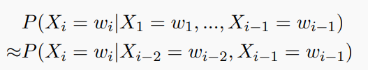

对于引入了N阶马尔可夫假设的语言模型，我们把它叫做**(N+1)-Gram LM**。这表示他们的"上下文窗口"为N+1。下面是一个3-Gram LM的例子：

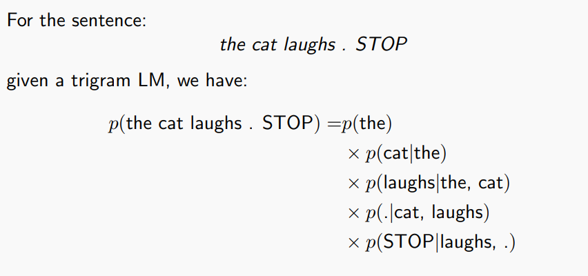

对于N-Gram模型，模型的参数就是给定前N-1个单词，下一个单词是某单词的概率，写成数学公式就是$p(w_k|w_{k-1},w_{k-2},\dots ,w_{k-N})$。可以直接通过统计的方法来确定模型参数：
$$
p(w_k|w_{k-1},w_{k-2},\dots ,w_{k-N})=\frac{\#(w_k,w_{k-1},w_{k-2},\dots ,w_{k-N})}{\#(w_{k-1},w_{k-2},\dots ,w_{k-N})}
$$
N-Gram模型的参数量随N是指数增长的。

评估模型时，可以计算模型对每个句子$s$的概率$P(s)$。对于测试集$D$，可以对每个句子作这样的计算，得到下面的一些评估标准(Perplexity是模型对测试集的困惑度)。

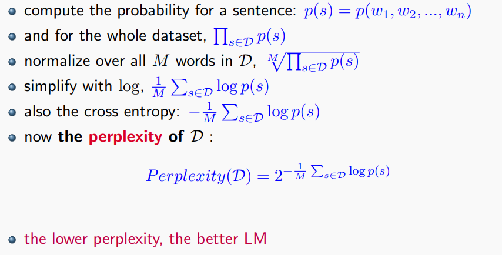

对于V个词汇的均匀猜测模型，有$p(s)=\frac{1}{|V|^{len(s)}}$，从而困惑度为$|V|$。

接下来，我们介绍两种对于未见组合的处理方式。

第一种是插值，适用于测试集中出现了训练集中未出现的单词组合(但是单词本身都见过)的情况。我们把马尔可夫假设作加权组合：
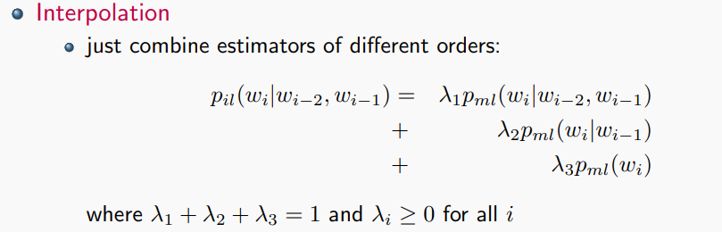

这样插值出来的结果依然满足概率分布性质。且它能保证，对于见过的单词，这个概率一定不是0。但是它对没见过的单词无能为力。

第二种是在贝叶斯模型中常见的平滑(Laplace-smoothing)方法：把所有组合的出现次数都视为多出现了1次，即：

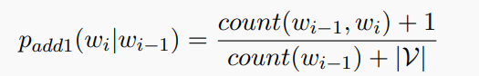

这种方法是很传统的方法，比较经典。但是如果在N-Gram中的N较大的情况，你分母上加的东西会是$|V|^N$这样的量级，导致过度padding。所以我们在此基础之上思考灵活地进行smoothing，引入如下做法：通过'seen once'的组合数目，来启发'unseen events'的数目。(**Good Turing Smoothing**)。但是在这里我不想具体展开了。

### 神经网络方法——Neural Language Models

上面介绍完了基于朴素贝叶斯的语言模型。下面来介绍更常见的基于特征处理的语言模型范式。对于这个模型，我们要学习$P(w_k|w_{k-1},w_{k-2},\dots ,w_{k-N})$。这个形式的任务可以认为基本是**Next Token Prediction**。这个任务也可以建模为一个分类任务，给定前面$N-1$个单词，预测后面的一个单词，相当于把上文信息分成$|V|$这么多类。

上文中介绍的**Log Linear Model**在此也可以作分类任务。但是实践表明这么简单的模型难以胜任这么复杂的任务。所以我们下面需要引入更加复杂的神经网络架构。

PPT讲了一堆神人话，主要就是介绍可学习的Embedding层(下图中这个从Onehot到编码的M矩阵)。这里不展开了。

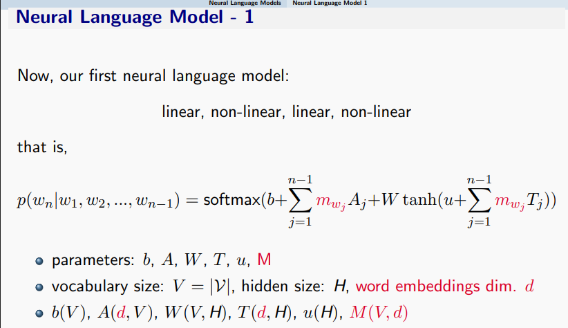

最简单的神经网络架构当然是FFN。这个很熟，不讲。

我们还要介绍一下一维卷积神经网络(CNN)。我们熟悉二维卷积，一维卷积就是降低一个维度的情况。我们梳理一下特征维度变化：

假设词向量编码维度为d，序列中有N个词，卷积核有k个，卷积窗口大小为w。每个卷积核用一个$w\times d$的矩阵来表示。每个卷积核在每个窗口位置内的行为，是两个$w\times d$的矩阵作内积，生成一个标量。窗口滑动后，每个卷积核会生成一个长为$N-w+1$的特征向量。所以卷积层的输出是一个大小为$(N-w+1,k)$的矩阵。

池化层会对每个卷积核的输出作池化，以消除序列长度对维度的影响。常见有max pooling 或 average pooling。这样每个卷积-池化后，输出的是一个$k$维向量。

此外，还有RNN(Recurrent Nerual Network)。基本的思路是维护一个隐藏状态$h_n$，输入当前$x_n$向量后，基于$x_n,h_n$同时输出$y_n$和$h_{n+1}$。这个也很熟悉了。

朴素的RNN会遇到一些梯度消失/爆炸的问题。有一些缝缝补补的办法如GRU和LSTM，这里不再展开。

(这里是复习到L6的我。现在不得不具体展开了。)

**LSTM**(long short-term memories)与**GRU**(gated recurrent units)。LSTM定义了两个隐藏状态$C_t$和$S_t$，并定义了一些"门"，来控制隐藏状态的变化量。其中$C_t$是不暴露的隐藏状态，而$S_t$是可见的隐藏状态。

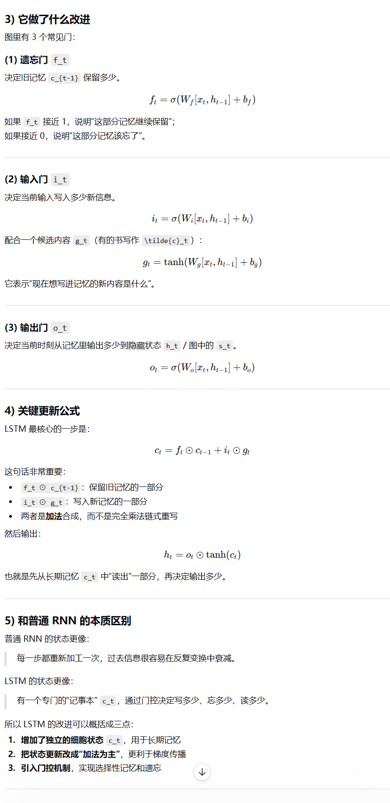

而GRU是对LSTM的改进，它将两种状态作合并，只保留一种状态。

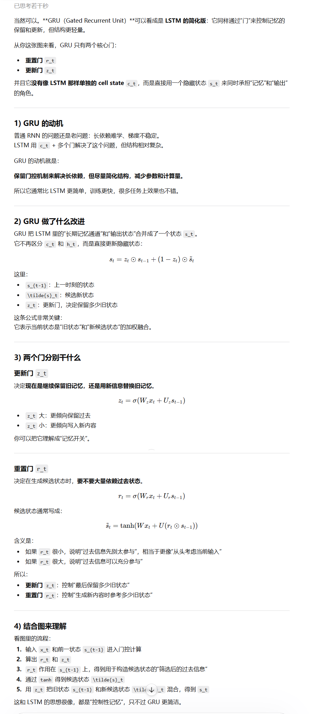

我感觉这两个对比是会考的。简单来说吧，就是GRU轻量一点，LSTM上限更高一点。

## 再谈特征编码

特征编码好好的怎么非要分两节来说。

我们前面提到了关于文档的**TF-IDF**编码。现在我们讨论的问题是关于单词的编码。

**词聚类模型**：认为词分为若干个类。分好类之后，可以从类别转移的角度计算下一词概率。

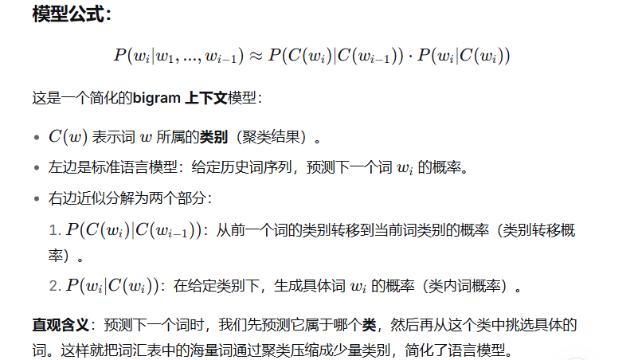

**向量空间模型**：把词嵌入到语义空间中(Embedding)。这是最常用的编码方式。One-hot当然是最简单的嵌入编码形式，但是这个编码形式完全没有反应语义特征。我们希望单词往语义空间的映射能够保持一些语义特性，例如相似的单词在语义空间的像相近，例如我们可能期望会有$king-man+woman=queen$这种特性等。

### 统计方法——PPMI矩阵

如何从数据去衡量两个单词的相似性？我们可以使用**Mutual Info**的启发形式，定义两个单词的Positive Pointwise mutual info(**PPMI**)为：
$$
PMI(X,Y)=\max(\log\frac{P(x,y)}{P(x)P(y)},0)
$$
其中**P(x,y)不是联合分布，而是x,y在一起出现的概率**。如果PMI很大，则反应出X与Y强相关。仔细品味，会发现这个东西还与TF-IDF有点相似性，只不过在PPMI中X,Y是两个单词，TF-IDF中一个是单词，一个是文档。

例子：给出这样的表格的形式，来计算PPMI(information,data)。

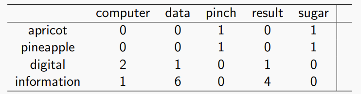

这个答案应该是$\log\frac{6/19}{11/19\times7/19}=\log\frac{6\times19}{11\times7}=0.566$。

同时我们也可以引入拉普拉斯平滑。我也不知道为什么，PPT上做的add-one smoothing 是对表格中的每个数神人地加了2，还神人地加错了一个数。然后按照平滑后的表格去作相同的计算。

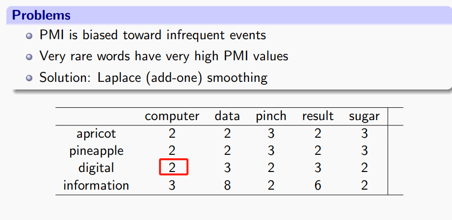

从这个角度建模了相似度的话，我们就可以使用这些相似度数据来启发我们的Embedding设计。

假设我们有相似度PPMI矩阵叫做P，我们可以取P的奇异值分解为$P=U\Sigma V^T$，对于上下文词，其编码矩阵为$U\Sigma^{1/2}$，对于中心词，其编码矩阵为$V\Sigma^{1/2}$。

这是什么意思呢？这是因为这样编码的话可以带来这样的效果：对于上下文词c和中心值m，它们的编码就满足：
$$
emb_m(m)^Temb_c(c)= P_{c,m}
$$
这使得cosine similarity恰好是PPMI相似度。如果这样得训练出的Embedding维度太高，则也可以通过**PCA**的方法来降维，即是对$\Sigma$这个矩阵作截断。

### 神经网络方法——word2vec

接下来我们来看这一领域最经典的结果word2vec。PPT上讲述得比较乱，我用我自己的理解讲述一遍word2vec的两种范式及其训练模式。

word2vec的模型基本上就只有两层：一个Embedding层和一个线性层。它的数据就是无标注文本，设计的下游任务有两种范式：

1. CBOW：给定上下文词，过Embedding后作avg Pooling，然后过线性层，去预测中心词。假设c代表context，则Loss设计就是对中心词预测的损失，为$-\log p(w_t|w_c)$。
2. Skip-gram：给定中心词，去预测上下文词。这个范式，因为输入只有一个词所以不用过Pooling，但是Loss需要设计为对多个上下文词预测的损失之和，为$-\sum_c\log p(w_c|w_t)$。

通过最优化下游任务，训练出一个模型，然后我们只去取它的Embedding层，这样取出来的Embedding层就是word2vec。**(这有点像GAN，有没有？)**

我们现在有很多Embedding模型，如BERT等。训练Embedding这种任务，往往都不会纯粹地去只设置一个Embedding层，没有其他，这么简单。因为这样训练出的Embedding难以去定义Loss。它们往往都是定义一个下游任务，同时在Embedding层后面接一些简单的模型，在下游任务上定义Loss，优化模型在下游任务中的表现，此后再单独取出这个Embedding层。这有点**协同训练**的味道。

其实word2vec的训练方式就是这样，它的模型与下游任务比较简单。现在例如BERT，本身它的下游任务就是上下文预测(具体地，是mask revealing和next sequence predicting)。或者说GPT Embedding，本身它的下游任务就是Next Token Prediction。

应该指出，这样训练出的Embedding模型某种程度上是和下游任务与下游模型相关的。如果说你要让word2vec作为你的词汇编码，而下游去接一个Transformer(Which is done by earlier LLM such as GPT1)，有可能它们之间并不能很好地进行cooperation，因为word2vec本身并不是为了transformer适配的。这也是现在的大模型训练往往都是自己去训适配自己的Embedding层(见CS336)的原因。

但是另一方面，也应该指出这样训出来的Embedding层某种程度上确实反映了语言本身的特性，体现了超越下游任务的编码价值(可能能够把它叫做可迁移性，或者编码的鲁棒性。)，如它能够去反映出$king-man+woman=queen$这种语言特质。

再多说一句，PPT上提到了基于统计的Embedding和基于Prediction的Embedding的区别。这其实也反映了我们讲述的词背包、PPMI等方法和word2vec、BERT等训练方法的区别。现在基本上没有人去用统计方法作Embedding了。某种程度上这体现出一种训练哲学——你把词汇编码成什么，更取决于你想要用你的编码来做什么，这样你的编码才能够针对性地去给你你要的信息。

## 序列标注

序列标注的任务是对于给定序列中的每个单词作分类。例如对于句子中的每个词，标注语法成分(POS tagging)，使用B(beginning)/I(inside)/O(other)去作序列分块等。

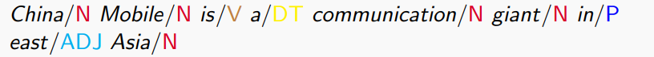

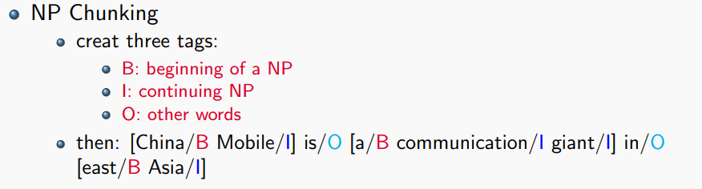

### 统计方法

建模这个问题，认为Sequence是一个长度为n的序列$x1,x2,\cdots x_n$，tagging是$y1,y2,\cdots y_n$我们要计算的是：
$$
\arg \max_{y_1,y_2,\cdots,y_n}p(y_1,y_2,\cdots,y_n|x_1,x_2,\cdots,x_n)
$$
可以把它拆分为两个部分。

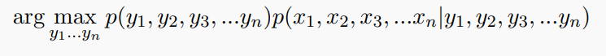

计算这个值，$p(y_1,y_2,\cdots,y_n)$可以建模成为一个序列(句子)本身的概率，前面介绍的语言模型能够解决这个问题。

而$p(x_1,x_2,\cdots,x_n|y_1,y_2,\cdots,y_n)$可以引入独立性假设，把它建模成$\Pi_ip(x_i|y_i)$。这个数可以通过统计的方法算出来。

由于我们假设先使用马尔可夫规则生成$y_i$序列，再在固定$\{y_i\}$的基础上，生成$\{x_i\}$序列。这提供了一种计算的方式。如果我们要从sequence到tagging，可以使用动态规划的方法来解决这个问题。假设使用二元马尔科夫假设，定义的DP状态就为$\pi[i][u][v]$，表示第$i$个位置tagging为u，第$i-1$个位置tagging为v的概率最大值。注意**End**也需要被引入作为一个状态，最后你需要额外乘一个项$p(STOP|u,v)$。这就是**Viterbi Algorithm**。

### 神经网络方法

神经网络中的RNN模型的特征天然适合序列标注任务。

这个神人居然又在这里详细展开了关于RNN的两个改进……这不得不让我回到之前的位置，并更新关于RNN的部分。

与单向的RNN不同，在序列标注任务中人们常见的是使用双向的RNN，使得在序列中能够注意到前后文的信息。这种双向RNN的运行方式是先计算前后向的所有hidden state，然后根据hidden state计算tagging。

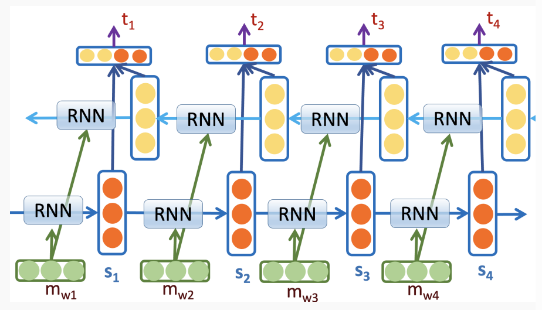

同时，RNN也可以做Sequence to Sequence的学习。这些内容我们在计算机视觉课程中介绍过，这里放张图片作为示意，也不再展开了。

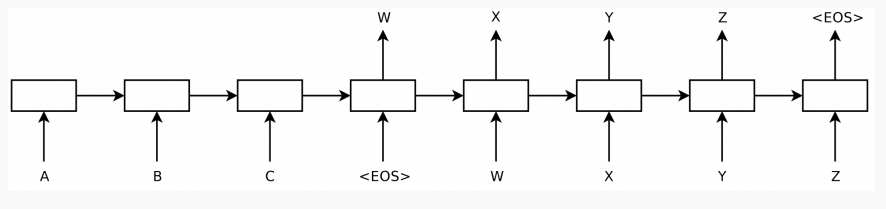

然后就是Attention和Transformer模型。Attention在RNN中的表现，就是当前隐藏层的更新不只依赖于上一个隐藏层，而是依赖于前面所有的隐藏层。他会对前面所有的隐藏层算一个注意力权重，然后加权计算出更新量。这能有效避免过分遗忘之前的信息。

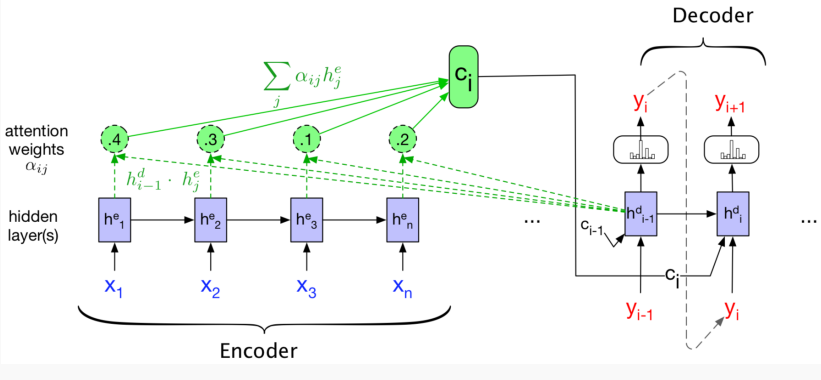

更进一步就是self attention，这是现代Transformer中的最经典范式。它允许每个单词对序列中所有单词都计算Attention Value，使用的是QKV的范式。这里不再展开了，具体关于transformer的架构，可见CS336的博客。

## 句法分析任务

### 语法解析任务及CYK算法

语法解析任务需要解决的问题是分析句子的成分，回答什么部分属于名词，什么部分属于动词等的问题。这个问题我们应该是在《数据结构与算法》课程中接触过，我们把它建模成这样一个问题(Chomsky Normal Form)：

+ 有单词集合为$\Sigma$，这些是文法中不可再分割的符号，例如cat,run等。
+ 有非终结符集合$N$，这些可以理解为句子成分，例如$V,N,S,NP$等。
+ 有规则集合$R$，每条规则形式形如$S\to \text{NP V P}$，或$N\to \text{"cat"}$等。

在数算课中，我们用CYK算法来去解析句子成分。现在我们额外对语法规则引入概率(Probabilistic Context Free Grammars, PCFG)，我们也就可以计算每个句子成分解析(以语法树的方式表示)结果的概率是多少。

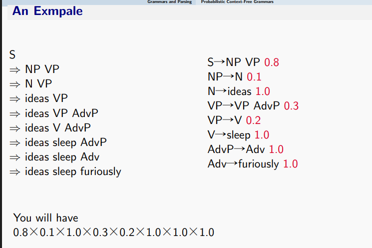

计算语法规则的概率也很简单，直接采用标注好的语法树，然后作统计即可。
$$
P(\alpha\to\beta)=\frac{\#(\alpha\to \beta)}{\#(\alpha)}
$$
感觉考试应该会有一道手算带概率CYK的题目。这个表格做得还是比较清晰的。表格的$(i,j)$元，$i\le j$，表示的是句子中从第i个词到第j个词组成的子成分可能是什么，以及其概率。表的填法，是先填主对角线，然后填主对角线上面的一斜，以此类推。填(i,j)格的时候，需要关注$(i,k),(k,j)$元是否能组合，k从i到j。

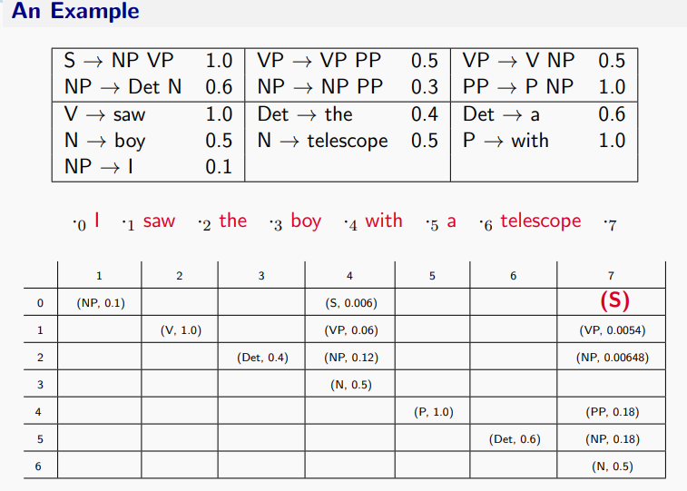

### 依存结构分析

除了语法结构外，句法结构中还有一个很重要的部分是依存结构。例如这个形容词修饰哪个成分？这个动词的宾语是谁？这一类问题。句子的依存成分，依照定义，可以画成一个依存图。这是一个有向图，按照PPT上的定义，每条边是`Head -> Dependent`的形式。Head某种程度上决定了Dependent，它比较厉害一点。

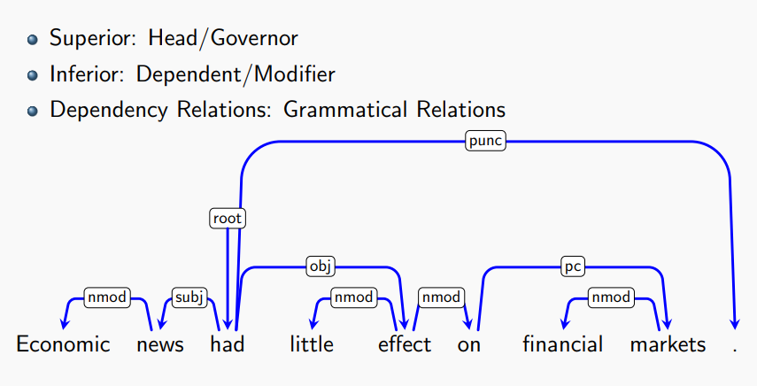

我们来分析一下这样形成的图的结构。根据PPT，我们希望它有如下的性质：

+ 弱联通性。理论而言，句子是一个有机的连接结构，故每个词元都应该在句子中作为成分，没有冗余。这里指出，神人PPT上关于**弱联通性**的定义并不正确。对于有向图，我们说它是弱联通的，当且仅当它作为无向图是联通的。对于PPT上的定义，我们可以构造这样一个图：`A->B C->D`，使得满足PPT上的条件但是不弱联通。
+ 无有向环性。理论而言，依存关系是层次化的（修饰或从属关系），环会导致循环定义，违反句法层级。
+ 单头性，每个节点入度不超过1。这是因为理论而言，每个词在句法中通常只直接依赖于一个更高层次的词。

由上面三个性质，就能够推出理想中的依存图是一个有向有根树。理由如下：先证明将这个图视为无向图，则这个无向图也无环。这是因为若无向图有环，环中有k个点与k条边，那么由每个点入度不超过1，可以得到这个无向环一定是有向环，与无有向环矛盾！又将其看为无向图，这个无向图是联通的。故这个无向环为树，故边数目为节点数减1。故图中有唯一点入度为0，其余点入度为1，这是一个有向有根树。

一般而言，依存结构树的根是其核心谓语。

此外，我们还有时会希望依存结构满足投射性：

+ 投射性：边不交叉。将图视为无向图，不存在句子序列中四个单词$i<j<k<l$，使得$i-k,j-l$。这直接推导出：若边$u→v$，则u和v在句子线性序列之间的所有词都必须位于以u为根的子树内。这种性质便于我们设计基于栈的解析算法。

当然，现实是残酷的。不满足投射性的句子结构很多，不满足有向有根树的句子结构也不少。

### Stack based Transition Algorithm与依存结构解析

我们把依存结构的构造建模成一个具有状态/动作的策略问题。对于一个句子，建立一个缓冲区栈`Buffer`(**注意，按照PPT中的理解，这个缓冲区也应该是栈，而不是队列。下面我们会看到。**)，初始按顺序存储了句子中的所有词；和一个栈`Stack`，初始只有一个根节点`Root`。状态就是当前构建好的部分依存结构图，以及当前缓冲区和栈的状态。允许的动作有下面三个：

+ Shift：`Buffer`栈顶元素出栈，推入`Stack`。
+ Left_Arc：`Buffer`栈顶元向`Stack`栈顶元连线，`Stack`栈顶元出栈，从此这个词消失。
+ Right_Arc：`Stack`栈顶元向`Buffer`栈顶元连线，`Buffer`栈顶元出栈，这个词消失。然后`Stack`栈顶元出栈并推回`Buffer`。

结束条件：最终`Stack`中只剩`Root`，`Buffer`为空。

为什么这样的建模和建立起一个依存结构树是等价的？我们来看这个将图转化为操作序列的算法。

我觉得这个算法会出一道手算模拟题。自己在图上体验一次这个算法是理解的最好方式。PPT第44页有一长串动画。完整过一遍就能理解得差不多了。这里为了检验大家的理解，给出一道习题：**建立出下面这个图结构所需要的动作序列是什么？**

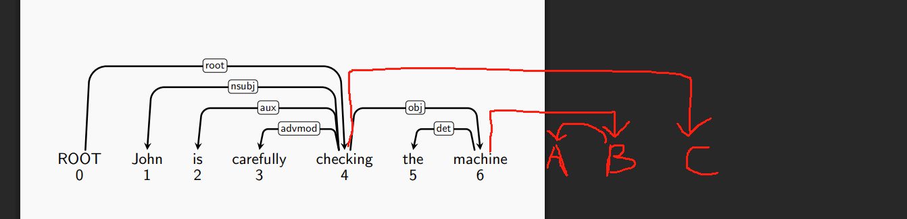

答案：`SSSLLLSSLSSLRRSRRS`。

如果读者看不懂答案，我这里按我的理解，列出来整个过程的解析。如果读者看懂答案了，按读者自己的理解即可，没必要强套我的理解。

1. 可以考虑整个句子的树结构。你有一把刀，刀的位置就在`Stack`与`Buffer`的交界处。这把刀不断地在树上移动。使用S操作可以使这把刀向右移动；如果这把刀当前碰到了一个**连着一个叶子结点的，长为1的弧**，就下刀，使这条弧消失，叶子节点消失。被左弧吊着的叶子被L操作划掉；被右弧吊着的叶子，被R操作划掉。**使用L操作后，刀位置不变。使用R操作后，刀左移一个单位。**
1. 在上面的题目中，刀首先在`ROOT`与`John`之间。它右移三次之后最先碰到可切的弧，即`carefully <- checking`。这是一条左弧，所以用L切掉。切掉后句子如下，绿色是刀的位置。

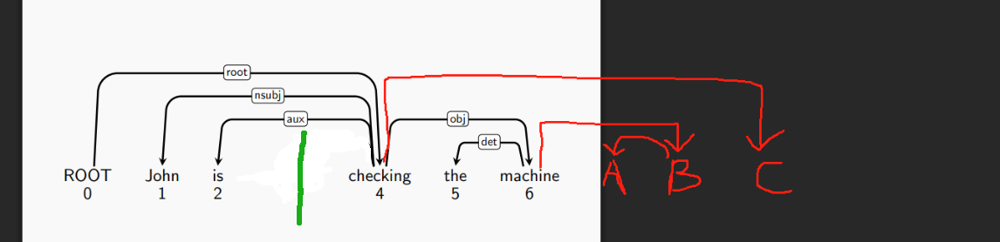

2. 接下来，刀碰到的`is <- checking`弧可切。也是用L切掉。然后变成`John <- checking`。再用L切。句子变成这样：

   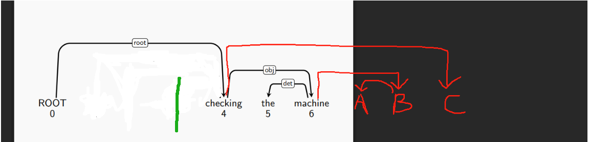

3. 此时，刀接触的弧成为`ROOT -> checking`。注意此时它不能被切，因为现在`checking`还不是叶子节点。所以此时刀继续右移两次，然后用L切掉`the <- machine`。

   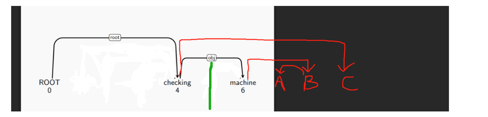

4. 然后，刀继续右移两次，下一刀切在`A <- B`。接下来`machine -> B`可以切了，这是一条右弧，所以用R切。切完之后，刀自动左移一个单位，下一刀切的就是`checking -> machine`。接下来请读者自己补全整个过程了。

读者不难将上面的"刀"与"切"的过程，规范化为两个栈的操作问题。同时读者也不难将一个上面所说的**理想依存结构树**与合法的操作过程建立起一个一一对应。

解释完这个算法之后，我们别忘了我们的初心——从一个句子中建立出依存结构。我们可以训类似强化学习的模型，给定当前状态，让它输出最可能的操作是什么，是S还是L/R。如果是L/R的话，带一个边的具体标签。根据PPT的说法，每步的贪心算法就是很好的方法。评估一个模型，可以采用正确的句子占比，或者正确的边占比。

