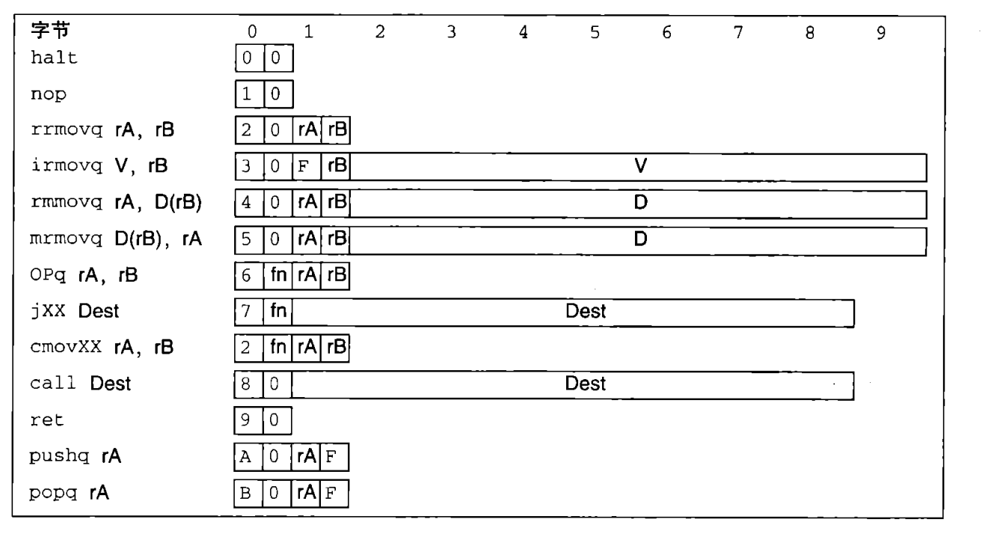
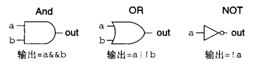
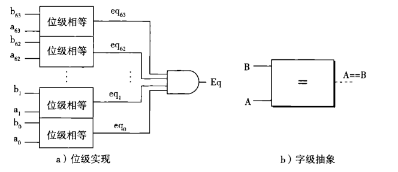
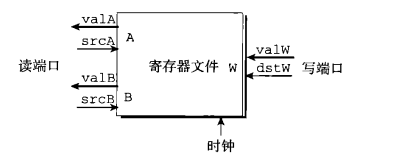
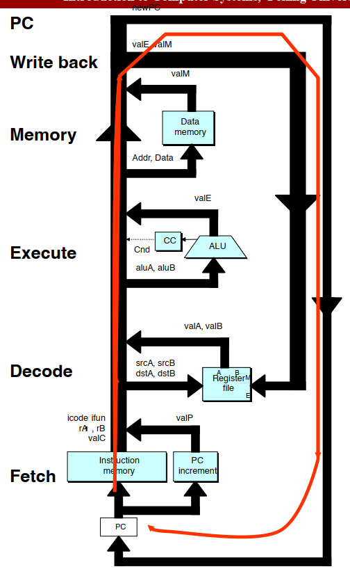
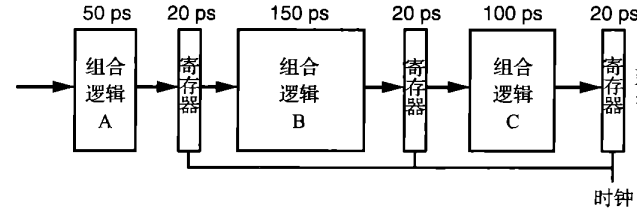

# **ICS第四章 处理器**

## Y86-64指令集

Y86-64是一个CSAPP为了教学而虚构出来的指令集。我们只需要记住它的指令有什么和对应的指令码即可。

请注意几个细节：

+ Y86-64中，总是使用寄存器rB去进行内存寻址操作。所以mrmovq中寄存器的顺序与正常的顺序是相反的。
+ 寄存器只有15个，编号为0-14。如果需要传入空寄存器，则需要传入数字15，即图中的F。注意这和空fn码不同，空fn码是0.
+ Y86-64只有64位数字。所有的常数都占8字节。

## **HCL语言**

### 逻辑门

~~区分And和OR：OR的头顶怎么尖尖的~~

下面是逻辑电路的一个实例——相等判断。注意从位级到字级的抽象

### 硬件寄存器与时钟

在逻辑电路中，每个结构只不过是一个电路。这个电路不能存储信息。它们只是进行输入，同时产生输出。但是我们想引入能够存储信息的设备，于是就引入了时序电路系统。

在硬件语境中，寄存器指的是电路中的一种结构。这种结构在时钟上升沿加载并存储输入信号，在时钟下降沿产生稳定的输出。这与编程语境的寄存器(比如说`rax`)是不同的。我们会用**硬件寄存器**与**程序寄存器**来分别称呼它们。请同学们尤其注意区分这两个概念。

程序寄存器在硬件中是由寄存器堆实现的。在Y86-64实现中，寄存器堆有两个读口和两个写口。

下图的写口是错误的。为了满足`popQ`指令的要求，必须要求寄存器堆有两个写口。

读口能够随时响应。在任何时刻，只要`srcA`线的电路输入改变，`valA`中的电路输出就会改变。

而写口只在时钟上升沿开放。在时钟上升沿信号发出的时候，寄存器堆根据`valW`与`dstW`的电信号输入，来修改硬件寄存器中的存储值。在程序视角来看，就是修改了程序寄存器。

---

下面我们来真正进入Processor的搭建。

## SEQ Processor

### OverView

+ 取指阶段(**Fetch**):输入是PC，输出是icode,ifun,rA,rB,valC,valP.
  + icode与ifun:指令信息。课件上会写作$icode,ifun=M_1[PC]$
  + rA:需要的第一个寄存器的id。
  + rB:需要的第二个寄存器的id。课件上会写作$rA,rB=M_1[PC+1]$，这表示以PC+1为起点，取一个字节。
  + valC:指令之中传入的常数值。$valC=M_8[PC+2]$或$valC=M_8[PC+1]$
  + valP:新的PC的值。应该加多少？

+ 解码阶段(**Decode**):输入rA,rB，输出valA与valB.
+ 执行阶段(**Execute**):输入aluA与aluB，输出valE，并给CC**传递信号**。
  + aluA可能来自valA或valC。
  + aluB可能来自valB，或者为0.(参见下面的Y86-64指令-SEQ过程表)
  + 特别注意SetCC的过程！在SEQ实现中，一个时间周期是五个阶段。这种分配其实基于于一个原则：**没有一条指令既Set CC又使用CC。即书上特别强调的绝不回读原则。**这一点其实我们在做ArchLab的时候也用到了。这就意味着，我们完全可以**将待传入CC的信号挂起，等到时钟上升到达(一条指令完整执行结束)，再改变CC寄存器的值。**
+ 内存操作阶段(**Memory**):输入Addr与Data，输出valM。
  + Addr可能来自ValE或ValA。
  + 如果有Data，则是写入。这里的写入和上面一样，也是向内存传递信号，等到时钟上升沿再执行写入。
  + 如果没有Data，则是读出。

+ 写回阶段(**Write Back**):输入ValE与ValM，给寄存器堆传递信号，修改ValP。

三个问题：

1. 上面图中所示，哪些是寄存器？
   + 只有PC、寄存器堆、内存(包括指令内存和数据内存)、CC是寄存器。
2. 不是寄存器的值，如valA,aluB这些，硬件上是什么？
   + 它们只是**电信号**！我们为了便于理解，给了它们名字作为抽象。
3. 时钟上升沿，有什么事情会发生？
   + 回答这个问题只需要观察每个寄存器会作何改变。
     + CC可能会被设置。
     + PC会被修改。
     + DataMemory可能会被修改。
     + 寄存器堆中的值可能会被修改。

### 指令-行为表

接下来我们来看看各种Y86-64指令究竟是怎么在流水线中实现的。

实现过程有两个原则：

1. 尽可能少的拉线，尽可能多地复用线。例如，我们总是让aluB=valB，而不会让aluB=valC。这是因为如果我们需要在某些情况中让aluB=valC,我们还需要额外拉一组线从valC到aluB。

   此外，表中还有许多这样的例子。

   感兴趣的同学可以对照下表，看看我们需要哪些线。

   进一步地，我们为了达到这个目的，甚至可以让一些阶段进行空转。比如在CMOVXX和IRMOVQ指令中，我们让execute阶段进行+0操作，只是为了让valA的值能够传递到valE中，而不引入新的线。

2. 绝不回读原则。上面已经介绍过了。这里再举一个例子，例如POPQ指令，我们会读取两次rsp程序寄存器的值，一个用来内存寻址，另一个用来+8并writeBack。

|                  | valA   | valB   | valC | valP  | aluA | aluB | valE      | Addr | data | valM    | dstM | dstE | NewPC     |
| ---------------- | ------ | ------ | ---- | ----- | ---- | ---- | --------- | ---- | ---- | ------- | ---- | ---- | --------- |
| CMOVXX(fn,rA,rB) | R[rA]  | R[rB]  |      | PC+2  | valA | 0    | aluB+aluA |      |      |         |      | rB/F | valP      |
| IRMOVQ(D,rB)     | 0      | 0      | D    | PC+10 | valC | 0    | aluB+aluA |      |      |         |      | rB   | valP      |
| RMMOVQ(rA,D(rB)) | R[rA]  | R[rB]  | D    | PC+10 | valC | valB | aluB+aluA | valE | valA |         |      |      | valP      |
| MRMOVQ(rA,D(rB)) | R[rA]  | R[rB]  | D    | PC+10 | valC | valB | aluB+aluA | valE |      | M[Addr] | rA   |      | valP      |
| OPQ(fn,rA,rB)    | R[rA]  | R[rB]  |      | PC+2  | valA | valB | aluB?aluA |      |      |         |      | rB   | valP      |
| JXX(fn,Dest)     |        |        | Dest | PC+9  |      |      |           |      |      |         |      |      | valC/valP |
| CALL(Dest)       |        | R[rsp] | Dest | PC+9  | 8    | valB | aluB-aluA | valE | valP |         |      | rsp  | valC      |
| RET              | R[rsp] | R[rsp] |      |       | 8    | valB | aluB+aluA | valA |      | M[Addr] |      | rsp  | valM      |
| PUSHQ(rA)        | R[rA]  | R[rsp] |      | PC+9  | 8    | valB | aluB-aluA | valE | valA | M[Addr] |      | rsp  | valP      |
| POPQ(rA)         | R[rsp] | R[rsp] |      | PC+9  | 8    | valB | aluB+aluA | valA |      | M[Addr] | rA   | rsp  | valP      |

手动打成，欢迎捉虫~

下面我们来拆解两个较为复杂的指令。

+ CALL(Dest)指令。这个指令既要进行栈操作Push，也要进行PC跳转操作。
  + Fetch&Decode阶段，设置valB为rsp寄存器的值。
  + Execute阶段，设置aluA为8(或说-8，课件上的实现，后面是加法)，aluB为valB(即为rsp)，进行减法。这是栈指针的改变。
  + Memory阶段，将valP写进栈中。Addr是valE,data是valP。
  + WriteBack阶段，将valE写进rsp，更新栈指针；将valC写进PC，执行跳转。
+ RET指令。这个指令也是既要进行栈操作Pop，也要进行PC跳转操作。
  + Fetch&Decode阶段，设置valA与valB均为rsp寄存器的值。后续过程，一个进行+8操作，另一个供内存寻址。
  + Execute阶段，设置aluA为8，aluB为valB(即为rsp)，进行加法。栈指针的改变。
  + Memory阶段，读取栈中的返回地址。Addr是valA，即未经改变的栈指针。
  + WriteBack阶段，将valE写进rsp，更新栈指针；将valM写进PC，执行跳转。

## Pipelined Processor

~~终于，进入正题（~~

### 什么是Pipeline(流水线)？

简单的来说，流水线就是并行化。让多条命令同时进入处理器中，不同的阶段同时处理。

例如对于上面的SEQ实现，我们想要把他改成Pipeline。只需要将它切分成五个阶段。在每个时钟周期，处理器中同时存在五条指令，分别在进行Fetch,Decode,Execute,Memory,WriteBack五个阶段的处理。在每个阶段之间，我们插入传递信息的硬件寄存器。然后每个时钟周期每条指令只进行一个阶段。这样，我们就把时钟周期的长度减小成了原先的约五分之一，指令吞吐量变成了原来的五倍。[^1]

[^1]:不一定是五分之一。这取决于五个阶段中最长的一个。见下面流水线的计算

### 流水线的计算

流水线的时钟周期长度，取决于其中最长的一个阶段的长度。

如上面的这个流水线，时钟周期的长度就是170ps。

下面介绍一下流水线的常见参数。

+ 延迟：一条指令从进入流水线到出流水线的过程，消耗的时间。延迟=阶段数×时钟周期。上图的流水线延迟为510ps.
+ 吞吐量：单位时间内，流水线能够处理的指令数目。单位是$1GIPS=ns^{-1}$。$吞吐量=\frac{1}{时钟周期}$。上图的流水线吞吐量为$\frac{1}{170ps}=5.88GIPS$

在切分流水线时，鼓励平均的切分。且由于寄存器损失积累，不宜过深。

### 搭建Y86-64流水线

