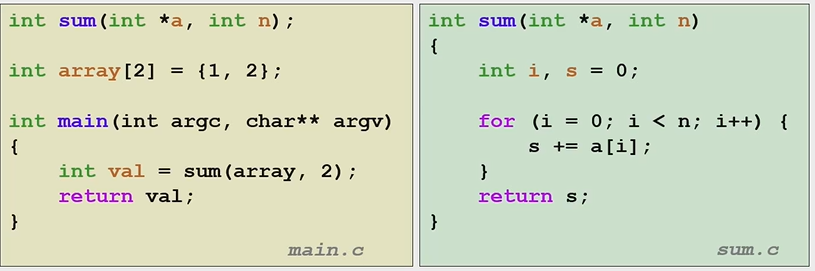
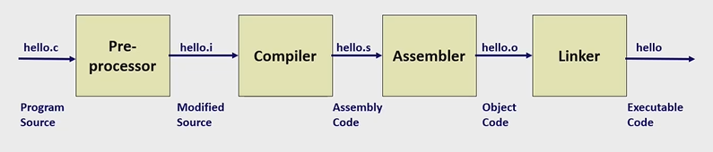
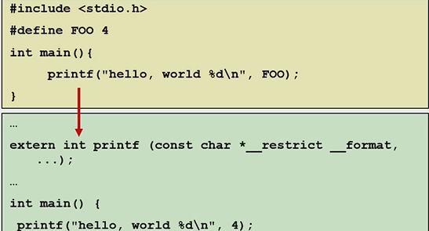
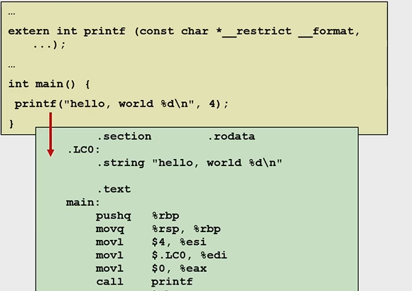
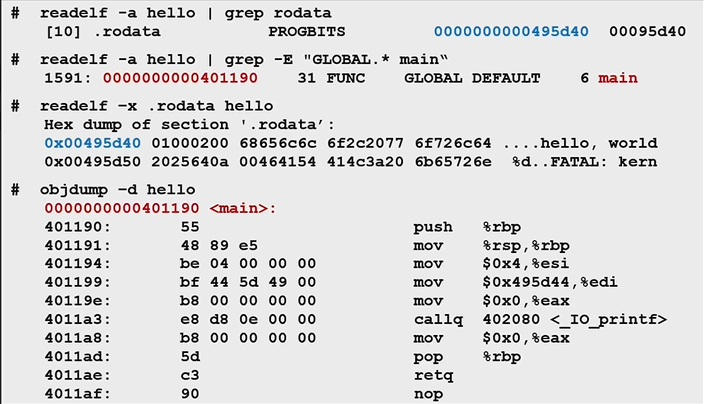
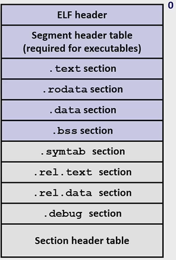

# 链接器

链接是将多个Object files连接成为可执行程序的过程。

涉及到多个文件的合作和库调用过程。

例子：



左边：sum函数的声明，右边：sum函数的实现。

## GCC的编译过程

gcc的编译过程可以粗分成为四部。



cpp(C preprocessor)进行预处理，一个.c文件合成一个.i文件。每个.c文件，预处理时会去解码所有#开头的宏。



cc1是编译器。接受.i文件，生成.s汇编语言格式文件。



gas是汇编器。将.s文件生成.o文件。.o文件就是机器语言了，是二进制文件。



ld是链接器。将多个.o文件连接成为一个可执行文件。

## ELF文件

ELF(Executable and Linkable)文件主要分为三种：

+ 可重定位的object file(.o)。各节的位置是以各节的初始位置为标准的偏移量。
+ 可执行的object file(a.out)。可以直接执行。
+ 共享object file(.so)。用于动态库链接。

下面是ELF文件的构造。



ELF header和Segment header table中记录一些基本信息，我们先不关注这两个部分。

接下来四个section，分别是程序段，只读数据段，数据段和未初始化数据段。这些段的介绍，可以在下面的"符号解析与符号表"中找到。

 symtab(symbol table)就是符号表。这个表中存储符号字符信息。下面会介绍。

rel.text与re.data存储的是重定位信息，分别存储的是text节与data节的绝对地址。

## 链接器的功能

### 符号解析与符号表

每个符号定义时，都会进入符号表。在需要进行符号引用时，会搜索符号表来寻找对应的符号。

使用nm命令，可以查看符号表。

举一个例子，来看看完整的符号表类型。假设这是main.c：

```c++
int sum(int *a , int n);
int sum1(int *a, int n);
int arr[2] = {1 , 2};
int x = 0;
int y = 114514;
int z;
int sum2(int *a , int n)
{
    return n;
}
static int static_global = 20;
static int static_uninit;
const int const_global = 30;
static void static_func() { }
int brr[2] = {1 , 2};
int main(int argc, char** argv)
{
    int val = sum(arr , 2);
    return val;
}
```

使用gcc -c -o main.o main.c，然后nm main.o，输出

```shell
0000000000000000 D arr
0000000000000010 D brr
0000000000000000 R const_global
000000000000001f T main
0000000000000014 t static_func
000000000000000c d static_global
0000000000000008 b static_uninit
                 U sum
0000000000000000 T sum2
0000000000000000 B x
0000000000000008 D y
0000000000000004 B z
```

- **D**: 已初始化的跨文件数据段符号（Data segment）
- **d**: 已初始化的本文件数据段符号（静态全局变量，作用域只有本文件。）
- **T**: 跨文件代码段符号（Text segment，通常是函数）
- **t**: 本文件代码段符号（静态函数）
- **B:** 未初始化的跨文件数据段符号。(BSS)
- **b:** 未初始化的本文件数据段符号。(BSS)
- **R**: 只读数据。(Read Only Data) 常数变量会放在这里面，又例如printf("helloworld")和printf("%d",a)中的"helloworld"和"%d"都会在R里面。
- **U**: 未定义符号（Undefined，需要在其他目标文件中解析）
- 未使用的声明(如sum1)不会在符号表中出现。
- 局部变量(如val)会被储存在栈中，不会出现在符号表中。

每个符号前面的一堆数字是什么意思呢？那些是偏移量地址(相对地址)，代表着该数据与节头的偏移量。在后面的重定位过程中，我们会为所有的指令分配绝对地址。

各个数据类所在的节如下所示。

```
+------------------+
|  代码段 (T/t)    |  // 函数代码
+------------------+
|  只读数据段 (R)  |  // 常量数据
+------------------+
|  数据段 (D/d)    |  // 已初始化全局/静态变量
+------------------+
|  BSS段 (B/b)     |  // 未初始化全局/静态变量
+------------------+
```

可以与上面的输出对照学习。

### 重定位

