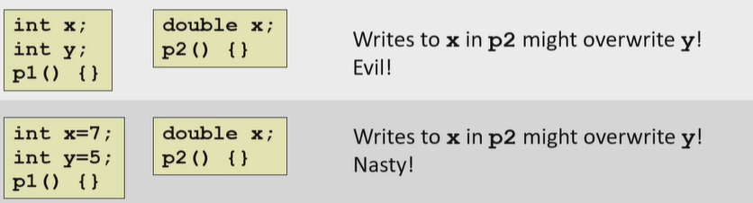
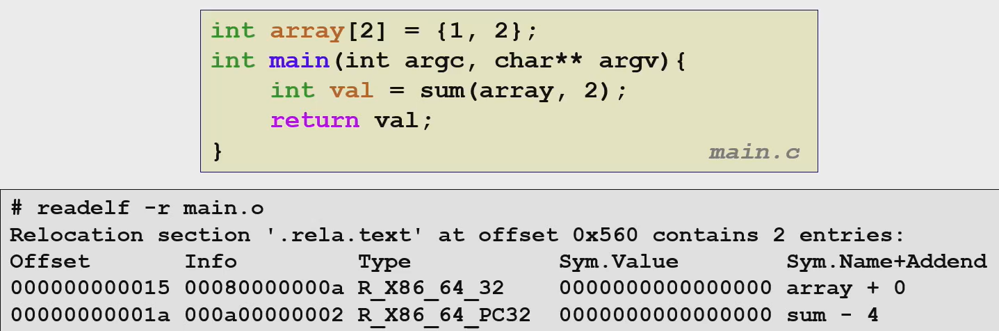
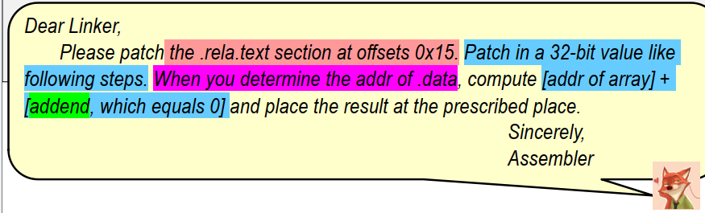
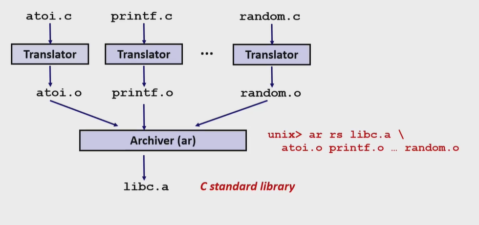

# 链接器

链接是将多个Object files连接成为可执行程序的过程。

涉及到多个文件的合作和库调用过程。

例子：


左边：sum函数的声明，右边：sum函数的实现。

## GCC的编译过程及链接器在其中的位置

gcc的编译过程可以粗分成为四步。


cpp(C preprocessor)进行预处理，一个.c文件合成一个.i文件。每个.c文件，预处理时会去解码所有#开头的宏。


cc1是编译器。接受.i文件，生成.s汇编语言格式文件。


gas是汇编器。将.s文件生成.o文件。.o文件就是机器语言了，是二进制文件。


ld是链接器。将多个.o文件连接成为一个可执行文件。

## ELF文件

ELF(Executable and Linkable)文件主要分为三种：

+ 可重定位的object file(.o)。各节的位置是以各节的初始位置为标准的偏移量。
+ 可执行的object file(a.out)。可以直接执行。
+ 共享object file(.so)。用于动态库链接。

下面是ELF文件的构造。


ELF header和Segment header table中记录一些基本信息，我们先不关注这两个部分。

接下来四个section，分别是程序段，只读数据段，数据段和未初始化数据段。这些段的介绍，可以在下面的"符号解析与符号表"中找到。

 symtab(symbol table)就是符号表。这个表中存储符号字符信息。下面会介绍。

rel.text与re.data存储的是text节中与data节中需要重定位后修改的地方。

.debug section中存储的是debug信息。Section header table存储的是每一节在该文件中的偏移量和尺寸。

> 一言以蔽之，链接器干的事情就是这样的：
>
> 首先，我们有很多个.o文件。这些.o文件存在一些与外部的交互，主要是外部函数调用与外部变量引用(符号表中的U)。
>
> 这些单独的.o文件不知道它们调用的东西地址在哪里，怎么办呢，它们就空在那里，并且在.rel节中告诉链接器，让链接器来填上这些坑。
>
> 比如main.o需要call sum，但是它不知道sum在哪里啊。于是就先在.text中写着call 0x00000000,然后再在.rel.text中告诉链接器："你等找到sum的时候(重定位的时候)，你在.text偏移xxx位的地方给我把那个32位的值改成sum."
>
> 再比如main.o有两句叫extern int x; int* y = &x;它不知道x的指针是什么。于是就先在.data中写着初始化值为00000000,然后再在.rel.data中告诉链接器："你等找到x的时候(重定位的时候)，你在.data偏移xxx位的地方给我把那个32位的值改成printf."
>
> 链接器怎么填上这些坑？它会先过一遍所有的.o文件，看这些家伙们都创建了什么变量，创建了什么函数(符号表中非U的部分)。
>
> 然后它给这些变量和函数都赋予绝对地址。
>
> 然后它再过一遍所有的.o文件，按照文件的指示，把坑都填上。
>
> 为什么不会有.rel.bss和.rel.rodata？很简单，因为bss和rodata类型变量创建的时候绝对不会依赖外部变量。它们的定义中不会存在坑要填。

## 符号解析与符号表

每个符号定义时，都会进入符号表。在需要进行符号引用时，会搜索符号表来寻找对应的符号。

使用nm命令，可以查看符号表。

举一个例子，来看看完整的符号表类型。假设这是main.c：

```c++
int sum(int *a , int n);
int sum1(int *a, int n);
int arr[2] = {1 , 2};
int x = 0;
int y = 114514;
int z;
int sum2(int *a , int n)
{
    return n;
}
static int static_global = 20;
static int static_uninit;
const int const_global = 30;
static void static_func() { }
int brr[2] = {1 , 2};
int main(int argc, char** argv)
{
    int val = sum(arr , 2);
    return val;
}
```

使用gcc -c -o main.o main.c，然后nm main.o，输出

```shell
0000000000000000 D arr
0000000000000010 D brr
0000000000000000 R const_global
000000000000001f T main
0000000000000014 t static_func
000000000000000c d static_global
0000000000000008 b static_uninit
                 U sum
0000000000000000 T sum2
0000000000000000 B x
0000000000000008 D y
0000000000000004 B z
```

- **D**: 已初始化的跨文件数据段符号（Data segment）
- **d**: 已初始化的本文件数据段符号（静态全局变量，作用域只有本文件。）
- **T**: 跨文件代码段符号（Text segment，通常是函数）
- **t**: 本文件代码段符号（静态函数）
- **B:** 未初始化的跨文件数据段符号。(BSS)
- **b:** 未初始化的本文件数据段符号。(BSS)
- **R**: 只读数据。(Read Only Data) 常数变量会放在这里面，又例如printf("helloworld")和printf("%d",a)中的"helloworld"和"%d"都会在R里面。
- **U**: 未定义符号（Undefined，需要在其他目标文件中解析）
- 未使用的声明(如sum1)不会在符号表中出现。
- 局部变量(如val)会被储存在栈中，不会出现在符号表中。

每个符号前面的一堆数字是什么意思呢？那些是偏移量地址(相对地址)，代表着该数据与节头的偏移量。在后面的重定位过程中，我们会为所有的指令分配绝对地址。

各个数据类所在的节如下所示。

```
+------------------+
|  代码段 (T/t)    |  // 函数代码
+------------------+
|  只读数据段 (R)  |  // 常量数据
+------------------+
|  数据段 (D/d)    |  // 已初始化全局/静态变量
+------------------+
|  BSS段 (B/b)     |  // 未初始化全局/静态变量
+------------------+
```

可以与上面的输出对照学习。


## 符号重名时的链接器行为

有初始化的全局变量和有定义的函数是强属性符号。

未初始化的全局变量或使用extern定义的变量，是弱属性符号。

如果说在某处同时存在多个强属性符号，会报链接器错误。

```shell
/usr/bin/ld: main.o:(.bss+0x0): multiple definition of 'y'; sum.o:(.data+0x0): first defined here
```

同时存在一个强属性的符号和多个弱属性符号，较早版本的GCC会使用强属性符号进行引用，但是新版本的GCC只认extern，也就是说

+ 如果file1.c定义int x = 1;file2.c定义int x;旧版本编译器认可file2.c中的x是引用file1中的x，而新版本编译器报错。
+ 如果file1.c定义int x = 1;file2.c定义extern int x;新旧版本编译器都会认可file2.c中的x是引用file1中的x。

我觉得这个新版本的更新是很好的。报错是好事，就怕你不报错在执行时乱搞。比如PPT中的两个例子：



如果同时存在多个弱属性符号，依照规则选择一个作为引用对象。如果编译时添加-fno-common选项，则报错。

如果某文件中静态定义x，则该文件的x均视为引用该静态变量，且这个静态变量不对其它文件造成影响。

**在C中，链接器并不作Type Check!**与C++不同，C是不允许函数重载的。这意味着如果有两个同名函数但是参数不同，编译器仍然会报错。

对于编程，尽量减少使用全局变量。如果一定需要使用，最好视情况加入static或extern前缀。

## 重定位

如上面所说的，重定位是链接器帮原来的.o文件"填坑"的过程。

有两种重定位模式。一种是填入相对地址，`type = R_X86_64_PC32`，一种是填入绝对地址，`type = R_X86_64_32`。区别类似于`call main+0x18`与`move (0x300) %rax`中的两个地址。

代码节中常用相对地址模式，数据节中常用绝对地址模式。

.rel.text的形式如图所示。Offset就是"坑"距离.text头的偏移量。Type即为上面的两种。



> 上图中的main函数，text有两个坑要填，一个是sum的地址，一个是array的地址。

这个表的意思呢，尼克说得很清楚了。



## 库函数的链接

### 静态库链接



将若干个.o文件链接起来，形成了一个可被引用的.a文件。

所谓静态链接，指的是将需要的代码都放在最后的库里面。

上面的libc.a，就可以与你的main.o文件进行进一步链接。在编译时，如往常一样，链接器会将程序中使用到的静态库中的代码直接复制到最终的可执行文件中。这就是你在main.c中调用libc.a的过程。

这就造成一个很明显的问题：库太大了！你每次调用这个程序，都会做一次很大的编译；且每个调用库最终做出来的可执行文件都会拷贝一次库，造成很多的麻烦。

### 动态库链接(Shared Libraries)

动态库的后缀名是.so。它在编译时并不会被复制到可执行文件中。相反，在链接阶段，链接器只是记录下程序需要使用的动态库中的符号信息，以及动态库的名字。当**程序运行时**，操作系统（或叫运行时链接器）会负责将动态库加载到内存，并将程序中的符号引用与动态库中实际的符号地址连接起来。这个过程称为动态链接。

