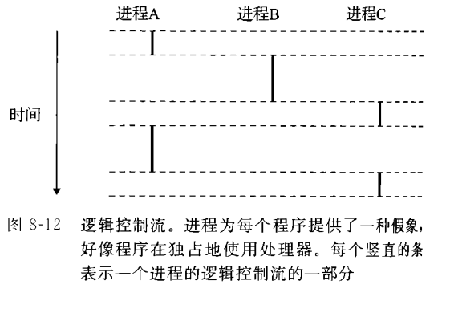
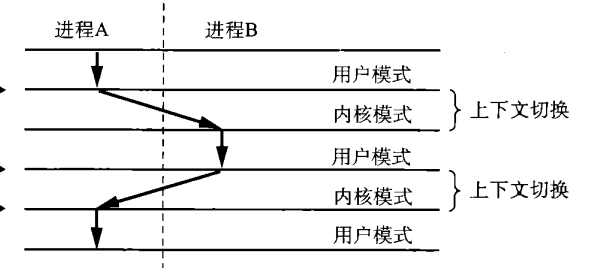
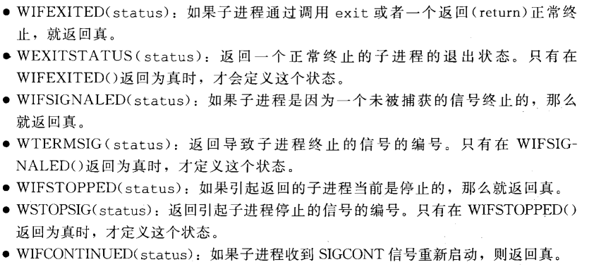
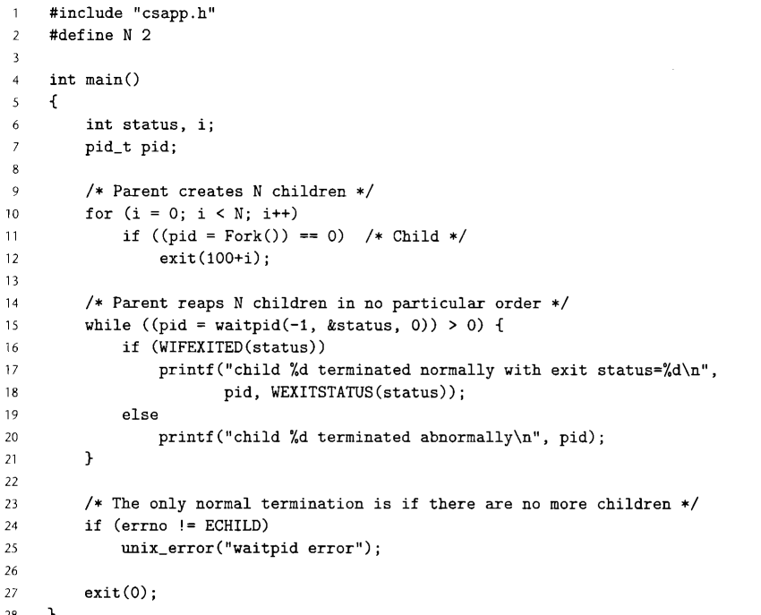
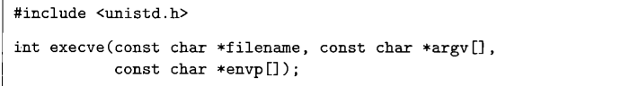
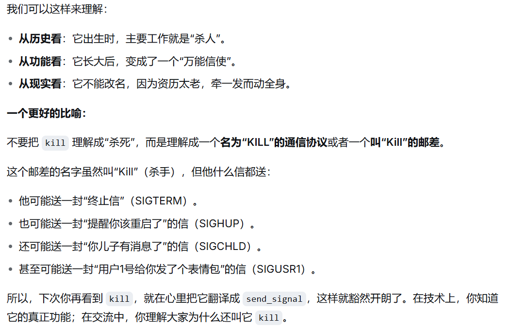
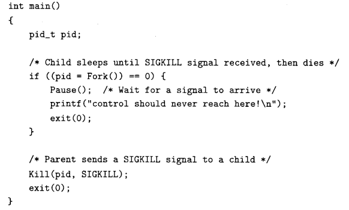
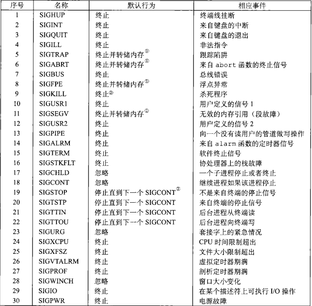
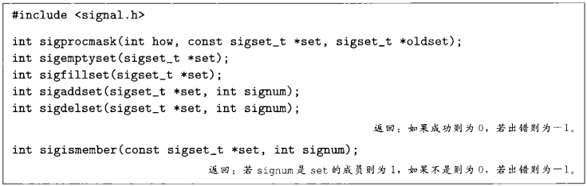

# ECF(Exception Control Flow)异常控制流

## 异常概述

我们主要处理下面四类异常。其中后三种都属于同步异常，只有Interrupt属于异步异常。

1. 硬件中断(Interrupt)。
   + 这是来自计算机外部硬件设备的信号。比如你按了一下键盘、移动了鼠标、网卡收到了数据、或者硬盘读完了数据。
   + 它跟你程序当前在做什么完全没关系，随时可能发生(**异步发生**)。且是系统正常工作的一部分，不是错误。
   + CPU 会立刻保存当前现场，然后**跳转**到一个预设的**异常处理程序**（比如操作系统里管键盘的代码），处理完这个中断（比如记录下你按了哪个键）之后，再**返回到原来指令的下一条指令**继续执行。
2. 陷阱(Traps)。
   + 这是程序**故意**引发的一个异常。目的就是为了向操作系统请求服务。
   + 正常的程序只能改变程序状态。比如修改寄存器/内存的值等。如果程序想读一个文件，或输出一些信息，或者调用一个新的程序，或者终止当前进程等，就要通过执行`syscall`指令来向**内核**请求服务。服务完成后，再**返回到原来指令的下一条指令**继续执行。
   + 执行`syscall`指令就是一个程序故意设置的到异常处理程序的**陷阱**。和程序中的call很相似，但是能够提高程序权限。
3. 故障(Faults)。
   + 故障是由程序错误引起的。它**有错误修正处理程序**，可能能够被修正。
   + 发生故障时，处理器将控制转移到故障处理程序。如果故障可以修正(例如缺页故障，可以通过操作系统拷贝磁盘内存来修正。)则将控制返回到**引起故障的指令本身**。如果故障不能修正，则终止引起故障的程序。
4. 终止(Aborts)。
   + 终止是指发生了**不可恢复的致命错误**。与故障不同，它没有修正程序，而是直接终止。

## 进程与进程控制(Process and Process control)

> CPU核心的处理器只有一个。那么你是怎么在边看视频的时候后台边跑模型的？
>
> 多个程序是怎么样一起执行的？控制权在哪个程序手上？
>
> 这些问题都是通过进程来解决的。

### 进程


进程的经典定义是一个执行中的过程。操作系统给予进程一种抽象：**使得每个进程拥有一个独立的逻辑控制流，以及一个独立的地址空间。**



上图是一个运行着三个进程的系统。

从单个进程的角度来看，比如进程A：你会认为它看上去是独占地使用处理器的，只是有时会发生一些停顿。并且你会认为单个进程看上去是独占地使用一块内存地址的，这是因为每个进程都有它自己的私有地址空间，其余的进程不能对这块地址空间进行读写。

但是从系统的角度来看，不同的进程是交错并发执行的。逻辑流在时间上重叠的进程，认为是并发的。例如上图中AB、AC都是并发的，BC不是并发的。

### 内核模式与用户模式

一般而言，进程运行在**用户模式**中。

用户模式中的进程权力很有限，它们不允许进行IO操作，不允许停止处理器，也不允许访问非该进程区域的内存地址。如果它们想要进行这些操作，就需要使用异常控制流来将控制转到**内核模式中的**异常处理程序。

**内核模式**中的进程权力很高。它们可以执行任何指令，并且可以访问系统中的任何内存位置。

除了**通过异常处理程序响应用户模式中的进程**，内核的工作包括**通过上下文切换来调度进程**。



如上图，上下文切换是为了能够合理地进行进程并发。具体地，它会中断当前进程的控制，先保存当前进程的状态(包括寄存器状态，程序计数器状态，栈状态，程序计数器等等)，然后切换到另一个进程的状态，最后将控制权转移到另外的进程。

### 程序中的进程控制

#### 进程id

每个进程都有自己的进程ID(PID)。进程ID是一个正整数。C语言中，可以使用getpid函数返回该进程的PID，getppid返回父进程的PID。这两个函数在库`<sys/types.h>`中。返回值类型是`pid_t`。

```c++
#include <sys/types.h>
#include <stdio.h>
int main()
{
    printf("getpid = %d\n" , getpid());
    printf("getppid = %d\n" , getppid());
    return 0;
}
```

输出：

```shell
getpid = 2851
getppid = 1492
```

#### 创建子进程——fork函数

fork函数不接收参数，返回类型为pid_t。

父进程可以通过fork函数来复制一个子进程。子进程的得到与父进程地址空间相同的一个副本，包括代码，数据，堆，栈，还可以获得父进程所有打开文件的副本。这就意味着**父子进程除了pid不同之外，完全相同。**

fork函数会在父进程和子进程中都进行一次返回。在父进程中，它返回子进程的PID，在子进程中，它返回0。**得到fork函数的返回值是子进程的开始。**

下面是一个实例，来说明fork函数的神奇之处。

```c++
#include <sys/types.h>
#include <stdio.h>
int main()
{
    int x = 1;
    pid_t pid_fork = fork();
    if(pid_fork == 0)
    {
        x ++;
        printf("child : x = %d\n" , x);
    }
    else
    {
        x --;
        printf("parent : x = %d\n" , x);
    }
    printf("pid_fork = %d\n" , pid_fork);
    printf("getpid = %d\n" , getpid());
    printf("getppid = %d\n" , getppid());

    return 0;
}
```

输出：

```shell
parent : x = 0
pid_fork = 2771
getpid = 2770
getppid = 1492
child : x = 2
pid_fork = 0
getpid = 2771
getppid = 2770
```

可以看到，父子两个进程都会被执行一次。在我的操作系统(Ubuntu)上，先执行的是父进程。但是这个顺序在不同的操作系统上都会有差异。**程序员不应该假设进程执行的顺序。**

观察x的信息，可以发现父进程中的x与子进程中的x是**相互独立**的。在父进程中，x虽然+1，但是它不影响子进程中的x。

子进程的PID是2771。这个数字同时出现在了父进程的pid_fork中。

父进程的PID是2770。这个数字同时出现在了子进程的getppid中。

父进程的getppid是1492。这个PID是我打开的终端的进程。

你可以在终端中输入指令`ps`来查看进程信息，输出结果:

```shell
PID TTY       TIME 	   CMD
1492 pts/2    00:00:00 bash
2887 pts/2    00:00:00 ps
```

这个结果的意思是：

第一行：当前终端bash shell的进程ID是1492，运行在2号伪终端上(这是因为我使用的终端是VS code中的终端)，累计使用的CPU时间很短(00:00:00)。

第二行也很有意思：第二行说的是进程ps的信息。ps就是我输入的查看进程信息的指令。它的ID是2887，运行在2号伪终端上，基本没占CPU时间(看个进程信息而已嘛，很快的啦)。

你会发现ps和bash也是父子关系。且bash还有一个儿子——就是我们上面运行的C语言程序(但是在输入ps查看进程信息时，那个进程已经被终结了)。

**思考：fork函数属不属于异常控制流？属于哪一类？**[^1]

**思考：下面的程序输出几个Hello World?**[^2]

```c++
#include <sys/types.h>
#include <stdio.h>
int main()
{
    fork();
    fork();
    printf("Hello World\n");
    return 0;
}
```
#### 子进程回收

进程终止时，不会立即被清除，而是等待被父进程回收。被回收后，内核将子进程的退出状态传递给父进程，然后清除子进程。

一个中止但没有被回收的进程叫做僵尸进程(zombie，死而不僵)。

如果父进程终止了，内核会安排一个特殊的进程init作为父进程的所有未清除的子进程的父亲。init进程的PID是1，是进程树的根节点。

#### 等待子进程终止——waitpid函数

waitpid函数的定义如下：

```c++
include<wait.h>
include<sys/types.h>
pid_t waitpid(pid_t pid, int *statusp, int options)
```

这个函数基本是等待一些子进程的终止。视参数的不同有多种不同的行为。

##### **等待集**

1. 如果pid不为-1，则等待集是pid对应的进程。这个进程**必须是当前进程的子进程**。
2. 如果pid为-1，则等待集是当前进程的所有子进程。

若pid为-1但是当前进程没有子进程，或者pid不为-1但是不合法，则直接返回-1，并设置errno为ECHILD。

##### **函数行为**

1. options = 0，执行默认行为。默认行为是挂起当前进程直到等待集中有进程**终止**。返回这个终止进程的pid。
2. options = WNOHANG，则执行不挂起行为。无论如何，函数都立即返回。如果等待集中没有进程终止，则返回0；否则返回终止的PID。
3. options = WUNTRACED，则不但监控终止行为，还**检测停止行为**。即等待集中的子进程被终止或者中断，都会引起返回。
4. options = WCONTINUED，监测等待集中的**终止行为或者中断后重新执行的行为**。即等待集中的子进程被终止或者被中断后收到信号SIGCONT重新执行，都会引起返回。
5. 可以用或运算符组合这些选项。如options = WNOHANG | WUNTRACED，行为是监测停止和中断，且如2所示，立即返回。

**如果waitpid函数检测到了终止行为，则会自动将终止的进程回收掉。**

##### **返回额外信息：**

该函数会将导致返回的子进程的信息传递到statusp指针中。

设`status = *statusp`，则我们有下面几个宏来通过status得到子进程信息：



请注意，这些宏的使用方式是和operations参数的选取对应的。你只有监测了子进程的Stop行为，访问WIFSTOPPED才有意义。

##### 几个栗子

举几个例子，来帮助理解waitpid函数。

先来看书上的例子，使用该函数的默认行为。



这段代码创建了N个子进程，每个在创建时即退出，返回码为100+i。

while循环中，每次循环等待一个子进程结束。if语句确保正常返回后，输出信息。

最终确保原进程没有其余子进程(因为在waitpid监测时，自动会将导致返回的终止的子进程回收。)

程序正常退出。


再来看一个算法界的段子——睡眠排序。

所谓睡眠排序就是说，对于一个n元正int数组，我需要排序。我创建n个进程，第i个进程去sleep a[i]秒。

**因为一秒的差异对于计算机来说是很大的，所以我们可以认为进程是按照睡眠时长从小到大醒来的。**

然后我监测进程醒来的顺序，就可以得到排序结果。[^3]

这个代码和上面的代码核心逻辑差不多。

```C++
#include <stdio.h>
#include <unistd.h>
#include <signal.h>
#include <stdlib.h>
#include <wait.h>
int a[5];
int n = 5;
int main()
{
    for(int i = 0; i < n; i++)
    {
        scanf("%d" , &a[i]);
    }
    for(int i = 0; i < n; i++)
    {
        pid_t pid = fork();
        if(pid == 0)
        {
            sleep(a[i]);
            exit(a[i]);
        }
    }
    int status;
    while(waitpid(-1 , &status , 0) > 0)
    {
        if(WIFEXITED(status))
        {
            printf("%d\n" , WEXITSTATUS(status));
        }
    }
    return 0;
}
```

再举一个例子，来看看选项WNOHANG的用处。

```c++
#include <sys/wait.h>
#include <unistd.h>
#include <stdio.h>

int main() {
    pid_t pid = fork();
    
    if (pid == 0) {
        // 子进程
        sleep(2);
        printf("Child process exiting\n");
        return 0;
    } else {
        // 父进程
        int status;
        pid_t result;
        
        while (1) {
            result = waitpid(pid, &status, WNOHANG);
            if (result == 0) {
                printf("Child still running, doing other work...\n");
                sleep(1);
            } else if (result == pid) {
                printf("Child exited\n");
                break;
            } else {
                perror("waitpid");
                break;
            }
        }
    }
    return 0;
}
```

这个代码中使用while循环每次等待子进程的返回。如果子进程没有返回，则父进程能够**在循环中继续干别的事情**，而不是在那干等着。

#### 加载并创建新的程序——execve函数



execve函数接受一个可执行文件的文件名，一个参数列表和一个环境变量列表。然后以指定的参数和环境变量，去运行对应的可执行文件。

可想而知，execve最常见的使用场景是shell。在Shell Lab中，这个尤其得到明显的体现。

## 信号

信号是由内核发送给进程的信息。

### 信号的发射

信号的发射是基于**进程组**概念实现的。进程组和pid差不多，也由一个进程组ID代表。

子进程和父进程默认在同个进程组中。但是进程也可以改变自己或者子进程所属的进程组，也可以创建一个只包含自己的新的进程组。

下面是一些例子：

+ 输入Ctrl+C会发射SIGINT(键盘中断)给当前的前台进程组。

+ 使用 /bin/kill -9 x会发送信号9(SIGKILL，杀死程序)给进程x。

+ 使用 /bin/kill -9 -x会发送信号9(SIGKILL)给**进程组**x。

+ C语言中可以使用kill函数来给其他进程发送信号。
  + 如果pid > 0，则发送信号码sig给进程pid。
  + 如果pid = 0，则发送信号给进程组中的所有进程，包括自己。
  + 如果pid < 0，则发送信号给**进程组**-pid中的所有进程。

```c++
#include <sys/types.h>
#include <signal.h>
int kill(pid_t pid , int sig)
```

附，段子一则：




~~（退役杀手当邮差.jpg)~~

例如下面的代码中，父进程发送`kill`信号给子进程。



你可以使用`ps`命令查看终端的pid，然后写个C代码把终端杀了……

然后你甚至还可以写出这种代码：

```c++
//killer_without_emotions.c
#include<signal.h>
#include<sys/types.h>
#include<stdio.h>
#include<unistd.h>
#include<stdlib.h>
int main()
{
    pid_t pid = getpid();
    for(int i = 1; ; i++)
    {
        if(i == pid)
        {
            continue;
        }
        kill(i , SIGKILL);
    }
    kill(pid , SIGKILL);
    exit(0);
}
```

注意，**千万不要在你的主系统中运行这个程序！** 

我尝试作死，在wsl中运行，导致wsl直接崩溃。好在windows主系统的进程和wsl是分开的，电脑没有蓝屏，然后wsl仍然可以重启。

### 接受信号

进程接收信号后，会采取一些行为。信号的默认行为见图所示。



进程可以通过`signal`函数修改默认行为。但是SIGSTOP与SIGKILL的行为不能修改。


这个函数修改与信号`signum`相关的行为。

+ 如果handler是`SIG_IGN`，那么会将默认行为改成忽略。
+ 如果是`SIG_DFL`，那么会将行为恢复为默认。
+ 否则handler传递一个用户定义的函数地址。只要进程接到这个信号，就会调用这个函数。这就是设置信号处理程序。

下面的例子写了一个信号处理函数，来处理ctrl+C传出的SIGINT信号。注意函数`sigint_handler`接受一个参数sig，是引起它的信号。

```C++
#include<signal.h>
#include<sys/types.h>
#include<stdio.h>
#include<unistd.h>
#include<stdlib.h>
void sigint_handler(int sig)
{
    printf("Received signal: %d\n", sig);
    printf("So you want to stop me?\n");
    printf("Well……\n");
    printf("OK :)\n");
    exit(0);
}
int main()
{
    signal(SIGINT , sigint_handler);
    pause();
    exit(0);
}
```

信号处理函数在执行过程中，也有可能因为接收到其它信号而被其它信号处理函数打断。

但是它不会被同类信号打断。举个例子：如果上面的信号处理函数是sleep 3秒，我在这三秒中再按一次ctrl+C，不会再跳进一次信号处理函数而重置sleep时间，而是默认已经接收这个信号，将信号状态设置为待处理。

### 信号阻塞与解阻塞

程序可以使用`sigprocmask`等函数，阻塞和解阻塞选定的信号。

被阻塞的信号不会被接收。



sigprocmask行为如下：

+ 当`how = SIG_BLOCK`时，会将set中的信号添加到blocked中。
+ 当`how = SIG_UNBLOCK`时，会从blocked中删除set中的信号。
+ 当`how = SETMASK`时，会将blocked直接设置为set.

如果oldset非空，那么该函数会将之前的blocked保存在oldset中。

举个例子，下面的程序会阻塞SIGINT信号，保证在sleep的时候不被keyboard打扰~~怎么听起来怪怪的()~~

```c++
#include<signal.h>
#include<sys/types.h>
#include<stdio.h>
#include<unistd.h>
#include<stdlib.h>
int main()
{
    sigset_t mask , prev;
    sigemptyset(&mask);
    sigaddset(&mask , SIGINT);
    sigprocmask(SIG_BLOCK , &mask , &prev);
    sleep(10);
    printf("first sleep OK!\n");
    sigprocmask(SIG_SETMASK , &prev , NULL);
    sleep(10);
    return 0;
}
```

请注意，如果在前10秒输入了Ctrl+C，在接触阻塞的一瞬间，程序就会结束。因为阻塞信号不等于将信号忽略，而只是屯着不处理。


[^1]:当然属于。用户模式中的进程没有权限创造一个新的进程，所以创造进程这件事得交给内核进程来干。这是一个标准的**Trap**。
[^2]:四个。别忘了第一个创建出来的子进程也要fork一次。
[^3]:~~这个算法的时间复杂度是O(1)的。因为对于任意大的数组，睡眠时间不会超过2147483647秒。你就说O不O(1)吧~~

