在可视化领域中，我们经常会将物体建模成几何模型。例如多边形网格，点云等。

# 多边形网格表示

多边形网格是表达几何体的常见方式。而最常见的就是三角形网格。我们在Lab中接触了很多关于三角形网格的内容了。

## 参数化

我们考虑纹理映射的问题。如何建立三维曲面和二维纹理平面上的一一映射？这也就是说，我们需要为每个三维空间中的顶点对应一个二维坐标值$(u,v)$。

### 世界地图的绘制

这是参数化的一个具体应用。例如立体投影和墨卡托投影两种方式。

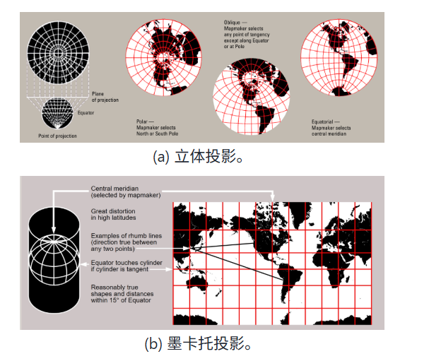

立体投影，又叫球极平面投影。这种投影能够保角度，但是无法保长度和面积。尤其在球极点附近，变形是很严重的。

墨卡托投影，将经纬线投影成xy坐标。这种方式也是保角度但是不会保长度。尤其是南北极点附近，拉伸是很严重的。

### 基于弹簧模型的网格平面化

我们假设网格中的每条边代表着一个弹簧，采用弹簧系统的能量函数来描述参数化后的系统状态，弹簧的拉伸最终会达到平衡状态，即使得整个系统能量最低。

假设从i到j的弹簧的劲度系数为$D_{ij}$，这其实是一组自选的参数。

则弹簧的总能量为
$$
E=\Sigma_{i,j}\frac{1}{2}D_{ij}||x_i-x_j||^2
$$
平衡状态时，能量关于各变量的导数为0。即对于任意$i$，若设$\Omega(i)$为顶点$i$的邻居集，则有：
$$
\Sigma_{j\in\Omega(i)}D_{ij}(x_i-x_j)=0
$$
整理可得
$$
x_i=\Sigma_{j\in\Omega(i)}\lambda_{ij}x_j
$$
其中$\lambda_{ij}$是仿射组合系数。满足$\Sigma_{j\in\Omega(i)}\lambda_{ij}=1$。

这是一个线性齐次方程组。平凡解是0.我们可以通过网格边界值的映射构建边界条件。比如在Lab中做的，我将人脸的边界按照周长均匀映射到一个圆形中。然后我们可以采用高斯迭代法去求解方程。

常用的仿射组合系数有三种。

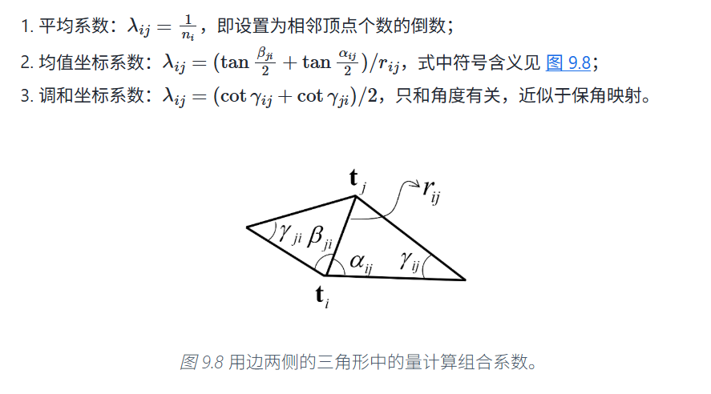

## 网格的存储——半边模型

将一个网格处理成若干个半边。

注意到每条半边只会属于一个面。我们规定每条半边的next edge总是与他首尾相连且处于同一个面中的。且每个面都是逆时针切分。

例如半边$e_0$的nextEdge就是$e_1$。

每条半边会存储有TwinEdge信息，会存储有它属于哪个面的信息。

每个面会存储一个起始边，每个点也会存储一个起始边。

采用这样的存储方法，就可以很方便地处理很多事情。

例如：遍历一个顶点的所有相关边：e从顶点的起始边开始，每次取e的Twin的nextEdge。这样便历下去，就可以得到一个顶点相关的所有边。

又例如：遍历一个面的所有边。就可以从面的起始边开始，每次取nextEdge。

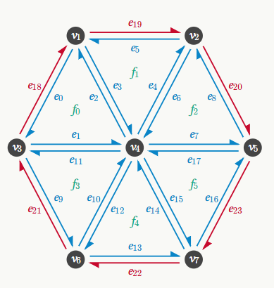

这个半边模型在Lab中一直需要使用。同学们应该还是比较熟的。

## 网格平滑

网格平滑是指将网格降噪从而获得相对光滑的几何模型的过程。

这个算法可以理解为每次更新顶点位置。对于每个顶点，先计算其相邻顶点位置的加权平均。权重可以采用均匀权重，也可以采用余切权重$w_{ij}=cot(\alpha_{ij})+cot(\beta_{ij})$。

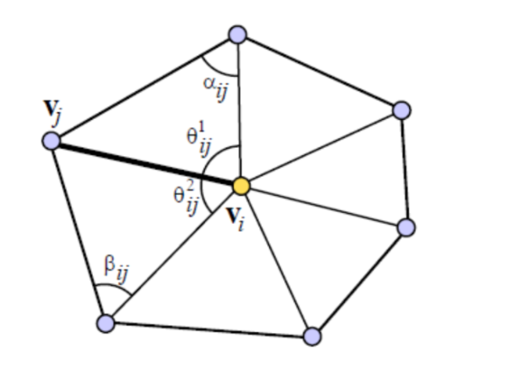

## 网格简化

网格简化的动机和MIP差不多。模型在远处的时候，你不需要为模型渲染那么多的三角形。这样就可以用网格简化算法来生成不同细节层次的模型，进而在不同情况下选择不同的层次去渲染。

Lab中做的网格简化的算法来自于一篇论文。基本的思想是边坍缩成点，然后对每条待坍缩的边，计算一个坍缩代价。每次在待坍缩的边中，选择一个坍缩代价最小的边来进行坍缩。

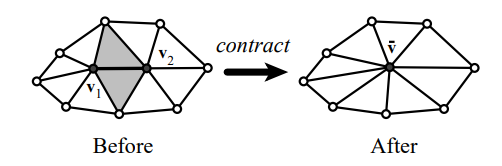

论文中定义的将$V_1,V_2$合并为$P$的代价定义为顶点P到两个顶点所属的面的集合的距离平方和。

对于一个平面$ax+by+cz+d=0$，其中$a^2+b^2+c^2=1$，我们将平面写成向量$p=[a,b,c,d]^T$。对于齐次坐标下的点$v=(x,y,z,1)^T$，有v到平面的距离就是$v^Tp^Tpv$。

令$K_p=pp^T$，然后对于每一个顶点$v_i$，将它的所有相邻面的$K_p$相加，得到矩阵$Q_i$。

对于坍缩i-j边为v，代价即为$C=v^T(Q_i+Q_j)v$

我们可以通过求导后解方程来解决最小化代价问题。

设Q和v的分块为
$$
Q=\begin{pmatrix}
A & b \\
b^T & q_{44}
\end{pmatrix}，v=(x,y,z,1)^T
$$
则求导并令梯度为0的结果是：
$$
A[x,y,z]^T=-b
$$
若A可逆，就可以解出$[x,y,z]$得到最佳坍缩点，并代入回原来的代价公式求出代价。若A退化，则可以选取特殊点作为坍缩目标，例如边的中点。

## 网格细分

和网格简化对应的就是网格细分。网格细分的过程其实也是一种平滑化的过程。

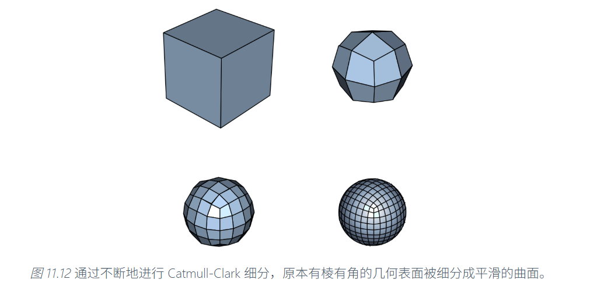

网格细分算法常用的是Catmull-Clark算法和Loop细分算法。

### Catmull-Clark细分

Catmull-Clark算法每次细分按照下面顺序来进行：

1. 增设面点。对多边形的每个面，增加一个面点。这个面点是这个多边形面上所有顶点坐标的平均值，即这个多边形的重心。

2. 增设边点。边点是对每条边的两个端点和使用这两条边的面的面点四个点做平均值得到的。

3. 顶点更新。对于**原来**多边形的所有顶点，使用：

   + 所有包含顶点v的**边的中点**的平均值**R**
   + 所有包含顶点v的多边形面的面点的平均值**F**
   + 原来的顶点坐标v

   这三个值来作加权平均。采用这样的权重：
   $$
   v'=\frac{F+2R+(n-3)V}{n}
   $$
   其中n为面点的数量，即v所在的面的数目。

4. 更新边和面。首先取消所有原来的边，然后按照下面的规则连边以形成新的边和面：

   + 将所有面点连接到所有它原始面所在的边点。
   + 将所有更新后的原多边形顶点连接到它原先所在边的边点。

   

如图所示：ABC是原先的三角形网格。假设G是面点，DEF是边点，HIJ是更新后的顶点，则连接后的网格就应该是如图所示的六边形，网格是由四边形组成的。

可以证明，经过一轮细分后，不论原多边形网格是何结构，新得到的多边形网格将只由四边形构成。在不断细分的过程中，表面会不断趋向平滑和圆润。

### Loop细分

Loop细分是处理三角面片的细分方法。它每次将一个三角面片细分为四个更小的面片(即每条边创建一个新的边点)，效果也是让三角面片变得更加平滑。

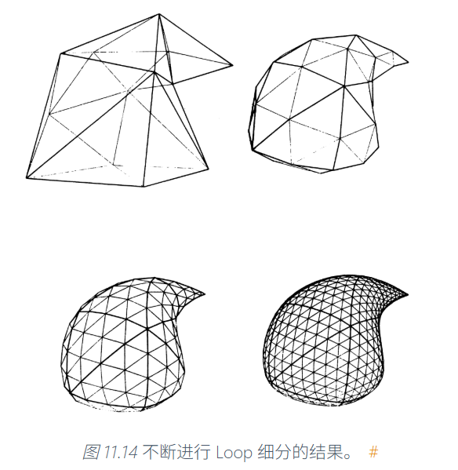

Loop细分的做法由三步组成：

1. 增加边点。对于每条边，如果这条边是边界边，则取边中点作为边点。否则，就将这条边的两个端点(如图，即为B，C)和这条边的两个对点(如图，A与D)来进行加权平均。

$$
E=\frac{1}{8}(A+D)+\frac{3}{8}(B+C)
$$

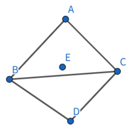

2. 更新原顶点。对于每个原有顶点$v$，根据以下公式计算更新后的位置$v'$: 

# 体素表示

体素是像素在三维中的拓展，是将空间划分成一系列方形网格的方式。但是这个很昂贵。

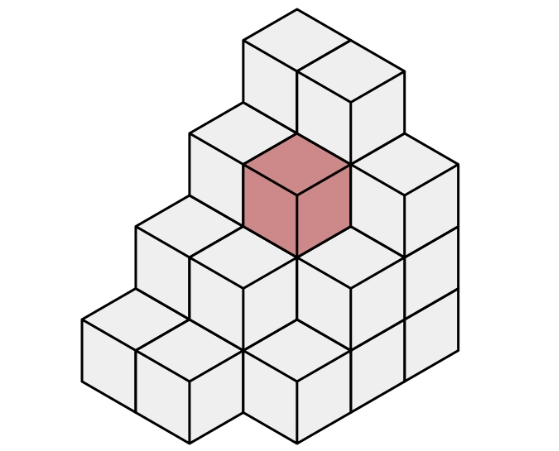

# 符号距离场表示

符号距离场维护了一个场函数f，它表示空间中每一点到模型表面的有向距离。我们认为内部的距离是负的，外部的距离是正的。

f函数需要满足性质$||\nabla f||=1$。

构建符号距离场的方法有扫描法和步进法。前者根据网格扫描的方式，使用梯度性质进行局部更新；后者采用活动传播的方式，每次提取距离最小的点来进行向外传播。

符号距离场可以重建网络模型。典型的方法是使用**Marching Cubes**算法。

这个做法是根据每个体素八个顶点的距离场值，计算出哪些边上可能会与几何模型有交。

将交点根据插值算法求出来，然后按照维护好的枚举表，就可以构建起三角形网格。

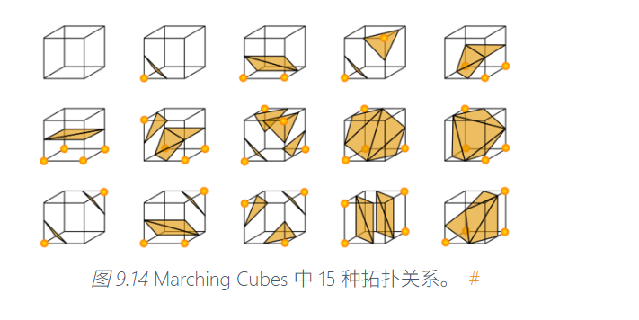

# 点云

点云是一组离散的数据点，刻画了三维形状的几何信息。点云是一种好获取的结构，比如深度相机等设备就可以把三维空间的物体建模成点云。

我们的任务是不同区域间的点云进行配准，然后重建出更好地几何模型。

## 点云的相似度

我们会用倒角距离衡量两个点云之间的相似度。它被定义为两个点云最近点对之间的平均距离。

其中$NN(x,P)$表示点x再P中的最近邻居。

## 点云下采样

+ 随机下采样：每个点以r的概率被保留。
+ 最远点采样：初始选择一个点，然后每次选择一个和已有备选点集最近距离最远的点加入点集。
+ 体素下采样：根据一定的分辨率和网格范围，在空间中划分体素网格，统计落在每个体素格子中的点。每个非空体素产生一个点，合并成为降采样后的新点云。

## 点云的配准——ICP算法

我们往往会对同一个场景的不同区域分别采集点云数据。

点云的配准处理的是多个点云数据**合并**的过程。具体来说，给定待变换点云P和目标点云Q，ICP算法的任务是得到一组旋转平移变换R和t，使得点云P经过该变换后，最大程度地与点云Q对齐。

令
$$
p_j'=Rp_j+t
$$
则对齐的误差定义为：
$$
E=\Sigma_j|p_j'-NN(p_j',q)|^2
$$
注意我们求和下标是对所有的匹配点云对，我们会丢弃距离过远的匹配对（例如大于所有匹配点距离中位数的若干倍）。

即对于匹配点对求最小误差。

这不是线性的。没有办法用线性的办法优化。但是我们可以每次假设匹配对不变，针对这组匹配对算出来最优的R与t，然后再根据算出来的R与t更新匹配对。

总结一下算法的流程：

1. 算法先初始化一组较好的变换R和t。初始化的方法是寻找R和t使得质心对齐且**主成分分析后得到的三个轴**对齐。
2. 将R和t运用到点云P中，变换后的每一个点$p_i'$找一个最近点$q_i$，成为一个匹配对。在这些匹配对中丢弃距离过远的匹配对，计算误差函数E。
3. 在这组匹配对的意义下找到最优的R和t。这是一个**最小二乘估计**问题。
4. 重复2-3步骤，直到误差小于阈值或循环次数超过上限。

其中主成分分析较为简单，但是求解这个最小二乘估计并不简单。这是比较经典的**Procrustes问题**。涉及到的数学比较复杂。下面来推导一下具体过程：

现在的问题是有点对$P=(p_1,p_2,...p_n)$,$Q=(q_1,q_2,...q_n)$,需要求解一个正交矩阵R和一个平移向量t,使得最小化$E=\Sigma_i||Rp_i+t-q_i||^2$。

第一步，首先我们先处理平移向量。固定R，对t求导。不出意外地，最优的t满足
$$
t=\frac{1}{n}\Sigma_i(q_i-Rp_i)
$$
即平移过程是将RP和Q的质心对齐。

然后我们将t代入。则有
$$
\begin{align}
E=&\Sigma_i||Rp'_i-q'_i||\\
=&||RP'-Q'||^2_F\\
=&trace((RP'-Q')^T(RP'-Q'))\\
=&trace(P'^TP')+trace(Q'^TQ')-2trace(P'^TR^TQ')
\end{align}
$$
其中，$||A||^2_F$表示将矩阵A视为向量时的模长平方，即每个元素的平方和。

有$||A||^2_F=trace(A^TA)$。

接下来，我们需要最小化E，就只需要最大化$trace(P'^TRQ')$。

而设$H=Q'P'^T$，H的奇异值分解为$H=U\Sigma V^T$，则有：
$$
\begin{align}
trace(P'^TRQ')&=trace(RQ'P'^T)\\
&=trace(RH)\\
&=trace(RU\Sigma V^T)\\
&=trace(V^TRU\Sigma)
\end{align}
$$
令$M=V^TRU$，则我们知道M也是一个正交矩阵。而$\Sigma=diag(\sigma_1,\sigma_2,\sigma_3)$是一个正定对角矩阵。自然有
$$
trace(M\Sigma)\le trace(\Sigma).
$$
取等条件：$M=E$为单位矩阵。即$V^TRU=E$，$R=VU^T$.

所以整体算法就是，先计算矩阵P和Q并去质心化得到$P',Q'$，计算$H=Q'P'^T$，H的奇异值分解为$H=U\Sigma V^T$，则$R=VU^T$，$t=\frac{1}{n}\Sigma_i(q_i-Rp_i)$。

## 点云的表面重建

我们想要将点云重建为多边形网格。主要有德布劳内三角剖分方法和泊松表面重建这两种方法。

### 德布劳内三角剖分

构造一种三角分割方式，使得生成结果中，任何三角形的外接圆内，都不包含任何点。可以证明，这样的三角剖分最大化了所有三角形中最小的内角。这样得到尽量“均匀”的三角网格。

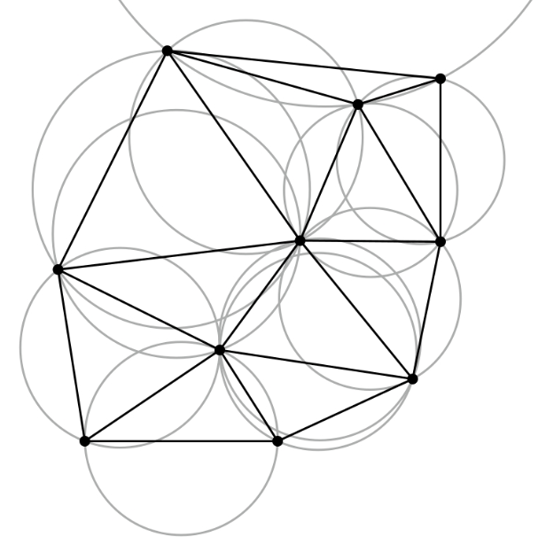

构建有一种较为简单的算法：

1. 构造任意三角剖分，然后检查共边三角形。
2. 如果不满足性质（如下图），就进行翻转，重新连接边。
3. 重复检查其他三角形对，直到所有三角形对都满足性质。

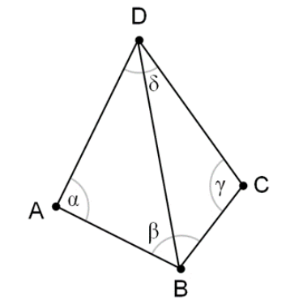

### 泊松表面重建

首先通过构建符号距离场函数，然后再通过行进立方体（Marching Cubes）算法，从符号距离函数场中提取出三角网格。

### 点云的模型拟合

通过计算平面来拟合一组点云。

我们需要求解$A,B,C,D$使得最小化误差
$$
L=\Sigma_i(Ax_i+By_i+Cz_i+D)^2
$$
令$M=[A,B,C,D]$，则$L=||PM||^2$

使用奇异值分解即可解决最小二乘问题。所求的M为$P^TP$的最小特征值对应的特征向量。

如果点云中的噪声点过多，我们也可以使用**RANSAC**的做法去做。

1. 随机选择一个用于估算的最小子集（对于估计平面来说，该子集包含 3 个点）；
2. 用这个子集估算待求的参数；
3. 用估算的参数测试整个数据集，将误差在一定范围内的数据点作为“内点”（inliers）；
4. 如果内点的数量超过一定比例，就以全部内点为输入，使用最小二乘法重新估计一组更精确的待求参数；
5. 重复 1-4 步若干次，最后将“用最多内点估计出的参数”作为最终结果。

