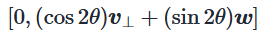
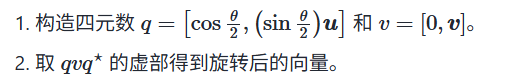
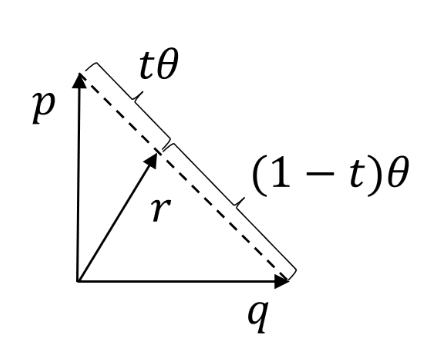
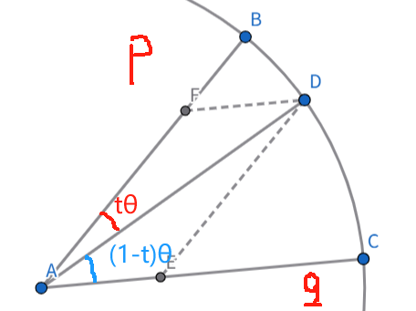
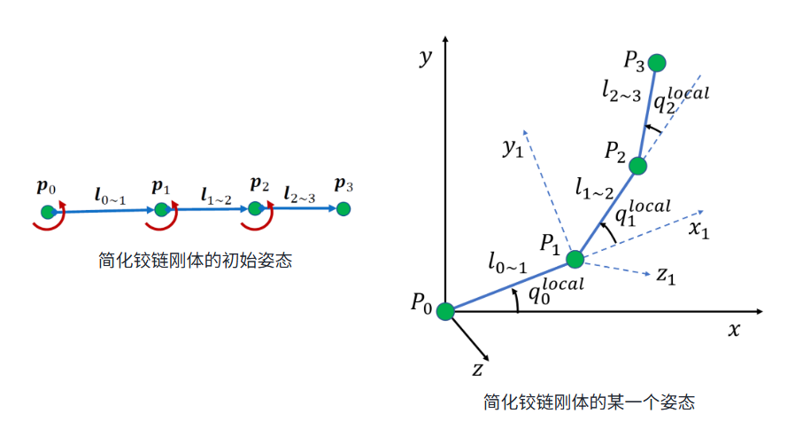
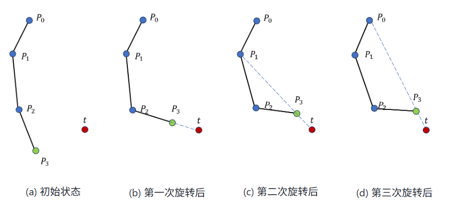
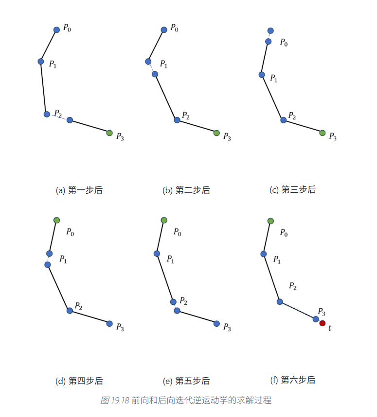
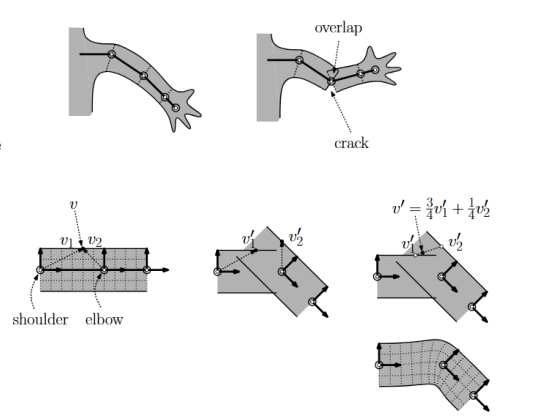

# 动画原理

我们会将我们感兴趣的动画分为两个部分。一个部分是主观动态，另一个部分是主观动态。

前者指的是场景中具有自主行动能力的角色自发产生的动态，后者指的是环境当中遵循物理定律的物体进行的运动。

其中后者我们主要考虑物理模拟，而这块的内容我们已经在[**物理模拟**](物理模拟)中涉及过了。所以现在我们就主要来处理主观动态。

## 数学基础

### 旋转矩阵

二维空间中，向量$(x,y)^T$逆时针旋转$\alpha$角，得到的结果等价于在向量前乘一个旋转矩阵$\begin{pmatrix}
cos\alpha & -sin\alpha \\
sin\alpha & cos\alpha \\
\end{pmatrix}$。将它拓展到三维，我们先考虑向量$(x,y,z)^T$绕$z$轴的旋转，这就等价于在xy平面上绕原点旋转且z轴不变。于是我们可以得到：
$$
\begin{pmatrix}
x'\\
y'\\
z'
\end{pmatrix}=
\begin{pmatrix}
cos\alpha & -sin\alpha & 0 \\
sin\alpha & cos\alpha & 0 \\
0 & 0 & 1
\end{pmatrix}
\begin{pmatrix}
x\\
y\\
z
\end{pmatrix}
$$
绕其余坐标轴旋转同理。我们记上面绕$z$轴逆时针旋转$\alpha$角的旋转矩阵为$R_z(\alpha)$。

接下来我们考虑绕空间中任意轴旋转的变换矩阵。设旋转轴单位向量为$u$，待旋转向量为$P_0$。

则基本思路如下：

1. 任取与$u$垂直的单位向量$w$，取$v=u\times w$。则$u,v,w$两两垂直。
2. 将$u,v,w$看成一个新的坐标系。令$R=(u,v,w)$则在新的坐标系下，$P_0$的坐标为$R^TP_0$。
3. 在新的坐标系中，u为x轴。我们将向量在新坐标系中绕x旋转$\alpha$角，再变回原坐标系。于是得到最终的算式$P_0'=RR_x(\alpha)R^TP_0$。于是旋转矩阵$R_u(\alpha)=RR_x(\alpha)R^T$。

经过一系列矩阵变换，得到罗德里格旋转公式（Rodrigues’ rotation formula）如下：
$$
R = I + sin\alpha[u]+(1-cos\alpha)[u]^2
$$
其中$[u]=\begin{pmatrix}
0 & -u_z & u_y \\
u_z & 0 & -u_x \\
-u_y & u_x & 0\end{pmatrix}$为u的叉乘矩阵。

### 四元数

我们知道复数可以表示二维中的旋转。$e^{i\theta}z$表示$z$绕复平面逆时针旋转$\theta$。类似地，我们可以定义四元数来表示旋转。

#### 四元数的定义

四元数$q=a+bi+cj+dk$。其中$a,b,c,d\in\R$，$i,j,k$满足：
$$
i^2=j^2=k^2=-1\\
ij=k,jk=i,ki=j\\
ji=-k,kj=-i,ik=-j
$$
我们可以将四元数表示为实部$w=a$和虚部向量$v=(b,c,d)^T$。记作$q=(w,v)$。

四元数的加减法，模长，点乘都与四维向量的运算规则相同。

四元数的乘法按照上面的$i,j,k$的性质进行。注意四元数的乘法**没有交换律**。

如果用实部和虚部向量的办法来表示，则会简单一些：
$$
q_1q_2=(w_1w_2-v_1\cdot v_2 , w_1v_2+w_2v_1+v_1\times v_2)
$$
四元数的共轭的定义与复数共轭定义类似。$q=(w,v)$的共轭为$q^*=(w,-v)$。

我们有$qq^*=q^*q=(w^2+v\cdot v,0)\in\R$。我们将其定义为$||q||^2$。这和四维向量的模长计算方式是相同的。

于是我们可以定义非零四元数的逆元为$q^{-1}=\frac{q^*}{||q||^2}$。

#### 四元数表示旋转

设$q=(cos\theta,(sin\theta)u)$是一个单位四元数，$v=(0,v)$是一个实部为0的四元数。则：

1. $qvq^*$实部为0。
2. $qvq^*$的虚部是向量v绕转轴u逆时针旋转$2\theta$的结果。

证明：将v分解成垂直于u的方向$v_{\perp}$和平行于u的方向$v_{//}$两部分。

分别计算乘法得到实部与虚部。对于$v_{\perp}$，计算出来的结果是

其中$w=u\times v_{\perp}$。

因此如果我们想将一个三维向量v绕单位长度的向量轴u旋转$\theta$，可以进行如下操作：

#### 四元数插值

比如说我们在一秒钟内需要将一个向量从原始形式(旋转0)到旋转q(这里旋转方式q用四元数的形式给出)。那么我们想渲染出这一秒的视频，我们需要做的事情是对于时间t，计算出它的旋转四元数是什么。

我们进一步泛化这个问题。我们想要对两个描述旋转的四元数$p,q$进行插值操作。

最简单的办法是进行线性插值。如图所示。但是这种插值方式得到的结果不是单位四元数，即使硬性归一化，它也存在运动速度不均匀的问题。

比较好的想法是在球面上对角度进行线性插值。因为四元数本身就代表旋转的含义，对于角度均匀的旋转是合乎情理的。如图所示。(课件的图中pq夹角过于接近垂直。遂重画)

由正弦定理(在三角形DFA和三角形DAE中使用)，可以得到插值公式为：
$$
r=\frac{psin((1-t)\theta)+qsin(t\theta)}{sin\theta}
$$

## 运动学

我们把结构视为铰链。比如人体，我们把每个关节看成一个节点，骨骼看成一条边，则可以确定一个树状结构。如果我们知道每个关节相对初始值的旋转情况以及根节点的位置，就可以从根节点开始，把每个节点的位置构建出来。

### 前向运动学(Forward kinematics)

前向运动学的任务就是从旋转情况中重建出各节点位置。为了简单，我们把树状结构简化成链状结构的铰链。初始状态中，各个铰链指向均朝向x轴正方向。

各个关节有一个相对旋转量$q_i^{local}$。我们都用四元数的方式表示。各关节之间有一个相对位移量$l_{i-1\to i}$。$l_{i-1\to i}$的值为初始值按顺序加上$q_0,q_1,q_{i-1}$这些旋转。或记为关节$P_{i-1}$的全局旋转$q_{i-1}$。

有了这种描述方式，我们可以采用插值的思想，在若干个关键时间节点创建出铰链的姿态，然后中间使用插值的方式，从而得到连续的动画形式。

### 逆向运动学(Inverse kinematics, IK)

逆向运动学的任务是根据某些关节的位置，反向解出一组关节局部旋转的解。

这个问题显然不是线性问题，它拥有很多强约束，在很多情况下无解，且在很多情况下有多解。

对于骨骼数量大于两个的逆向运动学任务，并不存在关节角度的解析解。因此，我们希望通过设计一些迭代算法，不断逼近这个解。下面我们简要介绍三种方法。其中前两种方法我们在Lab中有过实现。

#### 循环坐标法

思想是每次固定$P_i$，只调整$q_i$，让$P_n$与目标点$T$足够近。从数学的角度，最近当然是共线。如图所示。

将上述过程重复若干轮，即可逐渐逼近目标点。

#### 前向和后向迭代法

这种方法在每次循环中直接调整全部关节的位置。它的步骤如图所示。

简单说明一下思想：

为了让$P_3$接近$T$，我们需要让$P_2$接近$P'_2$，从而我们需要让$P_1$接近$P'_1$。

让$P_1$接近$P'_1$的最好方式是让$P_0,P_1,P'_1$共线。从而得到的$P_1$就是当前的结果。然后我们再让$P_1,P_2,P'_2$共线，得到$P_2$，再让$P_2,P_3,T$共线，得到$P_3$。

寻找$P'_i$的过程是后向迭代，更新$P_i$的过程是前向迭代。每一次更新，交替进行前后向迭代。

这种方法收敛的速度会远快于循环坐标法。但是它**难以处理关于旋转的约束问题(By讲义. But Why？我觉得可以处理啊)**

#### 梯度下降法

我们需要寻找一个旋转角所组成的向量$\theta=(\theta_0,\theta_1,\cdots ,\theta_n)$，使得最小化$||P_n-t||^2$。其中$P_n=f(\theta)$是关于$\theta$的函数。于是可以用梯度下降的方法来解这个问题。

~~我的评价是，万物皆可梯度下降。合着工程师们是只看结果好就够了，对于过程中什么函数的凸性你们是一点也不管啊（~~

## 动画生成

### 动捕

如果需要生成精细准确的运动，只靠生成关键帧后进行插值，需要非常多的关键帧才能确保动画的质量。这时我们需要依赖动作捕捉(Mocap，动捕)来生成动作数据。

动捕的主要方法有下面几种：

+ 外骨骼，让演员穿戴一套近似铰链的骨骼，通过测量外骨骼各关节的旋转角度来近似人体上关节的旋转角度。好处在于它能够比较精确地捕捉精细动作(比如手部)，但是问题在于如果需要做一些难度大的动作的话，演员穿上外骨骼就很难实现。
+ 惯性传感器。通过测量各个人体部位的速度或加速度信息，通过积分得到人体各部位相对运动情况。
+ 光学动捕。通过相机来进行三维定位。动捕演员穿戴一些反光或发光的标记点，场景中放置多个摄像机，每个相机都能够拍摄到这些标记点，通过多个视角的标记点位置，通过三维重建(CV中介绍的MVS)，来重建每个标记点的三维坐标。于是，我们只需要在动捕演员身体上的每个关节处都放置若干个标记点，通过这些点的三维坐标就可以反推出每个关节的位置和朝向。此外，更先进的技术不需要标记点，它们可以通过识别每个相机拍摄出图像中的关节等特征来重建人体姿态。但这类方法的准确性会受光线等因素影响。

### 关节重定向

有了动捕信息之后，我们会先将动捕演员的关节信息到虚拟角色的关节信息做一个映射。(因为一般来讲，动作捕捉的采集对象是人，而虚拟角色往往多种多样，其身体结构可能也会比人复杂得多。即使虚拟角色是人，虚拟角色的身体参数和动捕演员的身体参数肯定也不完全相同。)

这种映射不仅包括哪个关节对应哪个关节，还包括链条长度的对齐，初始姿态的修正等方面。

### 平滑的动作连接

我们希望角色在不同动作之间能够平滑过渡。比如动捕演员录了走路动作和跑步动作，而角色需要在前两秒进行走路，后三秒进行跑步动作。

最简单的过渡就是直接在两个动作之间选取一帧，引入一个跳变。

平滑的动作连接可以通过两个动作之间的插值来实现。

注意插值对象除了动作本身(包括位置插值和旋转插值)，还包含对角色坐标系的插值。例如在前两秒执行向前的跑步，后两秒执行向后的跑步，动作本身并没有区别，但是朝向需要改变，而这个改变最好也是平滑的。

(一个比较好的例子是《空洞骑士——丝之歌》中主角大黄蜂的冲刺跑转向动作。在这个例子中，大黄蜂的朝向方向的从左边平滑地转换至了右边。见这个视频https://www.bilibili.com/video/BV1RDYVzhEH9)

具体的操作方式，可以固定某个朝向坐标系为插值过程中使用的坐标系。然后计算前后两个动作在这个坐标系下的表示，最后再在这个坐标系下对动作进行插值操作。

例如我们考虑第一个动作的朝向坐标系为标准。那么我们就只需要做一个换系的操作，将第二个动作的过渡帧转化到标准系中就好了。

另外，还有一种做法更加直接地处理好了朝向坐标系的问题。每帧根据根关节的运动信息来计算角色的朝向应该是哪个方向，并以当前朝向建立朝向坐标系。

### 动作图

动作图是描述动作合成规则的数据结构。在执行完每个动作之后，机器会选择动作图中可以进行转换的下一个合法动作进行生成。

在动作图的基础上，我们实现动作合成是在以下步骤中不断循环的过程（每一帧执行一次这样的循环）：

1. 检查用户输入。
2. 检查当前场景的环境信息。
3. 检查当前场景中是否存在需要互动的其他角色。
4. 根据所有信息决定是否要进行状态转移。
5. 在状态转移之后，获取下一个动作的姿态。
6. 进行后处理。
7. 更新角色姿态。
8. 更新环境信息。

### 骨骼蒙皮

到目前为止，我们都是对骨骼架构进行动作处理。现在我们的问题是如何对运动中的角色蒙上一层皮肤，让它看起来更真实。

1. 首先我们会对标准姿势(A形或T形)的骨骼架构进行静止状态下的蒙皮。
2. 在运动中，我们会对蒙皮采用某种插值的方式，让它在运动过程中看起来更加自然。

