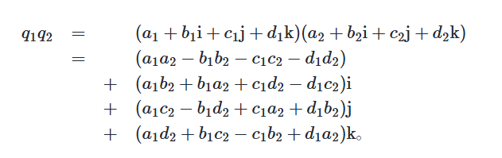

# 动画原理

我们会将我们感兴趣的动画分为两个部分。一个部分是主观动态，另一个部分是主观动态。

前者指的是场景中具有自主行动能力的角色自发产生的动态，后者指的是环境当中遵循物理定律的物体进行的运动。

其中后者我们主要考虑物理模拟，而这块的内容我们已经在[**物理模拟**](物理模拟)中涉及过了。所以现在我们就主要来处理主观动态。

## 数学基础

### 旋转矩阵

二维空间中，向量$(x,y)^T$逆时针旋转$\alpha$角，得到的结果等价于在向量前乘一个旋转矩阵$\begin{pmatrix}
cos\alpha & -sin\alpha \\
sin\alpha & cos\alpha \\
\end{pmatrix}$。将它拓展到三维，我们先考虑向量$(x,y,z)^T$绕$z$轴的旋转，这就等价于在xy平面上绕原点旋转且z轴不变。于是我们可以得到：
$$
\begin{pmatrix}
x'\\
y'\\
z'
\end{pmatrix}=
\begin{pmatrix}
cos\alpha & -sin\alpha & 0 \\
sin\alpha & cos\alpha & 0 \\
0 & 0 & 1
\end{pmatrix}
\begin{pmatrix}
x\\
y\\
z
\end{pmatrix}
$$
绕其余坐标轴旋转同理。我们记上面绕$z$轴逆时针旋转$\alpha$角的旋转矩阵为$R_z(\alpha)$。

接下来我们考虑绕空间中任意轴旋转的变换矩阵。设旋转轴单位向量为$u$，待旋转向量为$P_0$。

则基本思路如下：

1. 任取与$u$垂直的单位向量$w$，取$v=u\times w$。则$u,v,w$两两垂直。
2. 将$u,v,w$看成一个新的坐标系。令$R=(u,v,w)$则在新的坐标系下，$P_0$的坐标为$R^TP_0$。
3. 在新的坐标系中，u为x轴。我们将向量在新坐标系中绕x旋转$\alpha$角，再变回原坐标系。于是得到最终的算式$P_0'=RR_x(\alpha)R^TP_0$。于是旋转矩阵$R_u(\alpha)=RR_x(\alpha)R^T$。

经过一系列矩阵变换，得到罗德里格旋转公式（Rodrigues’ rotation formula）如下：
$$
R = I + sin\alpha[u]+(1-cos\alpha)[u]^2
$$
其中$[u]=\begin{pmatrix}
0 & -u_z & u_y \\
u_z & 0 & -u_x \\
-u_y & u_x & 0\end{pmatrix}$为u的叉乘矩阵。

### 四元数

我们知道复数可以表示二维中的旋转。$e^{i\theta}z$表示$z$绕复平面逆时针旋转$\theta$。类似地，我们可以定义四元数来表示旋转。

#### 四元数的定义

四元数$q=a+bi+cj+dk$。其中$a,b,c,d\in\R$，$i,j,k$满足：
$$
i^2=j^2=k^2=-1\\
ij=k,jk=i,ki=j\\
ji=-k,kj=-i,ik=-j
$$
我们可以将四元数表示为实部a和虚部向量$v=(b,c,d)^T$。记作$q=(a,v)$。

四元数的加减法，模长，点乘都与四维向量的运算规则相同。

四元数的乘法按照上面的$i,j,k$的性质进行。注意四元数的乘法没有交换律。

如果用实部和虚部向量的办法来表示，则会简单一些：
$$
q_1q_2=(w_1w_2-v_1\cdot v_2 , w_1v_2+w_2v_1+v_1\times v_2)
$$
四元数的共轭的定义与复数共轭定义类似。$q=(w,v)$的共轭为$q^*=(w,-v)$。

我们有$qq^*=q^*q=(w^2+v\cdot v,0)\in\R$。我们将其定义为$||q||^2$。

于是我们可以定义非零四元数的逆元为$q^{-1}=\frac{q^*}{||q||^2}$。

#### 四元数表示旋转

设$q=(cos\theta,(sin\theta)u)$是一个单位四元数，$v=(0,v)$是一个实部为0的四元数。则：

1. $qvq^*$实部为0。
2. $qvq^*$的虚部是向量v绕转轴u逆时针旋转$2\theta$的结果。

证明：参考[**讲义**](https://vcl-pku.github.io/vci-book/animation/kinematic-principles/rotation-representation.html)。

#### 四元数插值

