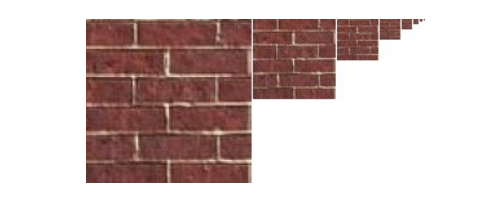

# 反走样

## 信号理论与频谱

图像的高频部分是一些细节。低频部分保存了大部分的形状信息。

香农采样定理：想要能完美恢复出原信号，我们必须要让采样频率至少是原信号截止频率的两倍。

上面是连续信号及其采样信号的时域图和频域示意图。

(a) 为连续信号，(b) 为对应的频谱。

(c) 表示对连续信号进行频率为的离散采样，也就是每隔fs采样一个值

(d) 表示采样得到的离散信号的频谱，是将连续信号的频谱按周期 进行周期延拓

能够恢复出原来的信号，需要(d)中的频谱信号不发生重叠。

## 几何边缘中的反走样

反走样的精髓在于提高采样频率。

### SSAA(super sample anti aliasing)，超采样反走样

这个做法的核心在于对每个像素内部进行多倍超采样(像素内部按照某种方式取多个点，分别计算颜色)，然后再取平均，降采样到屏幕上。这本质上是先将图形光栅化到了一个分辨率更高的屏幕上。

### MSAA(multi sample anti aliasing), 多重采样反走样

MSAA可以认为是优化了的SSAA。它只在反走样情况出现最大的地方进行超采样。

MSAA为每个像素设置多个**采样点**。当一个**图元**(一般是三角形)与像素有交时，检查图元**覆盖了多少个**采样点。

最终像素的颜色为图元提供的颜色乘以覆盖比例。如果全部覆盖，就是图元的颜色本身；如果部分覆盖，就是图元的颜色减淡。

通过这种方式，MSAA 对于三角形内部的像素处理方式和没有反走样是一样的。而在三角形的边界上 MSAA 的效果接近于 SSAA，可以实现比较好的反走样效果。

这种方法的好处是每个图元每个像素只用算一次颜色。

## 纹理图形中的反走样

我们在这节中解决的问题是纹理走样。比如一个拥有高分辨率纹理的物体离相机很远，这样一个像素就对应一大片纹理区域。或者一个拥有低分辨率纹理的物体具体相机很近。

如果说我们直接做物体的放大缩小，就会出现纹理不匹配的现象。

我们可以采用MIP Mapping的方式，预先计算处理一个物体各种形状的样子。大到整张图片的样子，小到一张像素。中间边长以每次两倍的步长等比缩放。

这样预先存储各种大小的物体之后，就可以便于显示了。