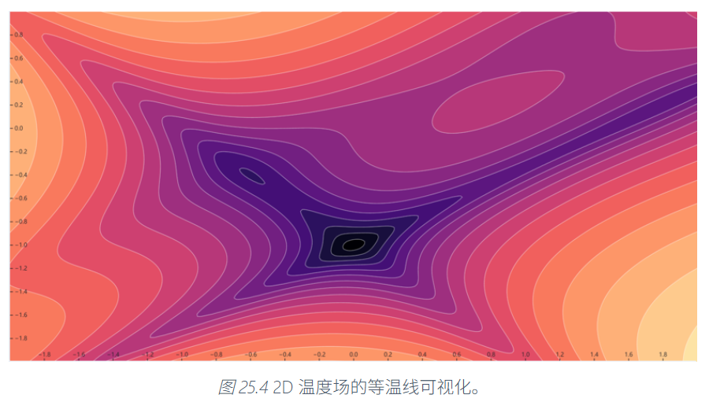
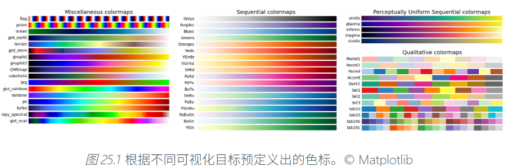
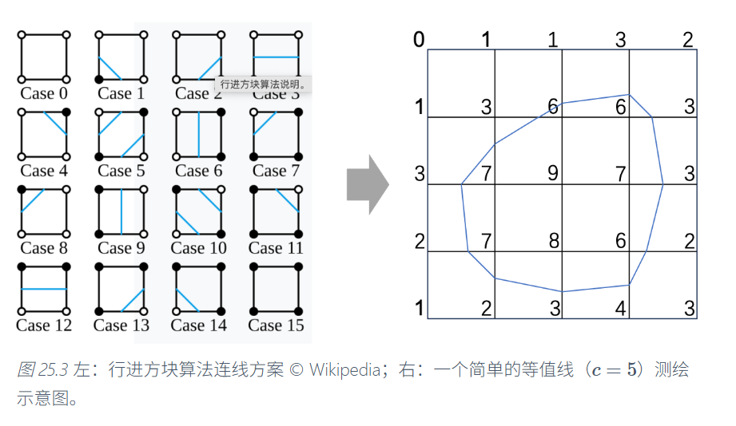
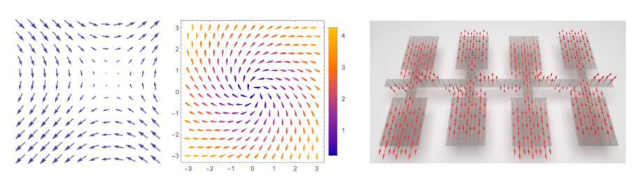
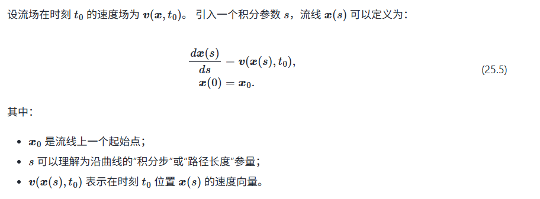
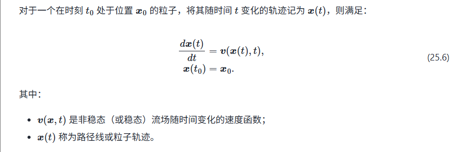

# 可视化

可视化是将难以显示的数据转化成符合人类感知的视觉形式呈现的过程。

我们主要研究三个主要分支：

+ 科学数据可视化
+ 信息数据可视化
+ 可视分析

可视化的一般流水线可以分为下面几个步骤：

+ Raw Data $\to$ Data Tables：将原始数据通过清理，格式化等转化成适合可视化分析的良好数据表
+ Data Tables $\to$ Visual Structs：通过视觉映射，将良好的数据表映射成为可视化的结构，包括图形元素(点，线等)及其属性(颜色，位置，大小等)，使数据获得良好的表达。
+ Visual Structs $\to$ Views：将可视化结构呈现为用户所能够看到的良好的视图，并且使用户能够有调整视角和视图等交互方式。

## 科学可视化

### 场数据可视化

#### 标量场

我们先考虑标量场的可视化。对于标量场，数据可视化最终呈现出来的样子大概是像下面的样子。

为了绘制出上面的图片，我们需要做几件事情：

首先，我们要定一个好的颜色映射。一种直接且有效的做法是色标法，就是首先将场数据归一化成[0,1]区间之间的一个实数，然后定义一个从0到1的颜色渐变方法(颜色查找表，colormap)。

可以使用插值方法得到颜色的方案，也可以使用库中预先定义好的colormap。Matplotlib、Matlab 等工具中包含了多种预定好的色标方案，包括 Jet、Viridis等，如下图所示。

如果单纯使用颜色映射的方式来进行绘图，得出来的图片就是一团渐变的颜色，其实有欠直观性。看上面的图，除了颜色映射之外还用白线标出了等值线。这也是我们需要做的事情。

等值线的绘制，直观来说就是把标量场中值为x的全体点连起来就可以。对于一般的问题，我们可以使用**Marching Cubes**的办法，使用插值的方式得到良好的结果。

如果标量场足够细致，我们也可以对每个屏幕像素，考虑像素的四个顶点的标量场取值，来判断这个像素点是不是在等值线上。

等值线进一步推广到三维世界中，就是等值面。也可以采用**Marching Cubes**的做法来求解。

#### 矢量场

在矢量场中，场数据不止有大小，还有方向。

典型的矢量场是电场和磁场。电场表示的是单位电荷在电场中某个位置所受的力，力同时存在大小和方向的性质，所以这个场是一个矢量场。

一种最简单的表示矢量场的方法就是用箭头把矢量画出来。可以用箭头的长度或者箭头的颜色来表示矢量的大小，方向指向矢量的方向。我们在中学物理中，会采用小磁针的指向来表示磁场，这其实就是这种方法的一种示例。

我们进一步定义三种线，以此来描述矢量场数据。

##### 流线

中学物理中，我们还引入了磁感线和电场线。电场线是这样的一条**闭合曲线：**它的每一点的切线方向都和该点的电场方向一致。对于任意的场，我们可以将电场线推广到一般的**流线。流线是一条闭合曲线，它的每一点的切线方向都和该点的矢量场方向一致。**或者我们引入试探电荷(或一般的试探点)，我们这样定义流线：**一个点在场中进行运动，它在每个点上的运动速度和场上的矢量一致。其运动轨迹即为流线。**

公式化定义如下：

##### 路径线

路径线和流线的区别在于：流线描述的是场的瞬时信息，或者说它描述的是静止场的信息；而流线将场随时间的变化也引入到定义中。它的定义如下：**一个点在变化场中进行运动，它在每个点上的运动速度和当时的场中的矢量数据一致。其运动轨迹即为路径线。**

直观地说上面两个的不同，就在于场会不会随运动的时间而改变。

##### 迹线

迹线的定义，将路径先的定义从单点拓展到了多点。

路径线描述的是：施放时间$\gamma=\gamma_0$为常数，观测时间$t$为变量，形成的一条线。

而迹线描述的是：施放时间$\gamma$为变量，观测时间$t=t_0$为常量，形成的一条线。

迹线描述的是连续注入的粒子的运动，在某一时刻观察时形成的线条。直观地说，想象不断地往水流(场)中滴墨水(试探点)，那么在某一特定时刻，去观察这些墨滴在流体中的分布，就是迹线。

##### 绘制

上面介绍的三种线结构都能描述矢量场。下面我们来看它们的绘制。

可以使用LIC法或点噪声法绘制矢量场的流线，路径线和迹线。

点噪声法在定义域内采样若干个点，给每个点附上一个强度/向量权重信息，然后根据该位置上的矢量方向调整扩散核的形变。最终通过叠加来形成最终的图像。

我们在Lab中实现过LIC(线性积分卷积)的方法。这种方法首先生成一张噪声图，然后对矢量场中的每个点，沿着流线方向按照步长L向前后各走若干步，使用路径上的点对应的噪声图的加权求和结果作为最终生成的图像。

此外还有其它基于神经网络的可视化方法。这里不展开了。

### 表面可视化

表面可视化展示物体的表面信息。我们之前常做的基于网格的渲染，就是表面可视化的一种方式。此外，如果需要让表面承载其他信息，比如数值等，可以让数值通过纹理映射贴附在物体表面上。

### 体可视化

我们想要展示物体的内部结构。常用的方式包括画剖面图和等值面图。此外还有体渲染的方式，它一般适用于生成云、烟、火焰、果冻等半透明物体的可视化效果。

体渲染有两种方式进行。一种方式和光线追踪的思路很相似，名叫**光线投影**。它对每个像素点发一条光线，通过计算每条光线与体内的元素相交得到的颜色和强度来生成图像。