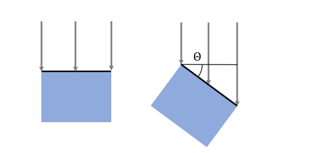
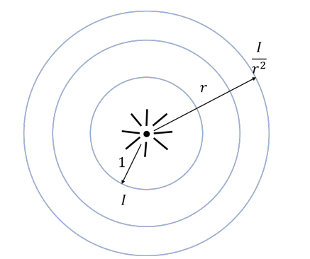
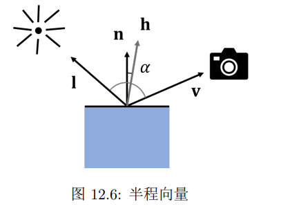
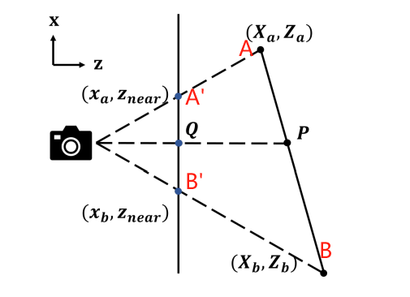

渲染是是将三维场景转化为图像的过程，是对人通过眼睛接受反射光线来观察世界的模拟。

# 光照与着色

物体需要反射来自外界的光线进入人眼之后，才能被我们看到。

## 光源

我们考虑三种光源：平行光，点光源和环境光。

平行光可以由光方向$d$和光强$I$两个数据来表示。光强指的是垂直于光方向时测量得到的光的强度。对于平行光，单位面积内右图接收到的光强是左图的$cos\theta$倍。

环境光是一种间接光照。它是光照经过各种物体多次反射散射得来的。我们在模型中近似认为环境光在各个方向上是均匀的。于是我们可以只需要一个光强$I_a$就可以定义环境光。

点光源发出的光强度会随距离衰减。在距离r处得到的光强正比于$\frac{1}{r^2}$。这是因为我们可以考察距离r处的一个包裹住光源的球面，这个球面将接受来自光源的所有光强。且由于球对称性，球面上的每个单位面积内受到的光强应该是等大的。所以这个光强值应该正比于$\frac{1}{r^2}$。

此外还有更复杂的体光源等。但为了简单，我们认为体光源可以看作是多个点光源的集合。

## 反射模型

经典的**Blinn-Phong 反射模型**中，一个物体的光照强度分为漫反射部分和镜面反射部分。

漫反射部分描述为：
$$
L_d=k_d(I_a+I_dmax(0,n\cdot l))
$$
其中$k_d$是物体表面漫反射的颜色，表示物体表面在 RGB 三个分量上的反射系数。$I_d$是光强，它可以是平行光的光强，也可以是点光源的光强$I_d=\frac{1}{r^2}I$。然后后面的$max(0,n\cdot l)$表示判断光的入射方向和法向是否同向，也即是说是不是从正面照射着物体。

镜面反射部分描述为：
$$
L_s=k_sI_dmax(0,n\cdot h)^p
$$
$k_s$是镜面反射颜色，$I_d$的含义和上面是一样的，我们会对同一个光源既计算漫反射部分又计算镜面反射部分。

h是半程向量，是入射方向和注视方向的角平分线。$n\cdot h$衡量它与法线的相近程度，能够反映**反射光线与注视角的相近程度**。指数上的参数p用于控制镜面反射的集中度，当p比较小时$cos^p\alpha$衰减比较慢，表示光线比较分散，表面比较粗糙。当p比较大时，$cos^p\alpha$衰减快，表示光线集中，表面比较光滑。**这是Blinn做的优化。经典的Phong模型就是直接计算视线与反射光线的夹角，两个角之间差个两倍关系。**

## 深度图像

对于每个像素，我们需要记录深度信息。最终渲染的时候，只保留深度最小的颜色。

对于每个三角形，我们如何计算当我们从屏幕上看它的时候，每个像素的深度？

直接进行插值是不正确的。以下面的图为例子，Q是$A'B'$的中点，但是对应的P并不是AB的中点。

让我们来理论推导一下正确的插值公式。

如上图，有
$$
\frac{AP}{PB}=\frac{S_{\Delta AOP}}{S_{\Delta BOP}}=\frac{OAsin\ang AOP}{OBsin\ang BOP}=\frac{OA\cdot A'Q\cdot OB'}{OB\cdot B'Q\cdot OA'}
$$
而
$$
\frac{OA\cdot OB'}{OB\cdot OA'}=\frac{Z_a}{Z_b}
$$
于是我们知道
$$
\frac{AP}{PB}=\frac{Z_a\cdot A'Q}{Z_b\cdot B'Q}
$$
