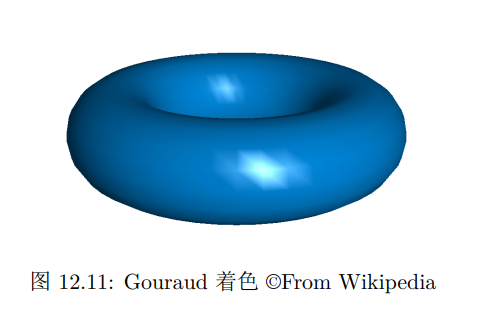
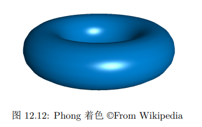
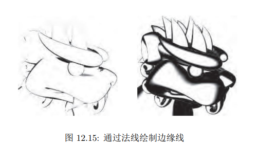
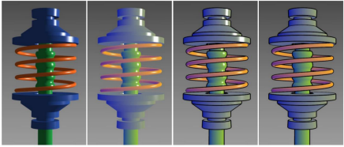
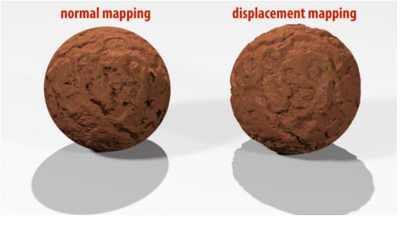
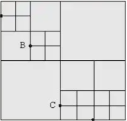

渲染是是将三维场景转化为图像的过程，是对人通过眼睛接受反射光线来观察世界的模拟。

# 光照与着色

物体需要反射来自外界的光线进入人眼之后，才能被我们看到。

## 光源

我们考虑三种光源：平行光，点光源和环境光。

平行光可以由光方向$d$和光强$I$两个数据来表示。光强指的是垂直于光方向时测量得到的光的强度。对于平行光，单位面积内右图接收到的光强是左图的$cos\theta$倍。


环境光是一种间接光照。它是光照经过各种物体多次反射散射得来的。我们在模型中近似认为环境光在各个方向上是均匀的。于是我们可以只需要一个光强$I_a$就可以定义环境光。

点光源发出的光强度会随距离衰减。在距离r处得到的光强正比于$\frac{1}{r^2}$。这是因为我们可以考察距离r处的一个包裹住光源的球面，这个球面将接受来自光源的所有光强。且由于球对称性，球面上的每个单位面积内受到的光强应该是等大的。所以这个光强值应该正比于$\frac{1}{r^2}$。


此外还有更复杂的体光源等。但为了简单，我们认为体光源可以看作是多个点光源的集合。

## 反射模型

经典的**Blinn-Phong 反射模型**中，一个物体的光照强度分为漫反射部分和镜面反射部分。

漫反射部分描述为：
$$
L_d=k_d(I_a+I_dmax(0,n\cdot l))
$$
其中$k_d$是物体表面漫反射的颜色，表示物体表面在 RGB 三个分量上的反射系数。$I_d$是光强，它可以是平行光的光强，也可以是点光源的光强$I_d=\frac{1}{r^2}I$。然后后面的$max(0,n\cdot l)$表示判断光的入射方向和法向是否同向，也即是说是不是从正面照射着物体。

镜面反射部分描述为：
$$
L_s=k_sI_dmax(0,n\cdot h)^p
$$
$k_s$是镜面反射颜色，$I_d$的含义和上面是一样的，我们会对同一个光源既计算漫反射部分又计算镜面反射部分。

h是半程向量，是入射方向和注视方向的角平分线。$n\cdot h$衡量它与法线的相近程度，能够反映**反射光线与注视角的相近程度**。指数上的参数p用于控制镜面反射的集中度，当p比较小时$cos^p\alpha$衰减比较慢，表示光线比较分散，表面比较粗糙。当p比较大时，$cos^p\alpha$衰减快，表示光线集中，表面比较光滑。**这是Blinn做的优化。经典的Phong模型就是直接计算视线与反射光线的夹角，两个角之间差个两倍关系。**


## 深度图像

对于每个像素，我们需要记录深度信息。最终渲染的时候，只保留深度最小的颜色。

对于每个三角形，我们如何计算当我们从屏幕上看它的时候，每个像素的深度？

直接进行插值是不正确的。以下面的图为例子，Q是$A'B'$的中点，但是对应的P并不是AB的中点。


让我们来理论推导一下正确的插值公式。

如上图，有
$$
\frac{AP}{PB}=\frac{S_{\Delta AOP}}{S_{\Delta BOP}}=\frac{OAsin\angle AOP}{OBsin\angle BOP}=\frac{OA\cdot A'Q\cdot OB'}{OB\cdot B'Q\cdot OA'}
$$
而
$$
\frac{OA\cdot OB'}{OB\cdot OA'}=\frac{Z_a}{Z_b}
$$
于是我们知道
$$
\frac{AP}{PB}=\frac{Z_a\cdot A'Q}{Z_b\cdot B'Q}
$$
若$Q=sA'+tB'$，则有
$$
\frac{A'Q}{B'Q}=\frac{t}{s}\\
\frac{AP}{PB}=\frac{tZ_a}{sZ_b}\\
P=\frac{tZ_aB+sZ_bA}{tZ_a+sZ_b}\\
Z_p=\frac{1}{tZ_a+sZ_b}\\
\frac{1}{Z_p}=s\frac{1}{Z_a}+t\frac{1}{Z_b}
$$
也就是说，我们应该对深度的倒数进行插值，而不应该对深度本身。

如果说我们需要插值的量不是深度，而是颜色等，我们也可以通过上面的推导来进行。
$$
P=\frac{tZ_aB+sZ_bA}{tZ_a+sZ_b}\\
f(P)=\frac{tZ_af(B)+sZ_bf(A)}{tZ_a+sZ_b}\\
$$

## 着色

根据上面的光照模型，给出一个点以及一个法向，我们可以计算出这个点处的反射光照强度，也即是这个点的颜色。

我们如何将整张三角形网格图渲染出来？一个方法是逐三角形着色(Flat Shading)，另一个办法是逐顶点着色，然后三角形内部去插值处理(Gouraud Shading)。这两种着色的效果如图所示。




在Flat Shading中，每个三角形只有一个法向，每个三角形只有一个颜色，于是我们能在渲染结果里看到很多独立的面片，但是我们还是可以直观看到整个形状上明暗的过渡以及高光。

而在Gouraud Shading中，从结果可以看到，在曲面的大部分区域里我们得到了光滑的颜色过渡，但是在高光区域我们还是能明显看到三角形插值的痕迹。

Gouraud Shading的流程是它在顶点处理时直接得到颜色，对于每一个像素，像素的颜色是顶点颜色的插值（做透视修正）。

上面的两种着色方法都是由物体出发的。其实我们可以换个视角，从像素出发去进行着色。

对于每个像素，我们可以找到对应的物体局部位置。那我们就可以使用每个像素的法向去找颜色，这就是**Phong着色**。

我们在顶点处理时不计算颜色，只计算法向，对于每个像素，像素的法向是顶点法向的插值（做透视修正）。而像素的颜色由像素的法向和位置，通过光照模型计算出来。



这个效果就好得多了。

从平面着色到 Phong shading，我们发现我们需要计算的颜色数量在增加，从逐三角形到逐顶点再到逐像素。换句话说就是着色频率在增加，连续性也在增加，效果越来越接近真实。

## 非真实化渲染

非真实化渲染有两个重要的特征。

一个是线，包括物体的轮廓线，结构线和光影线等等。

另一个是非真实的着色，比如卡通风格，冷暖色调，油画风格等等。

绘制物体的轮廓线有很多种做法。比如**通过物体的法线来在局部绘制轮廓线**。但是这样的方法得到的边缘的粗细并不一致，会有一些近大远小造成的不好现象。



第二种方法**绘制两遍几何体。第一遍只绘制几何体的背面，绘制颜色为边缘线的颜色，并且将几何体稍微向外扩展一点。**第二遍再在背面之上绘制正面的几何体，这样没有被遮挡的部分就是边缘线 了。

然后再来看着色。

物体的体积感并不是通过光影来塑造的，而是通过颜色的冷暖塑造的。由于冷暖色并没有明显的亮度区别，因此我们可以同时观察到物体的各个部分的细节，同时保有立体感。这种着色方式称为**Gooch着色**。



在这种我们给定两种颜色$k_{cool}$和$k_{warm}$，分别为冷色和暖色，插值的系数由物体法向与视线之间的夹角决定。插值公式为：
$$
k=\frac{1+l\cdot n}{2}k_{cool} + \frac{1-l\cdot n}{2}k_{warm}
$$
其中l为指向光源的方向，n为表面法向。


# 渲染流程

1. 输入待渲染模型(三角面片以及其纹理属性，光照属性)和各光源属性。
2. 对所有三角形，计算其顶点的投影坐标以及深度，法向量等需要用到的着色信息。
3. 对每个三角形，判断所有像素是否在三角形内部。(draw a triangle)
4. 对三角形内的像素点，遍历所有光源，将着色叠加得到像素点颜色。(Phong shading)
5. 计算三角形在该像素内的深度值，维护像素深度值。
6. 根据计算出的每个像素的最浅深度对应的颜色(framebuffer)，在显示器上完成显示。

GLSL着色语言是OpenGL着色器适配的。顶点着色、曲面细分、几何着色是可用GLSL编程的，而几何处理的其余部分则在硬件驱动中实现，仅能通过一些选项调整其参数。

下面是顶点着色器的一个示例，将传入的位置信息先投影到相机空间中，再进行proj投影。

```glsl
#version 450
layout (location = 0) in vec3 inPosition;
layout (location = 1) in vec3 inNormal ;
layout ( binding = 0) uniform GlobalUniformData {
    mat4 proj ;
	mat4 view ;
} global_data ;
layout (location = 0) out vec3 fragColor ;
void main ()
{
gl_Position=global_data.proj ∗ global_data.view ∗ vec4(inPosition , 1.0) ;
fragColor = inNormal;
}
```

>#version 450声明这是 OpenGL 4.5 的着色器代码，in、out 分别修饰着色器的输入 和输出，uniform 代表全局数据，layout 表示数据在内存中存储的顺序．整个几何处理的运 行逻辑位于main函数中，gl_Position则是 OpenGL 定义的全局变量，表示输出的顶点位置， 是顶点着色器中唯一必须输出的量．fragColor作为输出，后续将传给下面提到的片段着色 器，其内容是可以自由指定的．例如，这里将输入三角形的法向量编码为颜色传给后续片段 着色器．上面这一段代码会在 GPU 中遍历所有输入的顶点并行执行，得到所有顶点的输出 后交由 OpenGL 进行光栅化操作．

完成顶点着色之后，GPU会自动进行光栅化操作。接下来，处理的对象就不再是三角形网格顶点，而是屏幕中的像素。对像素的着色操作由片段着色器进行。

下面是一段片段着色器的代码。

```glsl
#version 450
in vec3 fragColor ;
out vec4 outColor ;
void main () {
outColor = vec4 ( fragColor , 1 . ) ;
}
```

>其中，#version 450声明这是 OpenGL 4.5 的着色器代码，in、out 分别修饰片段着色器的 输入和输出，整个着色的运行逻辑位于main函数中．值得一提的是，这里fragColor是与上 面提到的顶点着色器中输出相对应的量．在 OpenGL 中，如果片段着色器的输入和顶点着 色器输出的名称和类型都相同，那么 OpenGL 就会自动将二者关联起来．
>
>在我们展示的代码中，顶点着色器和像素着色器中都有类型为vec3的fragColor的参数， 这就意味着像素着色器得到的输入是由顶点着色器的输出决定的．但与简单的参数传递不 同，顶点着色器输出的是逐顶点的值，像素着色器接受的输入是逐像素的输入．这中间进行的转换正是光栅化这一步进行的操作．在默认情况下，OpenGL 会把顶点着色器的输出通过上面介绍的透视矫正的线性插值方法插值到每个像素上，喂给像素着色器使用．因此即使我们在像素着色器中没有进行任何的插值操作，直接输出得到的就是光滑插值之后的结果．
>
>OpenGL 提供了三种插值选项，由插值限定符（Interpolation Qualifier）决定．flat in vec3 fragColor 指这个变量在光栅化阶段不 会进行插值，像素着色器会得到三角形第一个顶点上的值．noperspective in vec3 fragColor 指这个变量会在屏幕空间做线性插值．smooth in vec3 fragColor 指这个变量会通过透视矫 正的方法插值，默认情况可以去掉smooth不写．

# 纹理映射

之前我们在**几何建模**中**参数化**的那一节接触过纹理映射。当时举的例子——世界地图的绘制，就是经典的纹理映射的应用。

纹理映射其实就是我们在二维空间中提前绘制过纹理图案，于是我们需要将三维的物体模型映射到二维，得到其**纹理坐标(Texture Coordinate，记为(u,v)，又称uv坐标)**。

对于三角形网格来说，我们可以先对顶点做好uv坐标，内部的点的uv坐标可以通过重心坐标插值得到(需要透视矫正)。

对于纹理坐标的查询，我们可以使用双线性插值的方法。而对于纹理走样的现象，我们可以使用Mipmap的方式来进行反走样。这些在前面都有所介绍。

纹理映射其实可以做的事情远多于单纯的记录纹理。还可以记录表面的几何凹凸结构(法向贴图和凹凸贴图)，或者让球的表面变得不再光滑(位移贴图)



还可以记录环境光在各方向的纹理(环境光贴图，如Lab中的包围盒模型)以及对于光源视角的**阴影贴图（Shadow Mapping）**。

在实现阴影贴图时，每个光源都需要计算一个深度贴图，平行光源应该使用正交投影，而点光源应该使用透视投影。

# 光线追踪及其加速算法

## 光线追踪

光线追踪方法，我们在Lab中实现过了。基本思想是从像素发射出假想光线，考察假想光线在场景中与物体相交的位置，及其反射，折射现象。这样得到的就是像素的颜色了。

我们在实现光线追踪的时候，需要多次考虑射线与几何体相交的问题。主要是三角形网格。

朴素的实现中，直接去对每个三角形面片考察交点(解析几何，用Crammer法则解方程)，取最近的交点作为答案。这无疑效率是很低的。于是我们考虑加速算法。

## 网格化

最简单的加速方法是画格子，即把空间进行网格化。对于光线，我们会从近到远地查询与光线相交的网格。如果光线与网格相交，那么再考察光线与网格内部的三角面片的交点。

这种方法对网格的大小要求比较高。网格过大，内部的三角面片太多；网格过小，光线与网格的交就会比较多。大小合适的网格才是好的网格。

## 八叉树

一说到构建大小合适的网格，八叉树算法就可能呼之欲出了。

八叉树是一种灵活的空间网格化的方法。这种做法每次把单个空间网格均匀分成八份。但是如果说网格符合某种条件，我们就不再细分它。在这里，我们会定义这种条件为网格内部的三角面片数量足够小，或者网格边长本身足够小。



这样，我们会将三角面片密集的地方，将空间网格分得更加细一点小一点；而在三角面片稀疏的地方，将空间网格分得大一点。

八叉树有个缺点，就是对于每个网格，网格内部需要存储所有与网格相交的三角面片。这其实造成了很多不必要的浪费。而BVH Tree能够解决这个问题。

## 层次包围盒树

层次包围盒树(BVH Tree)的方法和八叉树差不多。只是它将网格剖分时，并不是剖分成不交的几个部分，而是按照网格内部的三角面片去分。

每次剖分网格，这种算法将当前网格的三角面片按照待剖分的坐标分成两部分(比如说希望在x坐标方面做一个切割，就将网格内部的三角面片按照重心分成左右两个部分)。然后确保**剖分后的两个网格完全包围住它所负责的所有三角面片，即网格是一个包围盒**。

这样做剖分的时候，网格可能有交，但是单个三角面片只可能属于一个网格。

这其实为整个网格的数目提供了一个确定值。这颗二叉树总共有n个叶子节点，n-1个内部节点。n即为三角形面片的数量。

以上就是BVH Tree的基本做法。

---

下面我们来看一个优化：

我们上面提到的分割方法，要么是根据坐标轴跨度的中点进行划分，将位于中点左侧的图元划分到左节点，而将位于中点右侧的图元划分到右节点。要么是进行等量划分，将最左边的一半图元划分到左节点，剩下的一半则划分到右节点。在图元分布不均匀的时候，这两种划分策略效果其实并不好。

我们有一种基于表面积的启发式评估划分策略的方法(**Surface Area Heuristic，SAH**)。

假设当前节点中存在$n$个物体，设对每个物体求交的代价都是1，如果不做划分，依次求交的总代价为$n$。

如果我们将他们分为两组，两组物体分别有包围盒 A 和包围盒 B。设光线击中这两个包围盒的概率分别为$p(A)$和$p(B)$，我们近似为p(A)和p(B)是正比于它们的表面积的。

若光线与包围盒A相交，则光线与A内部三角面片遍历的时间复杂度为a，即A内部的三角面片数目。同理，若光线与包围盒B相交，则光线与B内部三角面片遍历的时间复杂度为b。则有
$$
C(A,B)\sim aS(A)+bS(B)
$$
我们需要找使代价最小的分割方法$A,B$。

怎么找？如果对于内部的n个面片一个一个找，未免太慢了。我们可以采取这样的方式：设置一个超参数N，假设分割点一定在N等分点上，然后对N种可能的分割方式，看哪种最优。这虽然丢失了精度，但是本来我们算的就是启发式，最终的效果也是很好的。

## KD Tree

**其实八叉树算法加上SAH，就是KD Tree了。**

KD Tree用上面所说的SAH算法改进了八叉树的切分方式。不直接找中点切分，而是按照SAH算法找代价最小的分割方式。有点区别的是，我们鼓励切分出的两个节点中有一个空节点。如果切分出的两个节点中有一个空节点，我们将代价设置为0。

回顾一下上面所说的八叉树的缺点——对于每个网格，网格内部需要存储所有与网格相交的三角面片。KD Tree继承了这个缺点。

# 高级渲染

