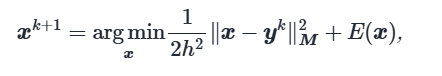

# 物理模拟

我们有公式$F=ma,v'=a,x'=v.$有了这三个公式，就可以模拟物理世界。

我们考虑的例子是在三维中的。所以其中的$a,v,x$都是三维向量，分别表示在$x,y,z$方向上的加速度，速度和位移。

## 离散化

### 空间离散化

我们认为空间是多个微元。将物体抽象为若干个质点，且有弹簧链接。

整个物体运动的模型就被抽象成了弹簧-质点模型。

对于一个连接质点$i , j$的弹簧，有:
$$
f_{ij}=k_{ij}(||x_j-x_i||-l_{ij})n_{ij}
$$
其中$f_{ij}$是质点$i$受到弹簧的弹力，$l_{ij}$是弹簧原长，$n_{ij}=\frac{x_j-x_i}{||x_j-x_i||}$是从$i$指向$j$的单位向量。

### 时间离散化

我们认为时间是多个微元。每个微元中我们单独处理欧拉积分。这有显式、半隐式和隐式之分。

假设时间间隔为$h$。已知当前物体的状态(包括位置x和初速度v)时，可以计算出相应的受力情况。

设$x^k=(x_1(t_k),x_2(t_k)...x_n(t_k))^T$为时刻$t_k$时各质点的位置构成的向量。它的形状是$n\times3$的。

同理，设$v^k=(v_1(t_k),v_2(t_k)...v_n(t_k))^T$为时刻$t_k$时各质点的速度构成的向量。它也是$n\times3$的。

然后我们来处理力。我们上面说过，每个时间状态t，根据物体的位置$x(t)$信息，我们可以计算出受力情况。

我们假设对于时刻$t$,受力矩阵为$f(t)=f(x(t))$.注意这也是一个$n\times3$的矩阵。

从受力矩阵到加速度矩阵，我们想要将每一行除以对应的质点质量。这相当于前乘一个质量倒数构成的对角矩阵。

令
$$
M=
\begin{pmatrix}
m_1 & \cdots & 0 \\
\vdots & \ddots & \vdots \\
0 & \cdots & m_n \\
\end{pmatrix}
$$
M为质量构成的对角矩阵。则
$$
M^{-1}=
\begin{pmatrix}
m_1^{-1} & \cdots & 0 \\
\vdots & \ddots & \vdots \\
0 & \cdots & m_n^{-1} \\
\end{pmatrix}
$$
那么我们的公式即为：
$$
x^{k+1}=x^k+\int_{t_k}^{t_{k+1}}v(t)dt\\
v^{k+1}=v^k+\int_{t_k}^{t_{k+1}}a(t)dt\\
a(t)=M^{-1}f(x(t))
$$
我们不想算积分，我们也算不出积分。于是我们最常用的假设就是积分中的值为定值。

视假设的定值不同，我们有下面三种近似计算积分的方式。

#### 显式欧拉积分

假设在时间区域$(t_k,t_{k+1})$中，有
$$
v(t)=v(t^k)=v^{k}\\
x(t)=x(t^k)=x^{k}
$$
那么，上式转化为：
$$
x^{k+1}=x^k+hv^k\\
v^{k+1}=v^k+hM^{-1}f(x^k)
$$
这就是一个马尔科夫链问题。每次由$x^k,v^k$就可以自动更新出$x^{k+1},v^{k+1}$。

#### 半隐式欧拉积分

假设在时间区域$(t_k,t_{k+1})$中，有
$$
v(t)=v(t^{k+1})=v^{k+1}\\
x(t)=x(t^k)=x^k
$$
那么，上式转化为：
$$
x^{k+1}=x^k+hv^{k+1}\\
v^{k+1}=v^k+hM^{-1}f(x^k)
$$
这其实也是一个马尔科夫链问题。每次由$x^k,v^k$，先更新出$v^{k+1}$，再更新$x^{k+1}$。

上面两种方法的问题在于它们不稳定**(为什么？如何定义不稳定性？如何严格证明它们的稳定性情况差异？如果你有见解欢迎联系笔者)**。

#### 隐式欧拉积分

隐式欧拉积分假设
$$
v(t)=v(t^{k+1})=v^{k+1}\\
x(t)=x(t^{k+1})=x^{k+1}
$$
那么，上式转化为：
$$
x^{k+1}=x^k+hv^{k+1}\\
v^{k+1}=v^k+hM^{-1}f(x^{k+1})
$$
这就不是简单地更新能搞定的事情了。这需要涉及到解方程。

## 求解隐式欧拉积分

我们把v消掉。得到方程：

$$
x^{k+1}=x^k+hv^k+h^2M^{-1}f(x^{k+1})
$$
然后，我们将这个方程转换成一个优化问题。我们假设f分为两个部分，其中一个部分为弹簧的弹力或说物体的内力$f_{int}=f_{int}(x)$，与各质点的位置有关。另一个部分为外力$f_{ext}=f_{ext}(t)$，只与时间t有关。于是，有方程：
$$
x^{k+1}=x^k+hv^k+h^2M^{-1}f_{ext}+h^2M^{-1}f_{int}(x^{k+1})
$$
令
$$
y^k=x^k+hv^k+h^2M^{-1}f_{ext}
$$
则方程变为：
$$
x^{k+1}=y^k+h^2M^{-1}f_{int}(x^{k+1})
$$
其中，$f_{int}$是弹力，而弹力可以视为弹性势能的导数。即
$$
f_{int}(x)=-\frac{\partial E(x)}{\partial x}
$$
而到此，讲义上就**非常不负责任**地将它等价成了这样的形式：

我们把这等式右边的这个函数记作$g(x)$。

注意，$||x-y^k||^2_{M}$中，M是下标，它的意思是$||v||^2_M=v^TMv$。

讲义上说：你可以通过计算目标函数$g(x)$关于$\bf{x}$的梯度等于$\bf{0}$证明**等价性**。

但是注意，$g(x)$关于$\bf{x}$的梯度等于$\bf{0}$只能说明解出来的$x^{k+1}$是个极值点，不能说明为什么是最小值点。建立严格的等价关系，还需要加上$g(x)$严格凹这个条件，这等价于其黑塞矩阵正定。

我们下面补充一下关于等价性的证明。

### 关于上面方程等价于最小化$g(x)$的(不严谨)证明

一方面，我们证明x为方程的解等价于x为$g(x)$的极值点。关于目标函数求梯度，得
$$
\nabla g=\frac{1}{2h^2}2(x-y^k)M-f_{int}(x)
$$
整理即可证。

另一方面，我们研究该函数的黑塞矩阵，证明其正定，以保证极值点的唯一性。

该函数的黑塞矩阵为
$$
H=\frac{1}{h^2}M+\nabla^2(E)
$$
我们认为在h足够小时，$\frac{1}{h^2}M$是一个元素都足够大的正对角矩阵，它加上$\nabla^2(E)$，能够形成一个正定矩阵(因为最极端情况，是对角线为正且足够大，其余元素的影响忽略不计)。

这与我们的先验是一致的。我们知道切分的时间元必须得小，否则当然会出问题。

由于数学与物理方面的知识限制，我们暂时不能够详细地解出h的下界。但是在实验中一般能够探索出良好的h。

### 求解方程

当方程转化为最小化目标函数之后，我们自然就可以通过梯度下降法或牛顿法等方法来处理之。

讲义上特别讲了牛顿法。这里就探讨一下如何使用牛顿法解这个最优化问题。

牛顿法最原始的版本是用来求